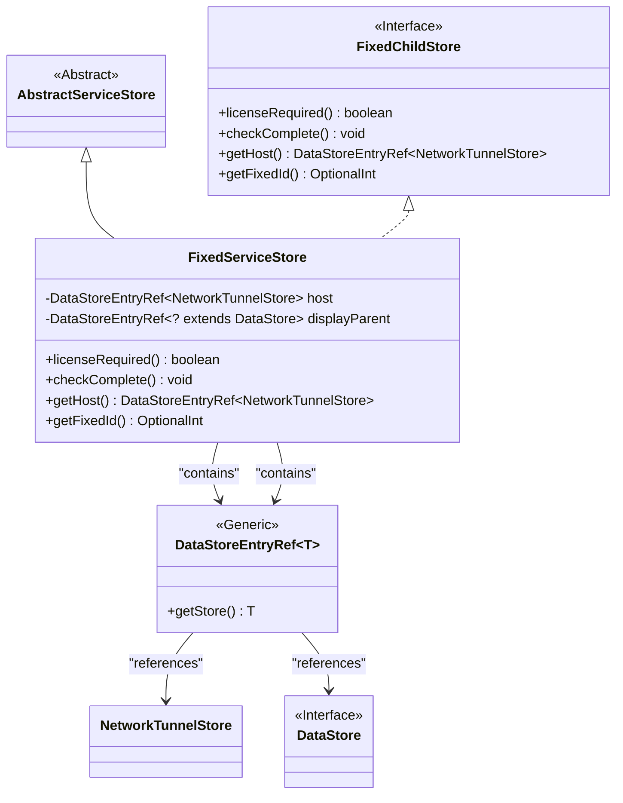
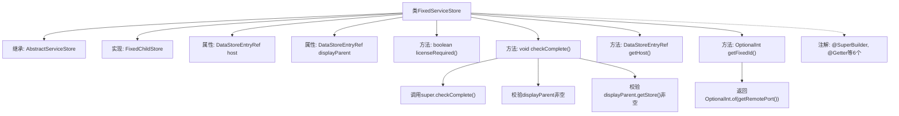

# 基础信息

|      |      |
|------|------|
| 名称 | FixedServiceStore |
| 编码语言 | .java |
| 代码路径 | xpipe/ext/base/src/main/java/io/xpipe/ext/base/service/FixedServiceStore.java |
| 包名 | io.xpipe.ext.base.service |
| 依赖项 | ['io.xpipe.app.storage.DataStoreEntryRef', 'io.xpipe.app.util.Validators', 'io.xpipe.core.store.DataStore', 'io.xpipe.core.store.FixedChildStore', 'io.xpipe.core.store.NetworkTunnelStore', 'com.fasterxml.jackson.annotation.JsonTypeName', 'lombok.EqualsAndHashCode', 'lombok.Getter', 'lombok.ToString', 'lombok.experimental.SuperBuilder', 'lombok.extern.jackson.Jacksonized', 'java.util.OptionalInt'] |
| 概述说明 | FixedServiceStore类继承AbstractServiceStore，包含host和displayParent字段，实现FixedChildStore接口，无需许可证，检查非空并返回固定ID。 |

# 说明

FixedServiceStore类继承自AbstractServiceStore并实现FixedChildStore接口，使用Lombok注解生成构建器、Getter方法等。包含host和displayParent两个不可变字段，类型分别为DataStoreEntryRef<NetworkTunnelStore>和DataStoreEntryRef<? extends DataStore>。该类重写了licenseRequired方法返回false，checkComplete方法验证displayParent及其存储对象非空。getHost方法返回host字段，getFixedId方法返回OptionalInt包装的远程端口值。类注解包括Jackson序列化支持、JSON类型命名等。

# 类列表 Class Summary

| 名称   | 类型  | 说明 |
|-------|------|-------------|
| FixedServiceStore | class | FixedServiceStore类继承AbstractServiceStore，包含host和displayParent字段，重写licenseRequired、checkComplete等方法。 |

## 类 FixedServiceStore

|      |      |
|------|------|
| 访问范围 | @SuperBuilder;@Getter;@Jacksonized;@JsonTypeName("fixedService");@EqualsAndHashCode(callSuper = true);@ToString(callSuper = true);public |
| 类型 | class |
| 名称 | FixedServiceStore |
| 说明 | FixedServiceStore类继承AbstractServiceStore，包含host和displayParent字段，重写licenseRequired、checkComplete等方法。 |

### UML类图

这段类图描述了FixedServiceStore继承自AbstractServiceStore并实现FixedChildStore接口的结构。该类包含两个泛型字段：host引用NetworkTunnelStore类型，displayParent引用DataStore的子类。通过继承和实现关系，FixedServiceStore具备了父类的特性并实现了接口定义的检查方法、获取主机引用和固定ID等功能。图中清晰展示了类之间的依赖关系和泛型参数的使用。

### 内部方法调用关系图

这段代码展示了一个使用Lombok注解的Java类FixedServiceStore，它继承AbstractServiceStore并实现FixedChildStore接口。类中包含两个final属性host和displayParent，以及四个重写方法。其中checkComplete()方法会先调用父类检查，然后验证displayParent及其存储对象非空；getFixedId()方法返回基于远程端口的OptionalInt。类上标注了@SuperBuilder等6个注解用于自动生成构建器、getter等方法。整体设计体现了对数据完整性的严格校验和接口契约的遵守。

### 字段列表 Field List

| 名称  | 类型  | 说明 |
|-------|-------|------|
| displayParent | DataStoreEntryRef<? extends DataStore> | 私有DataStoreEntryRef类型变量displayParent，引用DataStore子类。 |
| host | DataStoreEntryRef<NetworkTunnelStore> | 私有网络隧道存储引用 |

### 方法列表 Method List

| 名称  | 类型  | 说明 |
|-------|-------|------|
| checkComplete | void | 检查非空：displayParent及其store属性。 |
| getHost | DataStoreEntryRef<NetworkTunnelStore> | 重写getHost方法，返回host引用。 |
| licenseRequired | boolean | Java方法重写，返回false表示无需许可证。 |
| getFixedId | OptionalInt | 重写getFixedId方法，返回远程端口OptionalInt。 |

