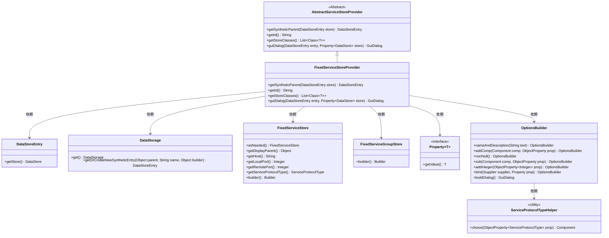
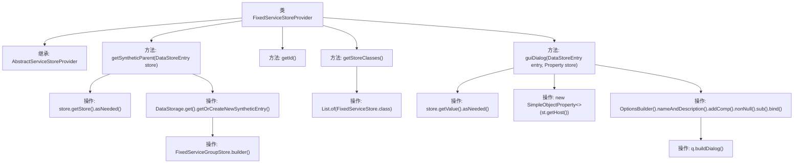

# 基础信息

|      |      |
|------|------|
| 名称 | FixedServiceStoreProvider |
| 编码语言 | .java |
| 代码路径 | xpipe/ext/base/src/main/java/io/xpipe/ext/base/service/FixedServiceStoreProvider.java |
| 包名 | io.xpipe.ext.base.service |
| 依赖项 | ['io.xpipe.app.comp.store.StoreChoiceComp', 'io.xpipe.app.comp.store.StoreViewState', 'io.xpipe.app.ext.GuiDialog', 'io.xpipe.app.storage.DataStorage', 'io.xpipe.app.storage.DataStoreEntry', 'io.xpipe.app.util.OptionsBuilder', 'io.xpipe.core.store.DataStore', 'io.xpipe.core.store.NetworkTunnelStore', 'javafx.beans.property.Property', 'javafx.beans.property.SimpleObjectProperty', 'java.util.List'] |
| 概述说明 | FixedServiceStoreProvider类继承AbstractServiceStoreProvider，提供固定服务存储功能，包括获取父存储、ID标识、存储类列表和GUI对话框配置。 |

# 说明

FixedServiceStoreProvider继承AbstractServiceStoreProvider，提供固定服务存储功能。主要方法包括：getSyntheticParent用于创建并返回合成数据存储条目；getId返回标识符"fixedService"；getStoreClasses返回支持的存储类FixedServiceStore；guiDialog构建并返回配置固定服务存储的图形用户界面对话框，包含主机、本地端口和服务协议类型等属性的设置与绑定。

# 类列表 Class Summary

| 名称   | 类型  | 说明 |
|-------|------|-------------|
| FixedServiceStoreProvider | class | FixedServiceStoreProvider类继承AbstractServiceStoreProvider，提供固定服务存储管理功能，包括获取父条目、ID、存储类及GUI对话框配置。 |

## 类 FixedServiceStoreProvider

|      |      |
|------|------|
| 访问范围 | public |
| 类型 | class |
| 名称 | FixedServiceStoreProvider |
| 说明 | FixedServiceStoreProvider类继承AbstractServiceStoreProvider，提供固定服务存储管理功能，包括获取父条目、ID、存储类及GUI对话框配置。 |

### UML类图

该类图展示了FixedServiceStoreProvider继承自AbstractServiceStoreProvider，并实现了数据存储管理功能。核心类通过DataStorage操作DataStoreEntry，使用FixedServiceStore和FixedServiceGroupStore构建服务配置，结合OptionsBuilder生成GUI对话框。Property接口提供泛型数据绑定，ServiceProtocolTypeHelper辅助协议类型选择，整体形成服务配置管理的完整体系。

### 内部方法调用关系图

该流程图展示了FixedServiceStoreProvider类的继承关系和方法调用流程。类继承自AbstractServiceStoreProvider，主要实现四个方法：getSyntheticParent用于创建合成数据存储条目，getId返回固定服务标识符，getStoreClasses返回支持的存储类列表，guiDialog构建服务配置的GUI对话框。核心逻辑集中在getSyntheticParent的数据存储操作和guiDialog的复杂属性绑定流程，后者通过OptionsBuilder逐步构建对话框组件并最终生成对话框实例。

### 字段列表 Field List

| 名称  | 类型  | 说明 |
|-------|-------|------|

### 方法列表 Method List

| 名称  | 类型  | 说明 |
|-------|-------|------|
| getId | String | 重写getId方法，返回固定值"fixedService"。 |
| getSyntheticParent | DataStoreEntry | 重写方法，获取或创建合成数据存储条目，基于给定存储的父级和服务组构建。 |
| getStoreClasses | List<Class<?>> | 重写方法返回包含FixedServiceStore的类列表。 |
| guiDialog | GuiDialog | 重写方法创建GUI对话框，配置主机、端口和协议类型，绑定数据存储。 |

