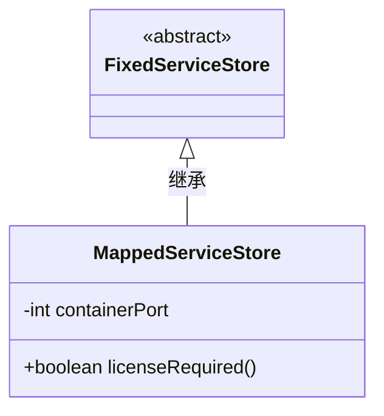
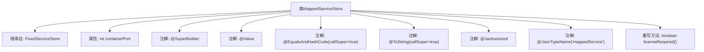

# 基础信息

|      |      |
|------|------|
| 名称 | MappedServiceStore |
| 编码语言 | .java |
| 代码路径 | xpipe/ext/base/src/main/java/io/xpipe/ext/base/service/MappedServiceStore.java |
| 包名 | io.xpipe.ext.base.service |
| 依赖项 | ['com.fasterxml.jackson.annotation.JsonTypeName', 'lombok.EqualsAndHashCode', 'lombok.ToString', 'lombok.Value', 'lombok.experimental.SuperBuilder', 'lombok.extern.jackson.Jacksonized'] |
| 概述说明 | MappedServiceStore类继承FixedServiceStore，包含containerPort字段且需许可证。 |

# 说明

该内容描述了一个名为MappedServiceStore的Java类，继承自FixedServiceStore类。使用了多个注解：SuperBuilder用于构建对象，Value表示不可变类，EqualsAndHashCode和ToString包含父类属性，Jacksonized支持Jackson反序列化，JsonTypeName定义JSON类型名。类中包含一个整型字段containerPort，并重写了licenseRequired方法返回true。

# 类列表 Class Summary

| 名称   | 类型  | 说明 |
|-------|------|-------------|
| MappedServiceStore | class | MappedServiceStore继承FixedServiceStore，含containerPort字段，需许可证。 |

## 类 MappedServiceStore

|      |      |
|------|------|
| 访问范围 | @SuperBuilder;@Value;@EqualsAndHashCode(callSuper = true);@ToString(callSuper = true);@Jacksonized;@JsonTypeName("mappedService");public |
| 类型 | class |
| 名称 | MappedServiceStore |
| 说明 | MappedServiceStore继承FixedServiceStore，含containerPort字段，需许可证。 |

### UML类图

这段类图展示了MappedServiceStore继承自抽象类FixedServiceStore的关系。MappedServiceStore包含一个私有整型字段containerPort，并重写了父类的licenseRequired()方法，该方法返回固定值true。类图中使用@Value等Lombok注解表明这是一个不可变类，但mermaid语法中未直接体现这些编译时特性，重点展示了类结构和继承关系。

### 内部方法调用关系图

这段代码定义了一个名为MappedServiceStore的类，它继承自FixedServiceStore，并包含一个整型属性containerPort。该类使用了多个Lombok和Jackson注解来简化代码，包括自动生成构建器、不可变对象、equals/hashCode方法、toString方法以及JSON序列化支持。此外，它还重写了licenseRequired方法，始终返回true。这些注解的组合使得该类具有简洁的语法和强大的功能，适用于构建复杂的服务存储结构。

### 字段列表 Field List

| 名称  | 类型  | 说明 |
|-------|-------|------|
| containerPort | int | 定义容器端口变量。 |

### 方法列表 Method List

| 名称  | 类型  | 说明 |
|-------|-------|------|
| licenseRequired | boolean | 覆盖方法声明许可证需求返回真值 |

