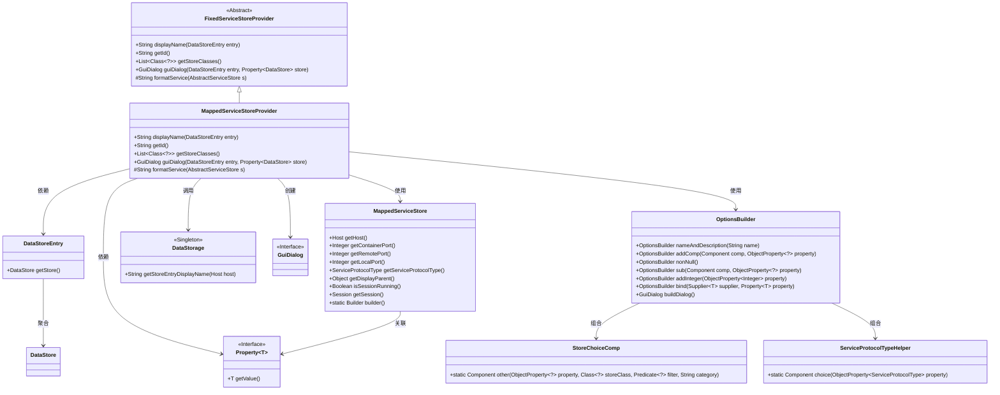
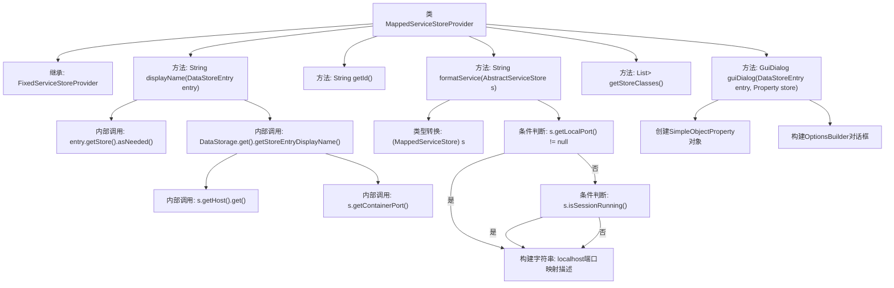

# 基础信息

|      |      |
|------|------|
| 名称 | MappedServiceStoreProvider |
| 编码语言 | .java |
| 代码路径 | xpipe/ext/base/src/main/java/io/xpipe/ext/base/service/MappedServiceStoreProvider.java |
| 包名 | io.xpipe.ext.base.service |
| 依赖项 | ['io.xpipe.app.comp.store.StoreChoiceComp', 'io.xpipe.app.comp.store.StoreViewState', 'io.xpipe.app.ext.GuiDialog', 'io.xpipe.app.storage.DataStorage', 'io.xpipe.app.storage.DataStoreEntry', 'io.xpipe.app.util.OptionsBuilder', 'io.xpipe.core.store.DataStore', 'io.xpipe.core.store.NetworkTunnelStore', 'javafx.beans.property.Property', 'javafx.beans.property.SimpleObjectProperty', 'java.util.List'] |
| 概述说明 | MappedServiceStoreProvider类扩展FixedServiceStoreProvider，提供映射服务存储的显示名称、ID、格式化服务和GUI对话框功能。 |

# 说明

MappedServiceStoreProvider类继承FixedServiceStoreProvider，提供映射服务的存储管理功能。displayName方法返回包含主机名和容器端口的显示名称。getId返回标识符"mappedService"。formatService方法根据本地端口和会话状态生成服务描述字符串。getStoreClasses返回MappedServiceStore类列表。guiDialog方法构建配置对话框，包含主机选择、服务协议类型和本地端口设置，通过OptionsBuilder绑定参数并生成最终存储配置。

# 类列表 Class Summary

| 名称   | 类型  | 说明 |
|-------|------|-------------|
| MappedServiceStoreProvider | class | MappedServiceStoreProvider类扩展FixedServiceStoreProvider，提供映射服务存储的显示、ID、格式化和GUI对话框功能。 |

## 类 MappedServiceStoreProvider

|      |      |
|------|------|
| 访问范围 | public |
| 类型 | class |
| 名称 | MappedServiceStoreProvider |
| 说明 | MappedServiceStoreProvider类扩展FixedServiceStoreProvider，提供映射服务存储的显示、ID、格式化和GUI对话框功能。 |

### UML类图

这段类图展示了MappedServiceStoreProvider继承自FixedServiceStoreProvider，并实现了服务映射存储的核心功能。该类通过DataStoreEntry获取存储信息，使用MappedServiceStore处理端口映射逻辑，依赖DataStorage获取显示名称，并通过OptionsBuilder构建GUI对话框。图中清晰呈现了类之间的继承、依赖和组合关系，特别是展示了泛型类Property和模板方法模式的使用。

### 内部方法调用关系图

流程图描述：该流程图展示了MappedServiceStoreProvider类的结构，它继承自FixedServiceStoreProvider，包含5个主要方法。displayName方法通过多层调用获取存储条目显示名称和端口信息；formatService方法根据不同的端口条件构建服务描述字符串；guiDialog方法负责创建包含主机选择、协议类型和端口配置的复杂对话框界面。图中清晰呈现了方法间的调用关系、条件分支和对象构建过程。

### 字段列表 Field List

| 名称  | 类型  | 说明 |
|-------|-------|------|

### 方法列表 Method List

| 名称  | 类型  | 说明 |
|-------|-------|------|
| guiDialog | GuiDialog | 创建GUI对话框，配置服务主机、端口和协议类型，绑定数据存储。 |
| getStoreClasses | List<Class<?>> | 重写方法返回包含MappedServiceStore的列表。 |
| formatService | String | 格式化服务描述，根据本地端口、会话状态组合远程和容器端口信息。 |
| displayName | String | 方法返回存储条目显示名和端口，格式为"主机名 - Port 端口号"。 |
| getId | String | 重写getId方法，返回字符串"mappedService"。 |

