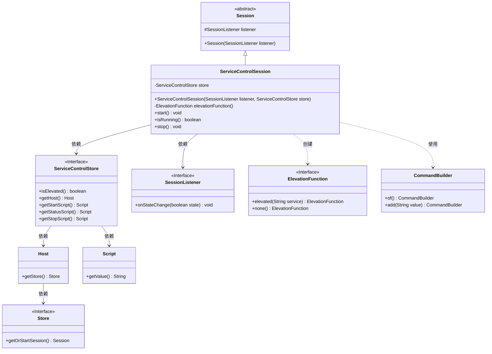
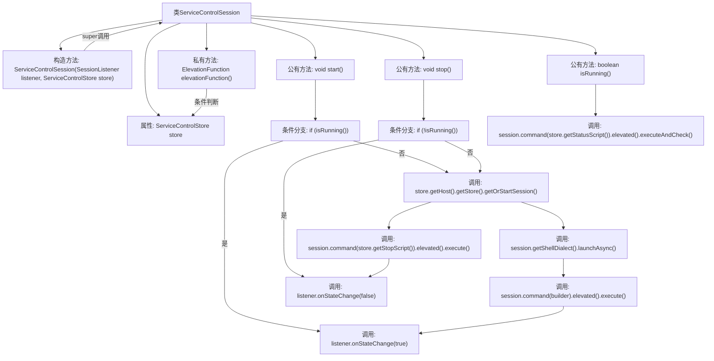

# 基础信息

|      |      |
|------|------|
| 名称 | ServiceControlSession |
| 编码语言 | .java |
| 代码路径 | xpipe/ext/base/src/main/java/io/xpipe/ext/base/service/ServiceControlSession.java |
| 包名 | io.xpipe.ext.base.service |
| 依赖项 | ['io.xpipe.core.process.CommandBuilder', 'io.xpipe.core.process.ElevationFunction', 'io.xpipe.core.store.Session', 'io.xpipe.core.store.SessionListener', 'lombok.Getter'] |
| 概述说明 | ServiceControlSession管理服务启停，检查状态并通知状态变更。 |

# 说明

ServiceControlSession类继承自Session，用于管理服务控制会话。它包含一个ServiceControlStore实例，通过构造器注入。类提供了三个核心方法：start()启动服务（若未运行则执行启动脚本并提升权限），isRunning()检查服务状态，stop()停止服务（若运行则执行停止脚本）。所有操作均通过会话执行命令，并根据权限需求调用elevationFunction()进行权限提升，状态变更通过listener回调通知。

# 类列表 Class Summary

| 名称   | 类型  | 说明 |
|-------|------|-------------|
| ServiceControlSession | class | ServiceControlSession类管理服务状态，含启动、停止和运行检查功能，依赖ServiceControlStore和权限提升。 |

## 类 ServiceControlSession

|      |      |
|------|------|
| 访问范围 | @Getter;public |
| 类型 | class |
| 名称 | ServiceControlSession |
| 说明 | ServiceControlSession类管理服务状态，含启动、停止和运行检查功能，依赖ServiceControlStore和权限提升。 |

### UML类图

类图描述：该图展示了ServiceControlSession类继承自抽象类Session，并依赖于ServiceControlStore接口和SessionListener接口。ServiceControlStore进一步依赖Host和Script类，Host又依赖Store接口。ServiceControlSession通过elevationFunction()方法创建ElevationFunction对象，并在start()、isRunning()和stop()方法中使用CommandBuilder来构建和执行命令。整个结构体现了服务控制会话的核心功能及其与周边组件的交互关系。

### 内部方法调用关系图

流程图描述了ServiceControlSession类的核心逻辑结构，包含构造方法初始化、权限提升函数选择、服务启动/停止/状态检查三个主要操作。通过store属性与远程主机交互，使用elevationFunction()动态决定命令执行权限级别，所有操作均会触发listener状态变更回调。关键路径包括：启动时检查运行状态避免重复启动，停止前验证服务状态，状态检查通过执行脚本并验证返回结果。

### 字段列表 Field List

| 名称  | 类型  | 说明 |
|-------|-------|------|
| store | ServiceControlStore | 私有ServiceControlStore存储实例 |

### 方法列表 Method List

| 名称  | 类型  | 说明 |
|-------|-------|------|
| isRunning | boolean | 检查服务运行状态并返回结果。 |
| start | void | 方法检查运行状态，未运行则启动会话并执行脚本，通知状态变更。 |
| elevationFunction | ElevationFunction | 私有方法返回权限状态：若已提升则返回"service"权限，否则无权限。 |
| stop | void | 停止服务时检查运行状态，未运行则通知状态变更；运行中则执行停止脚本并通知状态变更。 |

