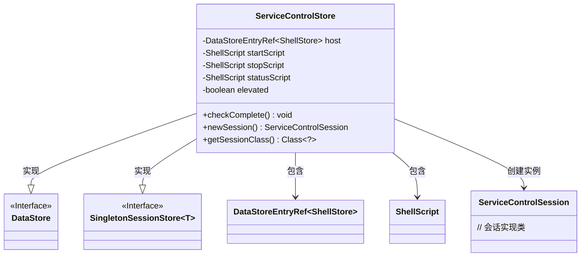
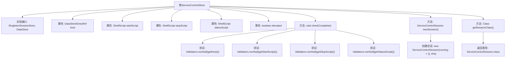

# 基础信息

|      |      |
|------|------|
| 名称 | ServiceControlStore |
| 编码语言 | .java |
| 代码路径 | xpipe/ext/base/src/main/java/io/xpipe/ext/base/service/ServiceControlStore.java |
| 包名 | io.xpipe.ext.base.service |
| 依赖项 | ['io.xpipe.app.ext.ShellStore', 'io.xpipe.app.storage.DataStoreEntryRef', 'io.xpipe.app.util.Validators', 'io.xpipe.core.process.ShellScript', 'io.xpipe.core.store.DataStore', 'io.xpipe.core.store.SingletonSessionStore', 'com.fasterxml.jackson.annotation.JsonTypeName', 'lombok.Value', 'lombok.experimental.SuperBuilder', 'lombok.extern.jackson.Jacksonized'] |
| 概述说明 | ServiceControlStore类实现SingletonSessionStore接口，包含主机、启停状态脚本及权限检查。 |

# 说明

该内容定义了一个名为ServiceControlStore的Java类，实现了SingletonSessionStore和DataStore接口。类包含host、startScript、stopScript、statusScript和elevated等字段，用于存储服务控制相关配置。类中实现了checkComplete方法，用于验证关键字段非空；newSession方法创建ServiceControlSession实例；getSessionClass方法返回会话类类型。类使用了SuperBuilder、Value等注解，支持JSON序列化。

# 类列表 Class Summary

| 名称   | 类型  | 说明 |
|-------|------|-------------|
| ServiceControlStore | class | ServiceControlStore类实现服务控制存储，含主机引用、启停状态脚本及权限检查。 |

## 类 ServiceControlStore

|      |      |
|------|------|
| 访问范围 | @SuperBuilder;@Value;@JsonTypeName("serviceControl");@Jacksonized;public |
| 类型 | class |
| 名称 | ServiceControlStore |
| 说明 | ServiceControlStore类实现服务控制存储，含主机引用、启停状态脚本及权限检查。 |

### UML类图

该代码定义了一个服务控制存储类`ServiceControlStore`，实现了`DataStore`和泛型接口`SingletonSessionStore<ServiceControlSession>`。类包含主机引用、启动/停止/状态脚本等核心字段，通过`checkComplete()`验证必填字段，`newSession()`创建服务控制会话。类图清晰展示了实现关系、组合关系以及泛型接口的应用，体现了服务控制存储的核心职责和依赖关系。

### 内部方法调用关系图

这段代码定义了一个名为`ServiceControlStore`的类，实现了`SingletonSessionStore`和`DataStore`接口。类中包含多个属性如`host`、`startScript`等，以及三个主要方法：`checkComplete()`用于验证非空属性，`newSession()`创建新的服务控制会话，`getSessionClass()`返回会话类类型。流程图清晰地展示了类结构、属性与方法的关系，以及方法内部的验证逻辑和返回值路径。

### 字段列表 Field List

| 名称  | 类型  | 说明 |
|-------|-------|------|
| elevated | boolean | 布尔变量elevated |
| startScript | ShellScript | Shell脚本启动脚本 |
| statusScript | ShellScript | Shell脚本状态检查 |
| stopScript | ShellScript | Shell脚本停止命令。 |
| host | DataStoreEntryRef<ShellStore> | 存储ShellStore引用的数据项host。 |

### 方法列表 Method List

| 名称  | 类型  | 说明 |
|-------|-------|------|
| checkComplete | void | 检查非空：主机、启动、停止、状态脚本。 |
| newSession | ServiceControlSession | 重写newSession方法，返回带回调的ServiceControlSession实例。 |
| getSessionClass | Class<?> | 重写方法返回ServiceControlSession类。 |

