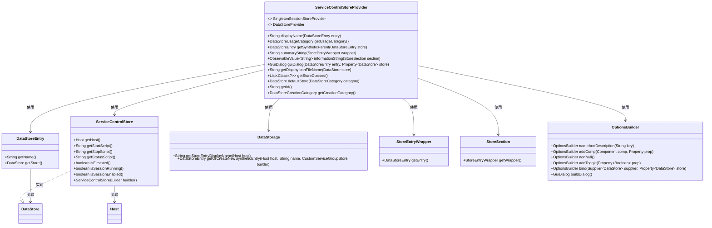
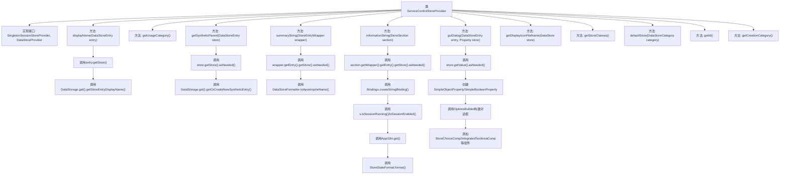

# 基础信息

|      |      |
|------|------|
| 名称 | ServiceControlStoreProvider |
| 编码语言 | .java |
| 代码路径 | xpipe/ext/base/src/main/java/io/xpipe/ext/base/service/ServiceControlStoreProvider.java |
| 包名 | io.xpipe.ext.base.service |
| 依赖项 | ['io.xpipe.app.comp.base.IntegratedTextAreaComp', 'io.xpipe.app.comp.store', 'io.xpipe.app.core.AppI18n', 'io.xpipe.app.ext', 'io.xpipe.app.prefs.AppPrefs', 'io.xpipe.app.storage.DataStorage', 'io.xpipe.app.storage.DataStoreCategory', 'io.xpipe.app.storage.DataStoreEntry', 'io.xpipe.app.util.DataStoreFormatter', 'io.xpipe.app.util.OptionsBuilder', 'io.xpipe.app.util.StoreStateFormat', 'io.xpipe.core.store.DataStore', 'javafx.beans.binding.Bindings', 'javafx.beans.property.Property', 'javafx.beans.property.SimpleBooleanProperty', 'javafx.beans.property.SimpleObjectProperty', 'javafx.beans.value.ObservableValue', 'java.util.List'] |
| 概述说明 | ServiceControlStoreProvider实现数据存储接口，管理服务控制存储的显示、分类和对话框配置。 |

# 说明

ServiceControlStoreProvider是一个实现SingletonSessionStoreProvider和DataStoreProvider接口的类，主要用于管理服务控制存储。它提供了显示名称、使用类别、合成父项获取、摘要字符串、信息字符串等功能。该类还包含创建GUI对话框的方法，用于配置服务主机、启动脚本、停止脚本、状态脚本和权限提升等属性。此外，它还定义了存储类的类型、默认存储、唯一标识符和创建类别等元数据信息。

# 类列表 Class Summary

| 名称   | 类型  | 说明 |
|-------|------|-------------|
| ServiceControlStoreProvider | class | ServiceControlStoreProvider实现数据存储接口，管理服务控制配置，包括脚本、主机和状态显示。 |

## 类 ServiceControlStoreProvider

|      |      |
|------|------|
| 访问范围 | public |
| 类型 | class |
| 名称 | ServiceControlStoreProvider |
| 说明 | ServiceControlStoreProvider实现数据存储接口，管理服务控制配置，包括脚本、主机和状态显示。 |

### UML类图

该代码展示了一个服务控制存储提供者(ServiceControlStoreProvider)的实现，它同时实现了SingletonSessionStoreProvider和DataStoreProvider两个接口。这个类主要负责管理服务控制存储的相关操作，包括显示名称处理、使用类别获取、创建合成父条目、生成摘要信息、构建GUI对话框等。它与多个其他类如DataStoreEntry、ServiceControlStore、DataStorage等协作，共同完成服务控制存储的管理功能。类图清晰地展示了这些类之间的关系和依赖。

### 内部方法调用关系图

该流程图展示了ServiceControlStoreProvider类的完整结构，它是一个实现了两个接口的服务控制存储提供者。类中包含11个核心方法，主要功能包括：显示名称处理、使用类别获取、合成父条目创建、摘要信息生成、状态信息绑定、GUI对话框构建、图标文件获取、存储类列表提供等。关键方法如guiDialog()展示了复杂的对话框构建流程，而informationString()则演示了多语言状态绑定的处理逻辑。所有方法都围绕ServiceControlStore的核心操作展开，体现了存储管理的完整生命周期。

### 字段列表 Field List

| 名称  | 类型  | 说明 |
|-------|-------|------|

### 方法列表 Method List

| 名称  | 类型  | 说明 |
|-------|-------|------|
| getStoreClasses | List<Class<?>> | 重写方法返回ServiceControlStore类列表。 |
| getSyntheticParent | DataStoreEntry | 重写方法，获取或创建合成数据存储条目，基于主机和服务组构建。 |
| displayName | String | 方法返回条目名称和主机显示名组合的字符串。 |
| getDisplayIconFileName | String | 重写方法返回服务图标文件名"base:service_icon.svg"。 |
| guiDialog | GuiDialog | 创建服务控制对话框，包含主机、启停脚本、状态脚本和权限设置，绑定数据存储。 |
| summaryString | String | 重写summaryString方法，返回主机名加"service control"。 |
| informationString | ObservableValue<String> | 重写方法返回可观察字符串，根据会话状态显示"active"、"starting"或"inactive"，依赖缓存和语言设置。 |
| getUsageCategory | DataStoreUsageCategory | 重写方法返回数据存储使用类别为隧道。 |
| defaultStore | DataStore | 重写方法，返回ServiceControlStore实例。 |
| getId | String | 重写getId方法，返回serviceControl字符串。 |
| getCreationCategory | DataStoreCreationCategory | 重写方法返回数据存储创建类别为服务类型。 |

