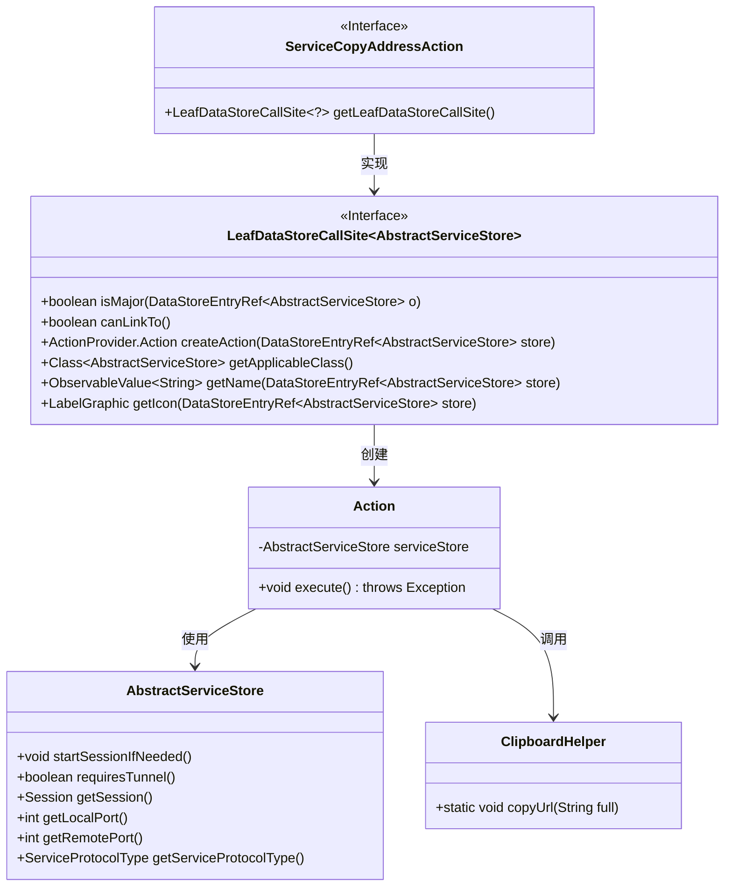
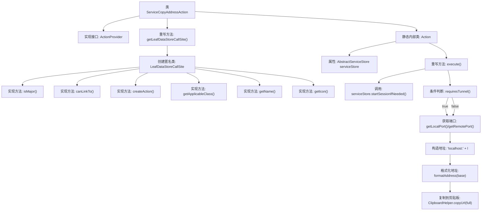

# 基础信息

|      |      |
|------|------|
| 名称 | ServiceCopyAddressAction |
| 编码语言 | .java |
| 代码路径 | xpipe/ext/base/src/main/java/io/xpipe/ext/base/service/ServiceCopyAddressAction.java |
| 包名 | io.xpipe.ext.base.service |
| 依赖项 | ['io.xpipe.app.core.AppI18n', 'io.xpipe.app.ext.ActionProvider', 'io.xpipe.app.storage.DataStoreEntryRef', 'io.xpipe.app.util.ClipboardHelper', 'io.xpipe.app.util.LabelGraphic', 'javafx.beans.value.ObservableValue', 'lombok.Value'] |
| 概述说明 | 服务地址复制动作类，实现ActionProvider接口，提供复制服务地址功能。 |

# 说明

这是一个实现地址复制功能的Java类。ServiceCopyAddressAction类实现了ActionProvider接口，提供了获取数据存储调用站点的方法。内部定义了LeafDataStoreCallSite类，包含判断主存储、创建动作、获取名称和图标等方法。静态Action类实现了具体执行逻辑：检查服务存储会话，获取本地或远程端口，拼接地址字符串并复制到剪贴板。整个过程支持国际化显示和多协议地址格式化。

# 类列表 Class Summary

| 名称   | 类型  | 说明 |
|-------|------|-------------|
| ServiceCopyAddressAction | class | 服务复制地址动作类，实现ActionProvider接口，提供复制服务地址功能。 |

## 类 ServiceCopyAddressAction

|      |      |
|------|------|
| 访问范围 | public |
| 类型 | class |
| 名称 | ServiceCopyAddressAction |
| 说明 | 服务复制地址动作类，实现ActionProvider接口，提供复制服务地址功能。 |

### UML类图

这段代码展示了一个服务复制地址动作的实现结构。ServiceCopyAddressAction实现了ActionProvider接口，通过内部类LeafDataStoreCallSite提供数据存储调用点，并生成具体的Action操作。Action类负责执行核心逻辑：根据服务存储状态获取端口信息，构建完整地址后通过ClipboardHelper复制到剪贴板。整个设计采用分层结构，通过接口隔离实现细节，体现了良好的扩展性和模块化思想。

### 内部方法调用关系图

这段代码流程图展示了ServiceCopyAddressAction类的完整结构和工作流程。主类实现ActionProvider接口并重写getLeafDataStoreCallSite方法，该方法返回一个包含6个具体实现的匿名类。静态内部类Action通过execute方法实现核心逻辑：启动会话、动态获取端口、构造服务地址并复制到剪贴板。整个设计采用策略模式，通过匿名类和内部类实现不同层级的操作封装，特别注重会话管理和地址格式化的异常处理。

### 字段列表 Field List

| 名称  | 类型  | 说明 |
|-------|-------|------|

### 方法列表 Method List

| 名称  | 类型  | 说明 |
|-------|-------|------|
| getLeafDataStoreCallSite | LeafDataStoreCallSite<?> | 重写方法返回自定义LeafDataStoreCallSite，实现数据存储操作和UI交互。 |

