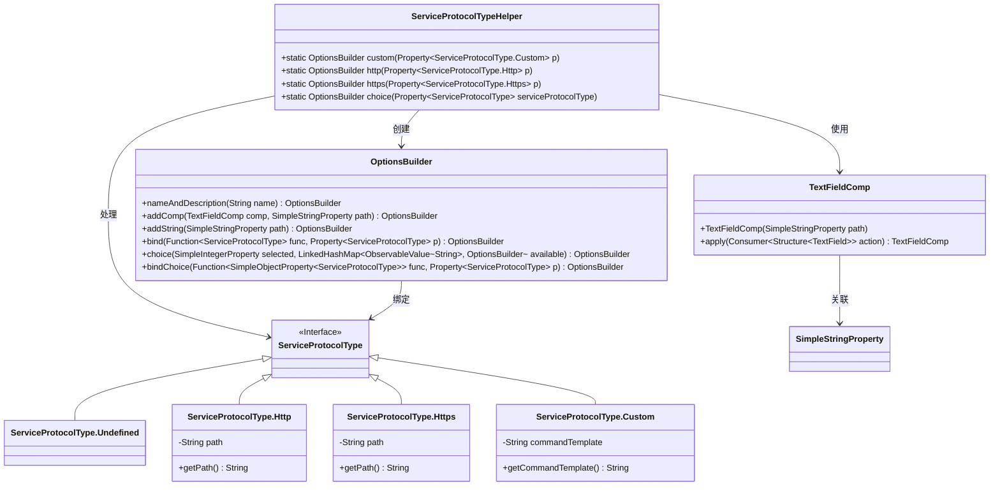
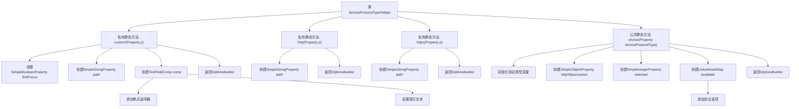

# 基础信息

|      |      |
|------|------|
| 名称 | ServiceProtocolTypeHelper |
| 编码语言 | .java |
| 代码路径 | xpipe/ext/base/src/main/java/io/xpipe/ext/base/service/ServiceProtocolTypeHelper.java |
| 包名 | io.xpipe.ext.base.service |
| 依赖项 | ['io.xpipe.app.comp.base.TextFieldComp', 'io.xpipe.app.core.AppI18n', 'io.xpipe.app.util.OptionsBuilder', 'javafx.beans.property', 'javafx.beans.value.ObservableValue', 'java.util.LinkedHashMap'] |
| 概述说明 | ServiceProtocolTypeHelper类提供HTTP、HTTPS和自定义协议选项构建功能。 |

# 说明

该代码定义了一个ServiceProtocolTypeHelper类，用于处理不同服务协议类型的配置。包含三个静态方法：custom处理自定义协议，http和https分别处理HTTP/HTTPS协议路径。choice方法提供协议类型选择功能，支持未定义、HTTP、HTTPS和自定义四种选项。通过OptionsBuilder构建配置界面，绑定属性值并处理用户选择。代码使用属性绑定和观察者模式实现动态更新，包含焦点控制、文本提示等交互细节。

# 类列表 Class Summary

| 名称   | 类型  | 说明 |
|-------|------|-------------|
| ServiceProtocolTypeHelper | class | Java类实现服务协议类型选择器，支持HTTP、HTTPS和自定义命令配置。 |

## 类 ServiceProtocolTypeHelper

|      |      |
|------|------|
| 访问范围 | public |
| 类型 | class |
| 名称 | ServiceProtocolTypeHelper |
| 说明 | Java类实现服务协议类型选择器，支持HTTP、HTTPS和自定义命令配置。 |

### UML类图

该代码实现了一个服务协议类型帮助类，通过OptionsBuilder动态构建不同协议类型的配置选项。核心是ServiceProtocolTypeHelper类，提供custom/http/https三种协议类型的构建方法，以及一个choice方法整合所有选项。通过Property和ObservableValue实现数据绑定，使用策略模式处理不同协议类型的转换。类图展示了与OptionsBuilder、TextFieldComp等组件的协作关系，以及ServiceProtocolType接口的四种实现类。

### 内部方法调用关系图

这段代码是ServiceProtocolTypeHelper类的实现，主要用于处理不同类型的服务协议配置。它包含三个私有静态方法(custom/http/https)用于构建特定协议类型的配置选项，以及一个公共静态方法choice用于提供协议类型选择功能。流程图展示了类结构和方法调用关系，从主类到各个方法的调用路径，以及方法内部的关键步骤。custom方法处理自定义命令协议，http和https方法分别处理HTTP/HTTPS协议，choice方法整合所有协议选项并提供绑定功能。

### 字段列表 Field List

| 名称  | 类型  | 说明 |
|-------|-------|------|

### 方法列表 Method List

| 名称  | 类型  | 说明 |
|-------|-------|------|
| http | OptionsBuilder | 私有方法http构建HTTP选项，绑定路径属性并返回OptionsBuilder实例。 |
| custom | OptionsBuilder | 静态方法创建自定义服务协议选项，绑定路径属性并处理焦点事件。 |
| https | OptionsBuilder | 静态方法https创建OptionsBuilder，绑定HTTPS路径属性。 |
| choice | OptionsBuilder | 根据服务协议类型创建选项构建器，包含HTTP、HTTPS和自定义选项。 |

