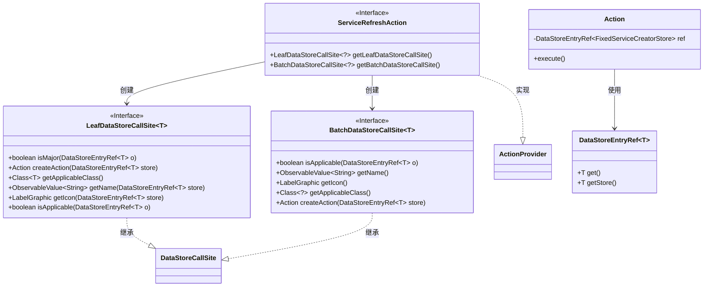
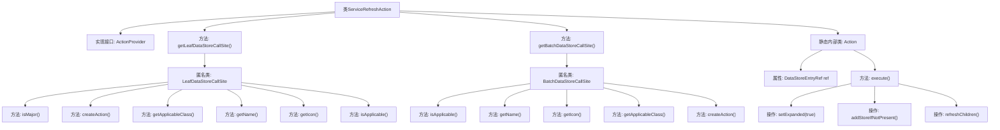

# 基础信息

|      |      |
|------|------|
| 名称 | ServiceRefreshAction |
| 编码语言 | .java |
| 代码路径 | xpipe/ext/base/src/main/java/io/xpipe/ext/base/service/ServiceRefreshAction.java |
| 包名 | io.xpipe.ext.base.service |
| 依赖项 | ['io.xpipe.app.core.AppI18n', 'io.xpipe.app.ext.ActionProvider', 'io.xpipe.app.storage.DataStorage', 'io.xpipe.app.storage.DataStoreEntryRef', 'io.xpipe.app.util.LabelGraphic', 'javafx.beans.value.ObservableValue', 'lombok.Value'] |
| 概述说明 | 实现服务刷新的ActionProvider类，包含单例和批量操作逻辑。 |

# 说明

该代码定义了一个名为ServiceRefreshAction的类，实现了ActionProvider接口，用于刷新服务数据。它包含两个主要方法：getLeafDataStoreCallSite和getBatchDataStoreCallSite，分别返回针对单个和批量数据存储的操作配置。这两个方法创建的CallSite都检查是否允许手动刷新服务，并提供了名称、图标和操作创建功能。内部Action类执行具体刷新逻辑：展开服务节点，添加服务组存储，并刷新子节点。所有操作都基于FixedServiceCreatorStore类，使用国际化文本和特定图标标识。

# 类列表 Class Summary

| 名称   | 类型  | 说明 |
|-------|------|-------------|
| ServiceRefreshAction | class | ServiceRefreshAction实现ActionProvider，提供刷新服务功能。 |

## 类 ServiceRefreshAction

|      |      |
|------|------|
| 访问范围 | public |
| 类型 | class |
| 名称 | ServiceRefreshAction |
| 说明 | ServiceRefreshAction实现ActionProvider，提供刷新服务功能。 |

### UML类图

该类图展示了ServiceRefreshAction作为ActionProvider接口的实现类，它通过创建LeafDataStoreCallSite和BatchDataStoreCallSite来处理数据存储操作。Action内部类负责执行具体的刷新服务操作，涉及对FixedServiceCreatorStore类型数据的处理。图中清晰地呈现了接口继承关系、泛型参数传递以及类之间的依赖关系，体现了模块化设计思想。

### 内部方法调用关系图

流程图描述：
该流程图展示了ServiceRefreshAction类的完整结构，该类实现了ActionProvider接口。主要包含两个核心方法：getLeafDataStoreCallSite()和getBatchDataStoreCallSite()，它们分别返回匿名内部类实现。每个匿名类都包含多个重写方法，如isApplicable()、createAction()等。静态内部类Action包含关键执行逻辑execute()，其中会进行服务扩展状态设置、存储添加和子节点刷新等操作。整体结构清晰地反映了服务刷新动作的完整生命周期和调用关系。

### 字段列表 Field List

| 名称  | 类型  | 说明 |
|-------|-------|------|

### 方法列表 Method List

| 名称  | 类型  | 说明 |
|-------|-------|------|
| getLeafDataStoreCallSite | LeafDataStoreCallSite<?> | 重写方法返回自定义LeafDataStoreCallSite，处理FixedServiceCreatorStore相关操作。 |
| getBatchDataStoreCallSite | BatchDataStoreCallSite<?> | 重写方法返回批处理数据存储调用点，检查适用性并提供名称、图标和操作。 |

