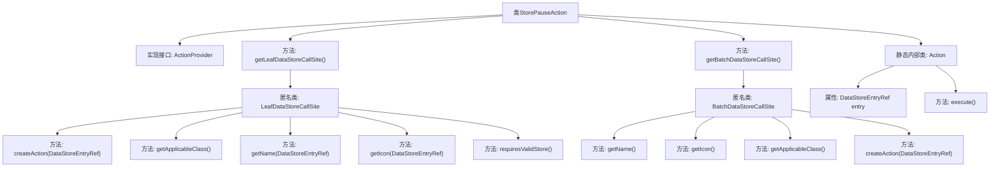

# 基础信息

|      |      |
|------|------|
| 名称 | StorePauseAction |
| 编码语言 | .java |
| 代码路径 | xpipe/ext/base/src/main/java/io/xpipe/ext/base/store/StorePauseAction.java |
| 包名 | io.xpipe.ext.base.store |
| 依赖项 | ['io.xpipe.app.core.AppI18n', 'io.xpipe.app.ext.ActionProvider', 'io.xpipe.app.storage.DataStoreEntryRef', 'io.xpipe.app.util.LabelGraphic', 'javafx.beans.value.ObservableValue', 'lombok.Value'] |
| 概述说明 | 实现暂停功能的ActionProvider类，支持单例和批量操作。 |

# 说明

该代码定义了一个名为StorePauseAction的类，实现了ActionProvider接口，用于暂停PauseableStore类型的存储实例。它提供了两种调用方式：单条操作（LeafDataStoreCallSite）和批量操作（BatchDataStoreCallSite）。两种方式都返回包含暂停功能、名称（"pause"）、图标（mdi2p-pause）和适用类（PauseableStore）的调用站点。执行操作时调用PauseableStore的pause方法。单条操作不要求存储必须有效。内部Action类封装了具体的暂停逻辑。

# 类列表 Class Summary

| 名称   | 类型  | 说明 |
|-------|------|-------------|
| StorePauseAction | class | 实现暂停功能的存储操作类，支持单例和批量操作。 |


## 类 StorePauseAction

|      |      |
|------|------|
| 访问范围 | public |
| 类型 | class |
| 名称 | StorePauseAction |
| 说明 | 实现暂停功能的存储操作类，支持单例和批量操作。 |


### UML类图

```mermaid
classDiagram
    class StorePauseAction {
        +LeafDataStoreCallSite~?~ getLeafDataStoreCallSite()
        +BatchDataStoreCallSite~?~ getBatchDataStoreCallSite()
    }

    class Action {
        -DataStoreEntryRef~PauseableStore~ entry
        +execute() void
    }

    <<Interface>> ActionProvider {
        <<Interface>>
        +LeafDataStoreCallSite~?~ getLeafDataStoreCallSite()
        +BatchDataStoreCallSite~?~ getBatchDataStoreCallSite()
    }

    <<Interface>> LeafDataStoreCallSite~T~ {
        <<Interface>>
        +Action createAction(DataStoreEntryRef~T~ store) Action
        +Class~T~ getApplicableClass() Class
        +ObservableValue~String~ getName(DataStoreEntryRef~T~ store) ObservableValue
        +LabelGraphic getIcon(DataStoreEntryRef~T~ store) LabelGraphic
        +boolean requiresValidStore() boolean
    }

    <<Interface>> BatchDataStoreCallSite~T~ {
        <<Interface>>
        +ObservableValue~String~ getName() ObservableValue
        +LabelGraphic getIcon() LabelGraphic
        +Class~?~ getApplicableClass() Class
        +Action createAction(DataStoreEntryRef~T~ store) Action
    }

    <<Interface>> DataStoreEntryRef~T~ {
        <<Interface>>
        +T getStore() T
    }

    <<Interface>> PauseableStore {
        <<Interface>>
        +pause() void
    }

    StorePauseAction ..|> ActionProvider : 实现
    Action ..> DataStoreEntryRef~PauseableStore~ : 依赖
    StorePauseAction ..> LeafDataStoreCallSite~PauseableStore~ : 创建匿名类
    StorePauseAction ..> BatchDataStoreCallSite~PauseableStore~ : 创建匿名类
    LeafDataStoreCallSite~PauseableStore~ ..> Action : 创建
    BatchDataStoreCallSite~PauseableStore~ ..> Action : 创建
    Action ..> PauseableStore : 调用pause()
```

这段代码展示了一个实现暂停功能的存储操作架构。StorePauseAction类实现了ActionProvider接口，提供了对可暂停存储(PauseableStore)的单个和批量操作支持。通过匿名内部类实现了LeafDataStoreCallSite和BatchDataStoreCallSite接口，两者都创建Action实例来执行暂停操作。Action类通过DataStoreEntryRef获取存储实例并调用其pause()方法。整个设计采用了工厂模式和策略模式，支持灵活的操作创建和执行。


### 内部方法调用关系图



这段代码流程图展示了StorePauseAction类的完整结构，该类实现了ActionProvider接口，包含两个核心方法getLeafDataStoreCallSite和getBatchDataStoreCallSite，分别返回不同的匿名内部类实现。每个匿名类都实现了特定接口方法，如创建动作、获取名称、图标等。静态内部类Action封装了暂停操作的具体执行逻辑，通过entry引用调用pause方法。整体结构清晰地分离了单例和批量操作的处理逻辑。

### 字段列表 Field List

| 名称  | 类型  | 说明 |
|-------|-------|------|

### 方法列表 Method List

| 名称  | 类型  | 说明 |
|-------|-------|------|
| getBatchDataStoreCallSite | BatchDataStoreCallSite<?> | 重写方法返回可暂停存储的批处理调用点，包含名称、图标、适用类和动作创建。 |
| getLeafDataStoreCallSite | LeafDataStoreCallSite<?> | 重写方法返回可暂停存储的调用站点，包含创建动作、类名、名称、图标及有效性要求。 |


