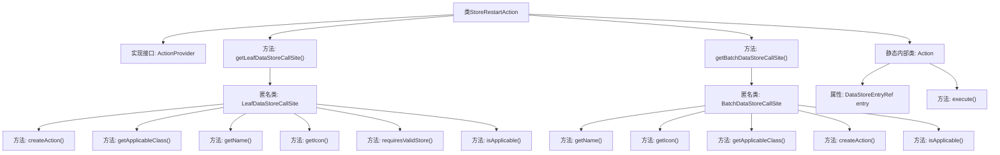

# 基础信息

|      |      |
|------|------|
| 名称 | StoreRestartAction |
| 编码语言 | .java |
| 代码路径 | xpipe/ext/base/src/main/java/io/xpipe/ext/base/store/StoreRestartAction.java |
| 包名 | io.xpipe.ext.base.store |
| 依赖项 | ['io.xpipe.app.core.AppI18n', 'io.xpipe.app.ext.ActionProvider', 'io.xpipe.app.storage.DataStoreEntryRef', 'io.xpipe.app.util.LabelGraphic', 'io.xpipe.core.store.DataStore', 'javafx.beans.value.ObservableValue', 'lombok.Value'] |
| 概述说明 | 实现重启商店操作的ActionProvider类，支持单例和批量操作，需商店实现StartableStore和StoppableStore接口。 |

# 说明

该代码定义了一个名为StoreRestartAction的类，实现了ActionProvider接口，用于提供重启数据存储的功能。类中包含两个主要方法：getLeafDataStoreCallSite和getBatchDataStoreCallSite，分别返回针对单个和批量数据存储的操作调用点。操作调用点定义了名称、图标、适用条件等属性，并创建具体的Action实例。Action类实现了执行逻辑，先停止再启动存储。适用条件要求存储同时实现StartableStore和StoppableStore接口。整个设计支持国际化和统一的图标显示。

# 类列表 Class Summary

| 名称   | 类型  | 说明 |
|-------|------|-------------|
| StoreRestartAction | class | 实现数据存储重启操作的ActionProvider类，包含单例和批量操作支持。 |


## 类 StoreRestartAction

|      |      |
|------|------|
| 访问范围 | public |
| 类型 | class |
| 名称 | StoreRestartAction |
| 说明 | 实现数据存储重启操作的ActionProvider类，包含单例和批量操作支持。 |


### UML类图

```mermaid
classDiagram
    class StoreRestartAction {
        +LeafDataStoreCallSite~?~ getLeafDataStoreCallSite()
        +BatchDataStoreCallSite~?~ getBatchDataStoreCallSite()
    }

    class Action {
        -DataStoreEntryRef~DataStore~ entry
        +execute() void
    }

    <<Interface>> ActionProvider {
        <<Interface>>
        +LeafDataStoreCallSite~?~ getLeafDataStoreCallSite()
        +BatchDataStoreCallSite~?~ getBatchDataStoreCallSite()
    }

    <<Interface>> LeafDataStoreCallSite~T~ {
        <<Interface>>
        +Action createAction(DataStoreEntryRef~DataStore~ store) Action
        +Class~DataStore~ getApplicableClass()
        +ObservableValue~String~ getName(DataStoreEntryRef~DataStore~ store)
        +LabelGraphic getIcon(DataStoreEntryRef~DataStore~ store)
        +boolean requiresValidStore()
        +boolean isApplicable(DataStoreEntryRef~DataStore~ o)
    }

    <<Interface>> BatchDataStoreCallSite~T~ {
        <<Interface>>
        +ObservableValue~String~ getName()
        +LabelGraphic getIcon()
        +Class~?~ getApplicableClass()
        +Action createAction(DataStoreEntryRef~DataStore~ store)
        +boolean isApplicable(DataStoreEntryRef~DataStore~ o)
    }

    <<Interface>> DataStore {
        <<Interface>>
    }

    <<Interface>> StartableStore {
        <<Interface>>
        +start() void
    }

    <<Interface>> StoppableStore {
        <<Interface>>
        +stop() void
    }

    StoreRestartAction ..|> ActionProvider : 实现
    ActionProvider --> LeafDataStoreCallSite : 依赖
    ActionProvider --> BatchDataStoreCallSite : 依赖
    LeafDataStoreCallSite --> DataStoreEntryRef : 依赖
    BatchDataStoreCallSite --> DataStoreEntryRef : 依赖
    Action --> DataStoreEntryRef : 依赖
    Action --> StoppableStore : 依赖
    Action --> StartableStore : 依赖
    DataStoreEntryRef --> DataStore : 依赖
    StartableStore --|> DataStore : 继承
    StoppableStore --|> DataStore : 继承
```

这段代码展示了一个商店重启动作的实现类`StoreRestartAction`，它实现了`ActionProvider`接口，提供了对数据存储的单个和批量重启操作支持。通过匿名内部类实现了`LeafDataStoreCallSite`和`BatchDataStoreCallSite`接口，定义了重启动作的具体行为。核心功能由内部类`Action`完成，它通过调用`StoppableStore`和`StartableStore`接口的方法实现重启逻辑。整个设计采用了多种接口和泛型，体现了良好的扩展性和类型安全性。


### 内部方法调用关系图



该流程图展示了StoreRestartAction类的完整结构，包含两个核心方法getLeafDataStoreCallSite和getBatchDataStoreCallSite，它们分别返回匿名类实现。这两个匿名类都提供了创建动作、获取名称/图标、验证适用性等功能。静态内部类Action实现了具体的重启逻辑，通过先停止再启动的方式执行操作。整体设计符合ActionProvider接口规范，适用于可启动和可停止的存储类型。

### 字段列表 Field List

| 名称  | 类型  | 说明 |
|-------|-------|------|

### 方法列表 Method List

| 名称  | 类型  | 说明 |
|-------|-------|------|
| getBatchDataStoreCallSite | BatchDataStoreCallSite<?> | 重写方法返回重启数据存储的调用点，包含名称、图标、适用类、创建动作及适用条件。 |
| getLeafDataStoreCallSite | LeafDataStoreCallSite<?> | 重写方法返回自定义LeafDataStoreCallSite，定义动作创建、适用类、名称、图标及适用条件。 |


