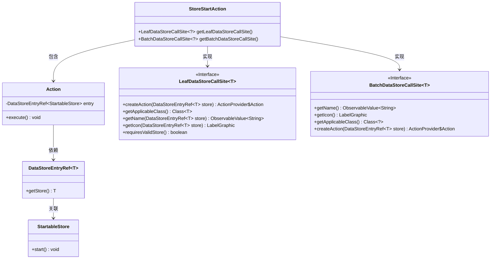
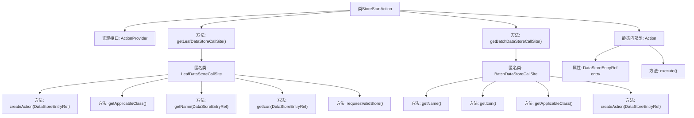

# 基础信息

|      |      |
|------|------|
| 名称 | StoreStartAction |
| 编码语言 | .java |
| 代码路径 | xpipe/ext/base/src/main/java/io/xpipe/ext/base/store/StoreStartAction.java |
| 包名 | io.xpipe.ext.base.store |
| 依赖项 | ['io.xpipe.app.core.AppI18n', 'io.xpipe.app.ext.ActionProvider', 'io.xpipe.app.storage.DataStoreEntryRef', 'io.xpipe.app.util.LabelGraphic', 'javafx.beans.value.ObservableValue', 'lombok.Value'] |
| 概述说明 | 实现启动商店操作的ActionProvider类，包含单例和批量操作逻辑。 |

# 说明

该代码定义了一个名为StoreStartAction的类，实现了ActionProvider接口，用于启动StartableStore类型的存储。它提供了两个调用站点方法：getLeafDataStoreCallSite处理单个存储操作，getBatchDataStoreCallSite处理批量操作。两者都返回启动操作的名称、图标和适用类，并创建执行启动的动作。内部Action类通过调用entry.getStore().start()执行实际启动操作。关键特性包括支持无效存储、国际化名称和Material Design图标。

# 类列表 Class Summary

| 名称   | 类型  | 说明 |
|-------|------|-------------|
| StoreStartAction | class | StoreStartAction实现ActionProvider，提供启动StartableStore的单例和批量操作，包含名称、图标和执行逻辑。 |

## 类 StoreStartAction

|      |      |
|------|------|
| 访问范围 | public |
| 类型 | class |
| 名称 | StoreStartAction |
| 说明 | StoreStartAction实现ActionProvider，提供启动StartableStore的单例和批量操作，包含名称、图标和执行逻辑。 |

### UML类图

这段代码展示了一个商店启动动作的实现结构。StoreStartAction类实现了ActionProvider接口，提供了两种调用站点：LeafDataStoreCallSite（单店操作）和BatchDataStoreCallSite（批量操作）。内部Action类封装了具体的启动逻辑，通过DataStoreEntryRef获取StartableStore实例并调用其start方法。整体设计采用了泛型和接口抽象，支持不同类型的商店启动操作，同时提供了国际化和图标支持。

### 内部方法调用关系图

这段代码展示了一个实现ActionProvider接口的StoreStartAction类，主要用于创建启动存储操作的动作。它包含两个核心方法：getLeafDataStoreCallSite()和getBatchDataStoreCallSite()，分别返回处理单个和批量操作的匿名类实例。这些匿名类实现了各种配置方法如获取名称、图标、适用类等。内部静态类Action封装了具体的执行逻辑，通过entry引用调用start()方法。整体设计采用了工厂模式和策略模式，支持灵活的动作创建和执行。

### 字段列表 Field List

| 名称  | 类型  | 说明 |
|-------|-------|------|

### 方法列表 Method List

| 名称  | 类型  | 说明 |
|-------|-------|------|
| getLeafDataStoreCallSite | LeafDataStoreCallSite<?> | 重写方法返回LeafDataStoreCallSite实例，定义创建动作、适用类、名称、图标及存储验证要求。 |
| getBatchDataStoreCallSite | BatchDataStoreCallSite<?> | 重写方法返回批处理数据存储调用点，包含名称、图标、适用类和创建操作。 |

