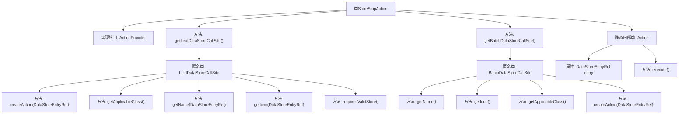

# 基础信息

|      |      |
|------|------|
| 名称 | StoreStopAction |
| 编码语言 | .java |
| 代码路径 | xpipe/ext/base/src/main/java/io/xpipe/ext/base/store/StoreStopAction.java |
| 包名 | io.xpipe.ext.base.store |
| 依赖项 | ['io.xpipe.app.core.AppI18n', 'io.xpipe.app.ext.ActionProvider', 'io.xpipe.app.storage.DataStoreEntryRef', 'io.xpipe.app.util.LabelGraphic', 'javafx.beans.value.ObservableValue', 'lombok.Value'] |
| 概述说明 | 实现StoppableStore停止操作的ActionProvider类，包含单例和批量处理逻辑。 |

# 说明

该代码定义了一个StoreStopAction类，实现ActionProvider接口，用于停止StoppableStore实例。它包含两个主要方法：getLeafDataStoreCallSite处理单个存储操作，getBatchDataStoreCallSite处理批量操作。两者都返回停止操作的相关配置，包括名称、图标和适用类。内部Action类执行实际的停止操作，通过entry.getStore().stop()实现。整个结构支持国际化文本和Material Design图标。

# 类列表 Class Summary

| 名称   | 类型  | 说明 |
|-------|------|-------------|
| StoreStopAction | class | StoreStopAction实现ActionProvider，提供停止StoppableStore的单例和批量操作，包含名称、图标和执行逻辑。 |


## 类 StoreStopAction

|      |      |
|------|------|
| 访问范围 | public |
| 类型 | class |
| 名称 | StoreStopAction |
| 说明 | StoreStopAction实现ActionProvider，提供停止StoppableStore的单例和批量操作，包含名称、图标和执行逻辑。 |


### UML类图

```mermaid
classDiagram
    class StoreStopAction {
        <<Interface>>
        +LeafDataStoreCallSite~?~ getLeafDataStoreCallSite()
        +BatchDataStoreCallSite~?~ getBatchDataStoreCallSite()
    }

    class LeafDataStoreCallSite~T~ {
        <<Interface>>
        +Action createAction(DataStoreEntryRef~T~ store)
        +Class~T~ getApplicableClass()
        +ObservableValue~String~ getName(DataStoreEntryRef~T~ store)
        +LabelGraphic getIcon(DataStoreEntryRef~T~ store)
        +boolean requiresValidStore()
    }

    class BatchDataStoreCallSite~T~ {
        <<Interface>>
        +ObservableValue~String~ getName()
        +LabelGraphic getIcon()
        +Class~?~ getApplicableClass()
        +Action createAction(DataStoreEntryRef~T~ store)
    }

    class Action {
        <<Interface>>
        +void execute()
    }

    class StoreStopAction$Action {
        -DataStoreEntryRef~StoppableStore~ entry
        +void execute()
    }

    StoreStopAction --> LeafDataStoreCallSite : 创建
    StoreStopAction --> BatchDataStoreCallSite : 创建
    StoreStopAction ..> StoreStopAction$Action : 包含
    LeafDataStoreCallSite <|.. StoreStopAction : 实现
    BatchDataStoreCallSite <|.. StoreStopAction : 实现
    Action <|.. StoreStopAction$Action : 实现
```

这段代码展示了一个StoreStopAction类，它实现了ActionProvider接口，提供了停止存储的功能。类图中包含5个主要组件：StoreStopAction作为主类，实现了两个泛型接口(LeafDataStoreCallSite和BatchDataStoreCallSite)来分别处理单个和批量操作，并通过内部静态类Action具体实现停止操作。整个设计采用了工厂模式创建不同的调用站点，并通过泛型保证类型安全，同时支持国际化和图标显示功能。


### 内部方法调用关系图



该流程图展示了StoreStopAction类的完整结构，它是一个实现了ActionProvider接口的类，主要提供两种数据存储调用站点（Leaf和Batch）。图中清晰呈现了匿名内部类的层级关系，以及静态内部类Action的执行流程。所有方法调用关系通过箭头连接，包括创建动作、获取类信息、名称/图标等UI元素的方法，最终聚焦到执行停止操作的核心功能。

### 字段列表 Field List

| 名称  | 类型  | 说明 |
|-------|-------|------|

### 方法列表 Method List

| 名称  | 类型  | 说明 |
|-------|-------|------|
| getBatchDataStoreCallSite | BatchDataStoreCallSite<?> | 重写方法返回可停止存储的批处理调用点，包含名称、图标、适用类和动作创建。 |
| getLeafDataStoreCallSite | LeafDataStoreCallSite<?> | 重写方法返回LeafDataStoreCallSite实例，定义停止存储操作的行为和属性。 |


