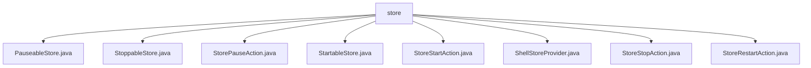

# 基础信息

|      |      |
|------|------|
| 名称 | store |
| 编码语言 | .java |
| 代码路径 | xpipe/ext/base/src/main/java/io/xpipe/ext/base/store |
| 包名 | xpipe.ext.base.src.main.java.io.xpipe.ext.base.store |
| 概述说明 | 暂停/启动/停止/重启存储操作类，实现ActionProvider接口，支持单条和批量操作，含名称、图标及执行逻辑。 |

# 说明

```markdown
## 概述
该代码模块主要提供了一套可扩展的存储管理基础功能，围绕`StartableStore`、`StoppableStore`和`PauseableStore`三类核心接口，实现了启动、停止、暂停和重启等基础存储操作。通过统一的`ActionProvider`接口设计，支持单条操作和批量操作两种执行模式，并集成国际化文本和Material Design图标体系。模块采用职责分离设计，将操作定义（如`StoreStartAction`）与存储行为实现解耦，便于扩展新的存储类型和操作。

## 主要业务场景
1. **存储生命周期管理**  
   - 启动存储：通过`StoreStartAction`调用`StartableStore.start()`，适用于初始化存储资源
   - 停止存储：通过`StoreStopAction`调用`StoppableStore.stop()`，用于释放存储资源
   - 暂停/恢复存储：通过`StorePauseAction`控制`PauseableStore`的临时状态切换
   - 重启存储：`StoreRestartAction`组合调用stop/start实现存储重启

2. **批量操作支持**  
   所有Action均提供`getBatchDataStoreCallSite()`方法，支持对多个同类型存储执行批量启停操作

3. **无效存储处理**  
   部分操作（如启动）允许在存储无效状态下执行，增强了异常场景的容错能力

4. **UI集成规范**  
   统一使用Material Design图标（如mdi2p-pause）和国际化名称，确保前端交互一致性

5. **扩展性设计**  
   - 新增存储类型只需实现对应接口（如`StoppableStore`）
   - 新增操作可通过实现`ActionProvider`快速集成
```


### 包内部结构视图



该流程图展示了xpipe项目中base模块下store目录的文件结构。根节点为store文件夹，其下直接包含8个Java类文件，包括PauseableStore、StoppableStore等实现类以及StorePauseAction、StoreStartAction等操作类。所有文件都位于同一层级，没有更深层次的嵌套结构，体现了该目录下扁平化的代码组织方式。

# 文件列表 File List

| 名称   | 类型  | 说明 |
|-------|------|-------------|
| [StoreStartAction.java](StoreStartAction.md) | file | 实现启动商店操作的ActionProvider类，包含单例和批量操作逻辑。 |
| [PauseableStore.java](PauseableStore.md) | file | 输入内容为空，无法生成概要。请提供具体信息。 |
| [StoreStopAction.java](StoreStopAction.md) | file | 实现StoppableStore停止操作的ActionProvider类，包含单例和批量处理逻辑。 |
| [ShellStoreProvider.java](ShellStoreProvider.md) | file | 输入内容为空，无法生成概要描述。请提供具体信息。 |
| [StartableStore.java](StartableStore.md) | file | 输入内容为空，无法生成概要描述。请提供具体信息以便总结。 |
| [StorePauseAction.java](StorePauseAction.md) | file | 实现暂停功能的ActionProvider类，支持单例和批量操作。 |
| [StoppableStore.java](StoppableStore.md) | file | 输入为空，无法生成概要。请提供具体内容。 |
| [StoreRestartAction.java](StoreRestartAction.md) | file | 实现重启商店操作的ActionProvider类，支持单例和批量操作，需商店实现StartableStore和StoppableStore接口。 |


