# 基础信息

|      |      |
|------|------|
| 名称 | io |
| 编码语言 | .java |
| 代码路径 | xpipe/ext/system/src/main/java/io |
| 包名 | xpipe.ext.system.src.main.java.io |
| 概述说明 | Java实现的LXD/Podman/Incus容器管理系统，支持生命周期管理、状态监控、配置编辑、控制台访问和自动发现功能。 |

# 说明

## 概述

该代码模块是一个基于Java实现的容器管理系统，包含对LXD、Podman和Incus三种容器技术的管理功能。模块采用分层架构设计，提供对容器的全生命周期管理能力，包括容器操作、状态监控、配置管理、控制台访问等功能。主要特点包括：

1. 支持多种容器技术（LXD/Podman/Incus）的统一管理
2. 提供完整的容器操作功能（启动/停止/暂停/重启）
3. 实现容器配置编辑和运行状态管理
4. 包含容器控制台访问和日志查看功能
5. 支持容器状态监控和列表展示
6. 提供Linux环境下的自动扫描发现能力
7. 采用命令模式与Shell交互，支持国际化、状态图标显示等辅助功能

## 主要业务场景

### 容器操作管理
- 通过各技术的CommandView（LxdCommandView/PodmanCommandView/IncusCommandView）执行基础容器命令
- 提供统一的操作入口（ActionMenu）
- 支持错误处理和权限提升（ElevationFunction）
- 通过ShellControl实现命令执行和结果处理

### 容器状态管理
- 各技术的CmdStore负责维护容器列表和服务器状态
- 使用正则表达式解析服务器版本信息
- 支持可达性检查和运行状态过滤
- 通过State类管理serverVersion等状态信息
- 状态可视化：不同运行状态显示对应图标

### 容器配置管理
- 提供常规配置和运行配置的编辑功能
- 通过终端启动器和文件系统操作实现配置编辑
- 支持权限提升访问受保护配置文件
- 生成只读检查报告（PodmanContainerInspectAction）

### 控制台与日志访问
- 提供控制台接入功能（ConsoleAction）
- 通过TerminalLauncher打开容器控制台
- 日志查看功能（PodmanContainerLogsAction）

### 存储与发现
- StoreProvider管理存储显示和交互
- ScanProvider实现Linux环境下的自动发现
- 支持数据存储的添加、更新和刷新
- 提供状态显示和摘要生成功能

### 用户界面
- 提供操作名称和图标支持
- 支持不同用户和终端模式
- 包含帮助文档链接
- 实现对话框构建和信息展示
- 支持国际化显示

### 系统集成
- 与系统Shell深度集成执行底层命令
- 处理权限提升和终端设置
- 端口映射与服务发现处理
- 与父级存储系统的状态同步刷新

### 包内部结构视图

```mermaid
graph TD
    java --> xpipe
    xpipe --> ext
    ext --> system
    system --> lxd
    system --> podman
    system --> incus
    lxd --> LxdCommandView.java
    lxd --> LxdCmdStore.java
    lxd --> LxdContainerActionMenu.java
    lxd --> LxdCmdStoreProvider.java
    lxd --> LxdScanProvider.java
    lxd --> LxdContainerStore.java
    lxd --> LxdContainerStoreProvider.java
    lxd --> LxdContainerEditConfigAction.java
    lxd --> LxdContainerEditRunConfigAction.java
    lxd --> LxdContainerConsoleAction.java
    podman --> PodmanContainerLogsAction.java
    podman --> PodmanCmdStore.java
    podman --> PodmanScanProvider.java
    podman --> PodmanContainerStoreProvider.java
    podman --> PodmanContainerStore.java
    podman --> PodmanContainerAttachAction.java
    podman --> PodmanContainerInspectAction.java
    podman --> PodmanCmdStoreProvider.java
    podman --> PodmanCommandView.java
    podman --> PodmanContainerActionMenu.java
    incus --> IncusContainerStore.java
    incus --> IncusContainerStoreProvider.java
    incus --> IncusContainerEditConfigAction.java
    incus --> IncusContainerActionMenu.java
    incus --> IncusContainerConsoleAction.java
    incus --> IncusInstallStore.java
    incus --> IncusInstallStoreProvider.java
    incus --> IncusContainerEditRunConfigAction.java
    incus --> IncusCommandView.java
    incus --> IncusScanProvider.java
```

该流程图展示了xpipe系统扩展模块的Java代码结构，从根目录java开始，逐级展开到xpipe、ext、system层级，并细分为lxd、podman、incus三个子系统。每个子系统下包含多个控制器、存储操作和功能实现类，如LxdCommandView.java、PodmanContainerLogsAction.java等，完整呈现了容器管理系统的模块化设计架构。

# 文件列表 File List

| 名称   | 类型  | 说明 |
|-------|------|-------------|
| [xpipe](xpipe/_module.md) | package | Java实现的LXD/Podman/Incus容器管理系统，支持生命周期管理、状态监控、配置编辑、控制台访问和自动发现功能。 |

