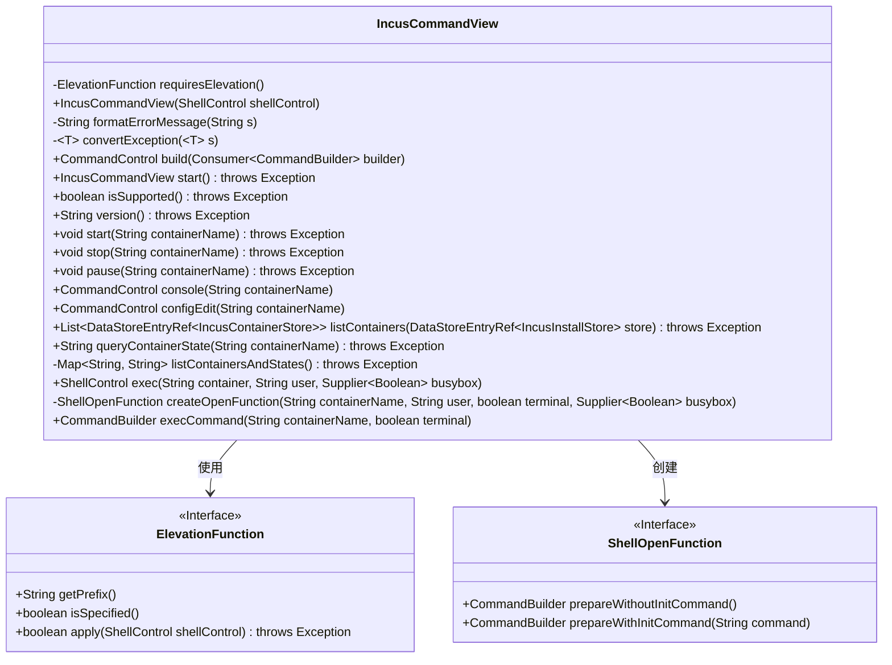
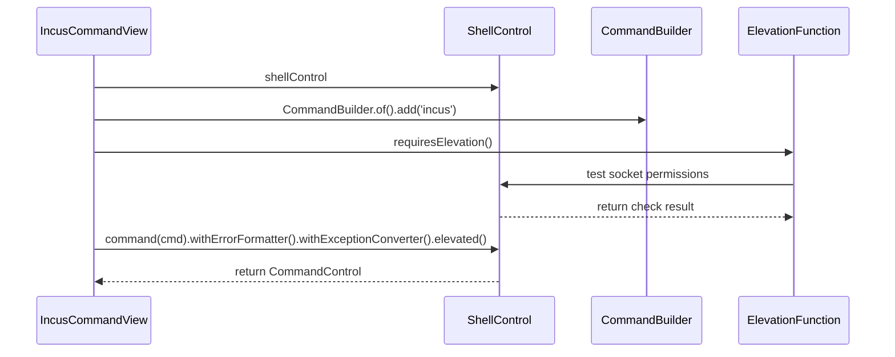

# 基础信息

|      |      |
|------|------|
| 名称 | IncusCommandView |
| 编码语言 | .java |
| 代码路径 | xpipe/ext/system/src/main/java/io/xpipe/ext/system/incus/IncusCommandView.java |
| 包名 | io.xpipe.ext.system.incus |
| 依赖项 | ['io.xpipe.app.ext.ContainerStoreState', 'io.xpipe.app.issue.ErrorEvent', 'io.xpipe.app.storage.DataStoreEntry', 'io.xpipe.app.storage.DataStoreEntryRef', 'io.xpipe.app.util.CommandViewBase', 'io.xpipe.core.process', 'lombok.NonNull', 'java.util', 'java.util.function.Consumer', 'java.util.function.Supplier', 'java.util.stream.Collectors'] |
| 概述说明 | IncusCommandView类扩展CommandViewBase，提供容器管理功能如启动、停止、暂停等，支持权限检查和错误处理。 |

# 说明

IncusCommandView类继承自CommandViewBase，用于管理Incus容器操作。它包含权限检查功能，验证对Incus套接字的写入权限。提供容器生命周期管理方法如启动、停止、暂停，以及控制台访问和配置编辑。支持查询容器状态列表，执行容器内命令，并处理用户权限和终端设置。错误处理和异常转换机制确保操作可靠性。通过ShellControl执行命令，支持子Shell创建和命令构建。

# 类列表 Class Summary

| 名称   | 类型  | 说明 |
|-------|------|-------------|
| IncusCommandView | class | Incus命令视图类，提供容器管理功能。 |

## 类 IncusCommandView

|      |      |
|------|------|
| 访问范围 | public |
| 类型 | class |
| 名称 | IncusCommandView |
| 说明 | Incus命令视图类，提供容器管理功能。 |

### UML类图

这段代码展示了一个`IncusCommandView`类，它继承自`CommandViewBase`，主要用于管理Incus容器操作。该类提供了容器生命周期管理（启动/停止/暂停）、状态查询、控制台访问、配置编辑等功能。关键特性包括：通过`ElevationFunction`处理权限提升，使用`ShellControl`执行命令，以及通过`ShellOpenFunction`实现容器内命令执行。代码结构清晰，通过泛型和函数式接口实现了高度可配置的命令构建机制，同时考虑了错误处理和异常转换。

### 内部方法调用关系图

```mermaid
graph TD
    A["类IncusCommandView"]
    B["构造方法: IncusCommandView(ShellControl shellControl)"]
    C["静态方法: requiresElevation()"]
    D["静态方法: formatErrorMessage(String s)"]
    E["静态方法: convertException(T s)"]
    F["方法: build(Consumer<CommandBuilder> builder)"]
    G["方法: start()"]
    H["方法: isSupported()"]
    I["方法: version()"]
    J["方法: start(String containerName)"]
    K["方法: stop(String containerName)"]
    L["方法: pause(String containerName)"]
    M["方法: console(String containerName)"]
    N["方法: configEdit(String containerName)"]
    O["方法: listContainers(DataStoreEntryRef<IncusInstallStore> store)"]
    P["方法: queryContainerState(String containerName)"]
    Q["方法: listContainersAndStates()"]
    R["方法: exec(String container, String user, Supplier<Boolean> busybox)"]
    S["方法: createOpenFunction(String containerName, String user, boolean terminal, Supplier<Boolean> busybox)"]
    T["方法: execCommand(String containerName, boolean terminal)"]

    A --> B
    A --> C
    A --> D
    A --> E
    A --> F
    A --> G
    A --> H
    A --> I
    A --> J
    A --> K
    A --> L
    A --> M
    A --> N
    A --> O
    A --> P
    A --> Q
    A --> R
    R --> S
    A --> T
```

这段代码定义了一个IncusCommandView类，用于管理Incus容器的操作。主要功能包括容器生命周期管理（启动/停止/暂停）、状态查询、控制台访问、配置编辑等。通过ShellControl执行底层命令，使用ElevationFunction处理权限提升需求。代码结构清晰，通过方法链式调用构建命令，并提供了完善的错误处理和异常转换机制。流程图展示了类的方法结构，时序图则重点描述了命令构建和执行的核心流程。

### 字段列表 Field List

| 名称  | 类型  | 说明 |
|-------|-------|------|

### 方法列表 Method List

| 名称  | 类型  | 说明 |
|-------|-------|------|
| pause | void | 暂停指定名称的容器。 |
| isSupported | boolean | 检查Incus命令是否支持，执行帮助命令并处理错误。 |
| listContainers | List<DataStoreEntryRef<IncusContainerStore>> | 列出容器并返回运行状态列表。 |
| convertException | T | 私有方法转换异常，返回预期错误事件。 |
| version | String | 获取版本号并返回标准输出。 |
| requiresElevation | ElevationFunction | 检查Incus套接字文件存在且可写。 |
| formatErrorMessage | String | 私有方法格式化错误信息，直接返回输入字符串。 |
| start | IncusCommandView | 重写start方法，启动shellControl并返回当前视图。 |
| configEdit | CommandControl | 配置编辑命令，传入容器名参数。 |
| build | CommandControl | 构建命令控制流程，包含错误处理和权限提升。 |
| queryContainerState | String | 查询容器状态，返回名称对应状态，无则返回"?"。 |
| console | CommandControl | 构建控制台命令，参数为容器名。 |
| stop | void | 停止指定名称的容器。 |
| start | void | 启动指定名称的容器。 |
| listContainersAndStates | Map<String, String> | 私有方法：获取容器名与状态的映射表，格式为CSV，异常时抛出。 |
| exec | ShellControl | ShellControl方法创建子shell，设置打开函数并配置错误处理和权限提升。 |
| createOpenFunction | ShellOpenFunction | 创建ShellOpenFunction，根据用户和终端参数生成命令，支持初始命令判断。 |
| execCommand | CommandBuilder | 构建执行容器命令的方法，支持终端参数。 |

