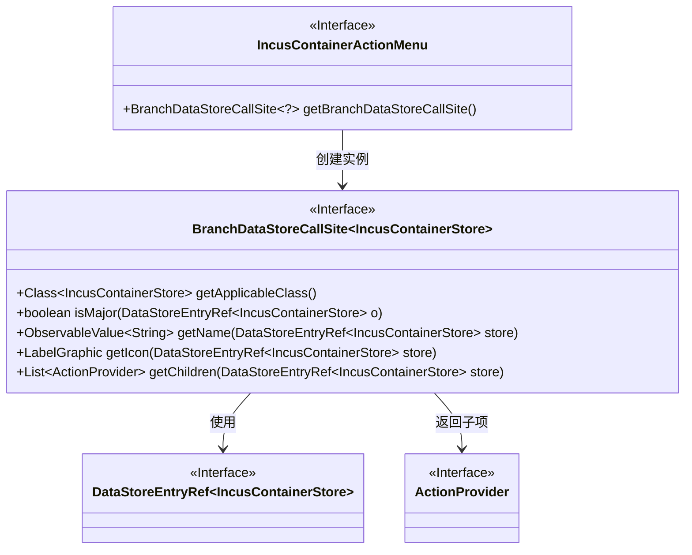
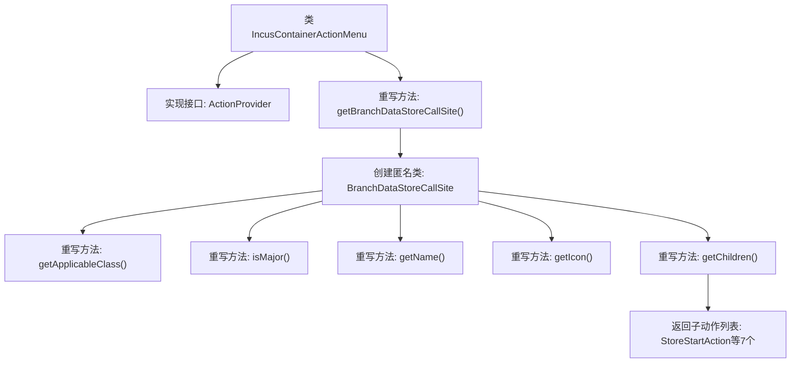

# 基础信息

|      |      |
|------|------|
| 名称 | IncusContainerActionMenu |
| 编码语言 | .java |
| 代码路径 | xpipe/ext/system/src/main/java/io/xpipe/ext/system/incus/IncusContainerActionMenu.java |
| 包名 | io.xpipe.ext.system.incus |
| 依赖项 | ['io.xpipe.app.core.AppI18n', 'io.xpipe.app.ext.ActionProvider', 'io.xpipe.app.storage.DataStoreEntryRef', 'io.xpipe.app.util.LabelGraphic', 'io.xpipe.ext.base.store.StorePauseAction', 'io.xpipe.ext.base.store.StoreRestartAction', 'io.xpipe.ext.base.store.StoreStartAction', 'io.xpipe.ext.base.store.StoreStopAction', 'javafx.beans.value.ObservableValue', 'java.util.List'] |
| 概述说明 | Incus容器操作菜单实现，包含启动、停止、暂停、重启等子操作。 |

# 说明

该代码定义了一个名为IncusContainerActionMenu的类，实现了ActionProvider接口。它重写了getBranchDataStoreCallSite方法，返回一个针对IncusContainerStore类型的BranchDataStoreCallSite实例。该实例指定了适用的类为IncusContainerStore，并定义了主要操作标志、名称、图标及子操作列表。子操作包括启动、停止、暂停、重启容器，以及控制台访问、编辑配置和运行配置等操作。名称和图标通过国际化资源和Material Design图标实现。

# 类列表 Class Summary

| 名称   | 类型  | 说明 |
|-------|------|-------------|
| IncusContainerActionMenu | class | Incus容器操作菜单实现，包含启动、停止等子操作。 |

## 类 IncusContainerActionMenu

|      |      |
|------|------|
| 访问范围 | public |
| 类型 | class |
| 名称 | IncusContainerActionMenu |
| 说明 | Incus容器操作菜单实现，包含启动、停止等子操作。 |

### UML类图

这段代码描述了一个容器操作菜单系统，其中IncusContainerActionMenu实现了ActionProvider接口，通过getBranchDataStoreCallSite方法返回一个BranchDataStoreCallSite匿名内部类实例。该实例提供了容器存储相关的操作功能，包括获取适用类、判断重要性、获取名称和图标，以及返回包含多种容器操作（如启动、停止、暂停等）的子项列表。类图清晰地展示了这些接口之间的依赖关系和泛型参数的使用。

### 内部方法调用关系图

该流程图展示了IncusContainerActionMenu类的核心结构，该类实现了ActionProvider接口并重写了getBranchDataStoreCallSite方法。该方法返回一个匿名BranchDataStoreCallSite对象，该对象包含5个重写方法和1个子动作列表生成逻辑。子动作列表包含7种容器操作类型（如启动、停止、暂停等），整体设计采用组合模式实现容器操作菜单的层级结构。

### 字段列表 Field List

| 名称  | 类型  | 说明 |
|-------|-------|------|

### 方法列表 Method List

| 名称  | 类型  | 说明 |
|-------|-------|------|
| getBranchDataStoreCallSite | BranchDataStoreCallSite<?> | 重写方法返回BranchDataStoreCallSite实例，定义容器操作相关逻辑。 |

