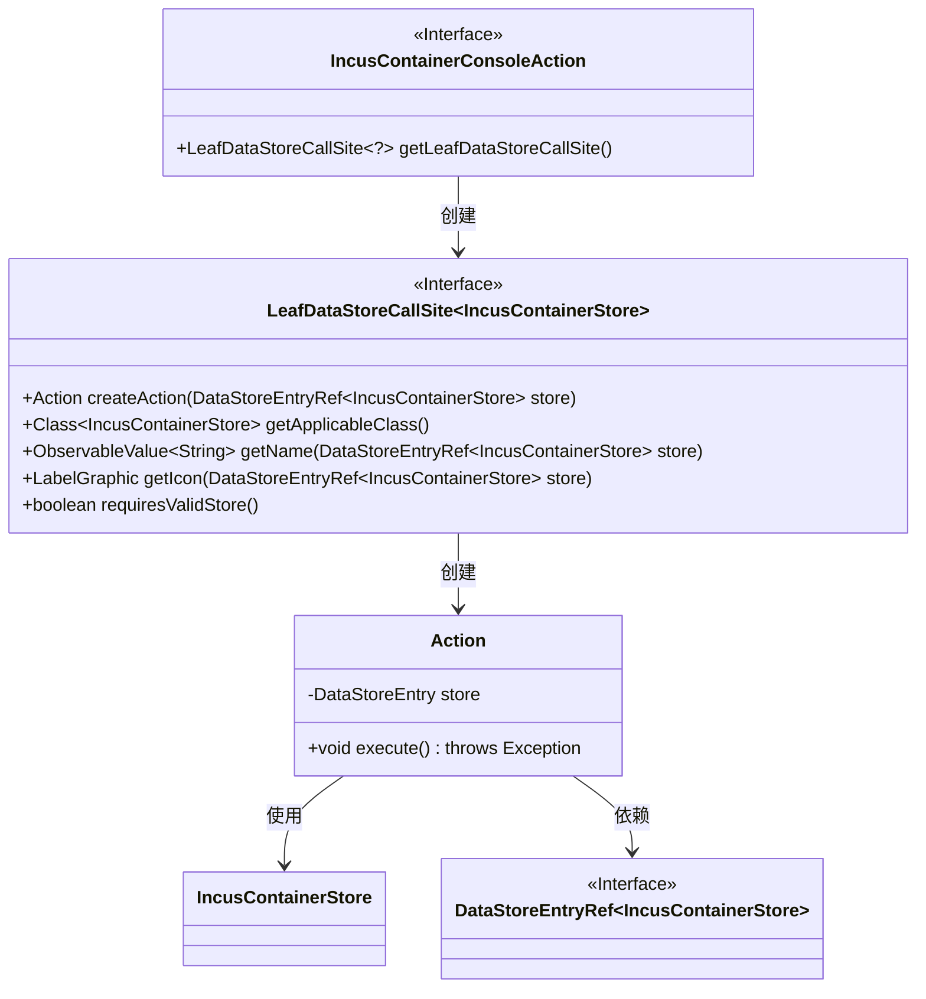
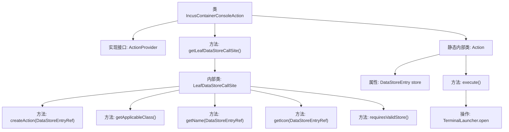

# 基础信息

|      |      |
|------|------|
| 名称 | IncusContainerConsoleAction |
| 编码语言 | .java |
| 代码路径 | xpipe/ext/system/src/main/java/io/xpipe/ext/system/incus/IncusContainerConsoleAction.java |
| 包名 | io.xpipe.ext.system.incus |
| 依赖项 | ['io.xpipe.app.core.AppI18n', 'io.xpipe.app.ext.ActionProvider', 'io.xpipe.app.storage.DataStoreEntry', 'io.xpipe.app.storage.DataStoreEntryRef', 'io.xpipe.app.terminal.TerminalLauncher', 'io.xpipe.app.util.LabelGraphic', 'javafx.beans.value.ObservableValue', 'lombok.Value'] |
| 概述说明 | Incus容器控制台操作类，提供创建、执行及界面显示功能。 |

# 说明

该内容描述了一个名为IncusContainerConsoleAction的Java类，实现了ActionProvider接口。主要功能是为Incus容器提供控制台操作支持。类中包含两个关键部分：一是getLeafDataStoreCallSite方法，返回一个LeafDataStoreCallSite实例，用于定义与Incus容器存储相关的操作，包括创建动作、获取适用类、名称、图标等；二是内部静态Action类，实现了具体的执行逻辑，通过TerminalLauncher打开指定容器的控制台视图。整体设计遵循数据存储和动作分离的模式，支持国际化名称和图标显示，适用于Incus容器管理场景。

# 类列表 Class Summary

| 名称   | 类型  | 说明 |
|-------|------|-------------|
| IncusContainerConsoleAction | class | Incus容器控制台操作类，实现ActionProvider接口，提供创建、执行和显示终端功能。 |

## 类 IncusContainerConsoleAction

|      |      |
|------|------|
| 访问范围 | public |
| 类型 | class |
| 名称 | IncusContainerConsoleAction |
| 说明 | Incus容器控制台操作类，实现ActionProvider接口，提供创建、执行和显示终端功能。 |

### UML类图

这段代码描述了一个容器控制台操作的实现结构。IncusContainerConsoleAction作为入口类实现了ActionProvider接口，通过getLeafDataStoreCallSite方法返回一个LeafDataStoreCallSite匿名实现类。该匿名类负责创建具体的Action操作，其中包含对IncusContainerStore数据存储的操作逻辑。Action内部类实现了具体的执行逻辑，通过TerminalLauncher打开容器命令行视图。整个结构展示了从动作提供者到具体执行的完整调用链，涉及数据存储引用、类型校验和UI组件创建等关键环节。

### 内部方法调用关系图

该流程图展示了IncusContainerConsoleAction类的结构及其内部调用关系。主类实现ActionProvider接口，核心方法getLeafDataStoreCallSite()返回一个匿名LeafDataStoreCallSite实现类，包含5个重写方法。静态内部类Action通过execute()方法执行终端启动逻辑，涉及会话获取和容器控制台操作。整体结构体现了插件式设计模式，通过数据存储引用和动作分离实现控制台功能扩展。

### 字段列表 Field List

| 名称  | 类型  | 说明 |
|-------|-------|------|

### 方法列表 Method List

| 名称  | 类型  | 说明 |
|-------|-------|------|
| getLeafDataStoreCallSite | LeafDataStoreCallSite<?> | 重写方法返回自定义LeafDataStoreCallSite，定义动作、类、名称、图标及有效性要求。 |

