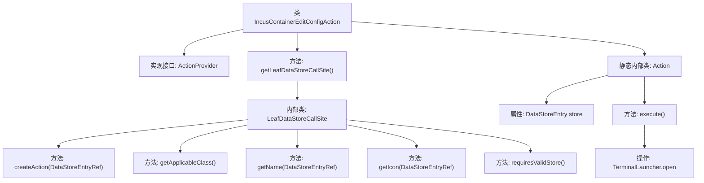

# 基础信息

|      |      |
|------|------|
| 名称 | IncusContainerEditConfigAction |
| 编码语言 | .java |
| 代码路径 | xpipe/ext/system/src/main/java/io/xpipe/ext/system/incus/IncusContainerEditConfigAction.java |
| 包名 | io.xpipe.ext.system.incus |
| 依赖项 | ['io.xpipe.app.core.AppI18n', 'io.xpipe.app.ext.ActionProvider', 'io.xpipe.app.storage.DataStoreEntry', 'io.xpipe.app.storage.DataStoreEntryRef', 'io.xpipe.app.terminal.TerminalLauncher', 'io.xpipe.app.util.LabelGraphic', 'javafx.beans.value.ObservableValue', 'lombok.Value'] |
| 概述说明 | Incus容器编辑配置操作类，实现ActionProvider接口，提供创建、执行编辑配置功能。 |

# 说明

该代码定义了一个名为IncusContainerEditConfigAction的类，实现了ActionProvider接口，用于编辑Incus容器的配置。主要功能包括创建数据存储调用站点，提供动作创建、名称、图标及有效性检查。内部Action类执行具体操作，通过TerminalLauncher打开配置编辑视图。关键点涉及数据存储处理、界面交互及容器配置编辑功能。

# 类列表 Class Summary

| 名称   | 类型  | 说明 |
|-------|------|-------------|
| IncusContainerEditConfigAction | class | Incus容器编辑配置操作类，含数据存储调用和视图执行逻辑。 |


## 类 IncusContainerEditConfigAction

|      |      |
|------|------|
| 访问范围 | public |
| 类型 | class |
| 名称 | IncusContainerEditConfigAction |
| 说明 | Incus容器编辑配置操作类，含数据存储调用和视图执行逻辑。 |


### UML类图

```mermaid
classDiagram
    class IncusContainerEditConfigAction {
        +LeafDataStoreCallSite~?~ getLeafDataStoreCallSite()
    }
    <<interface>> IncusContainerEditConfigAction {
    }

    class LeafDataStoreCallSite~IncusContainerStore~ {
        <<interface>>
        +Action createAction(DataStoreEntryRef~IncusContainerStore~ store)
        +Class~IncusContainerStore~ getApplicableClass()
        +ObservableValue~String~ getName(DataStoreEntryRef~IncusContainerStore~ store)
        +LabelGraphic getIcon(DataStoreEntryRef~IncusContainerStore~ store)
        +boolean requiresValidStore()
    }

    class Action {
        -DataStoreEntry store
        +void execute() throws Exception
    }

    class IncusContainerStore {
    }

    class DataStoreEntryRef~IncusContainerStore~ {
    }

    IncusContainerEditConfigAction --> LeafDataStoreCallSite~IncusContainerStore~ : 创建
    LeafDataStoreCallSite~IncusContainerStore~ --> Action : 创建
    Action --> IncusContainerStore : 使用
    Action --> TerminalLauncher : 调用
    Action --> IncusCommandView : 创建
```

这段代码展示了一个用于编辑Incus容器配置的动作提供者系统。IncusContainerEditConfigAction作为入口点，通过LeafDataStoreCallSite接口实现创建具体动作的逻辑。内部Action类负责实际执行配置编辑操作，涉及IncusContainerStore数据存储、TerminalLauncher终端启动以及IncusCommandView视图创建。整个设计采用工厂模式，通过泛型接口实现类型安全的回调机制，支持可观察的国际化名称和图标显示。


### 内部方法调用关系图



这段代码流程图展示了IncusContainerEditConfigAction类的核心结构和调用关系。该类实现了ActionProvider接口，主要功能是通过getLeafDataStoreCallSite()方法返回一个LeafDataStoreCallSite内部类实例，该实例包含多个回调方法用于创建动作、获取适用类、名称、图标等。静态内部类Action负责具体执行逻辑，通过TerminalLauncher打开终端视图进行配置编辑。整体设计采用分层结构，将动作创建与执行逻辑分离，符合职责单一原则。

### 字段列表 Field List

| 名称  | 类型  | 说明 |
|-------|-------|------|

### 方法列表 Method List

| 名称  | 类型  | 说明 |
|-------|-------|------|
| getLeafDataStoreCallSite | LeafDataStoreCallSite<?> | 重写方法返回自定义LeafDataStoreCallSite，包含创建动作、适用类、名称、图标及有效性要求。 |


