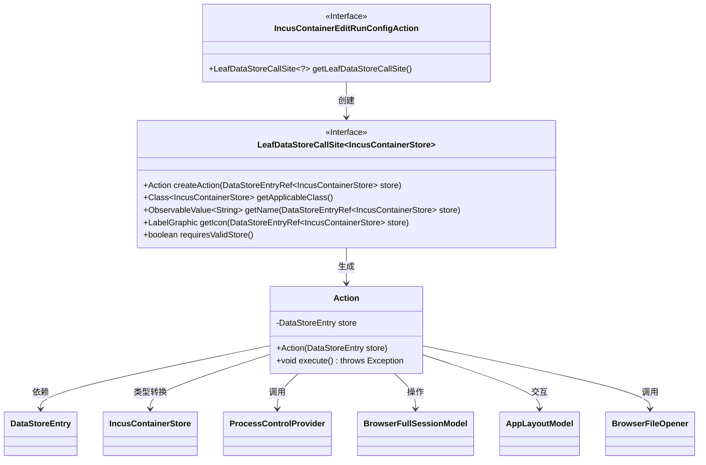
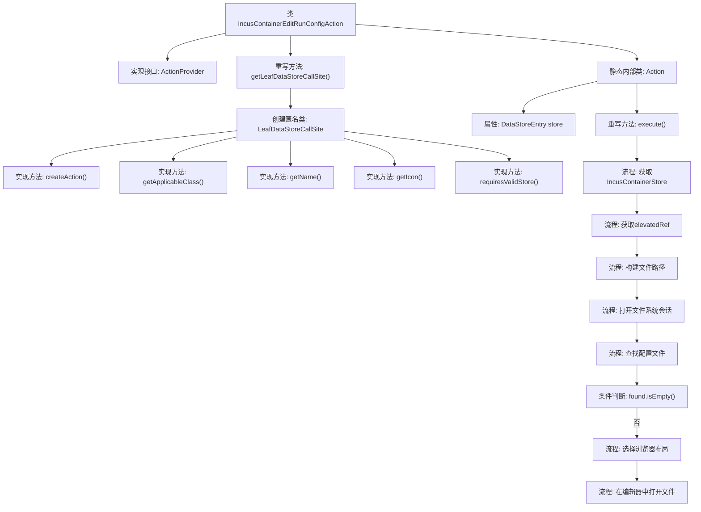

# 基础信息

|      |      |
|------|------|
| 名称 | IncusContainerEditRunConfigAction |
| 编码语言 | .java |
| 代码路径 | xpipe/ext/system/src/main/java/io/xpipe/ext/system/incus/IncusContainerEditRunConfigAction.java |
| 包名 | io.xpipe.ext.system.incus |
| 依赖项 | ['io.xpipe.app.browser.BrowserFullSessionModel', 'io.xpipe.app.browser.file.BrowserFileOpener', 'io.xpipe.app.core.AppI18n', 'io.xpipe.app.core.AppLayoutModel', 'io.xpipe.app.ext.ActionProvider', 'io.xpipe.app.ext.ProcessControlProvider', 'io.xpipe.app.storage.DataStoreEntry', 'io.xpipe.app.storage.DataStoreEntryRef', 'io.xpipe.app.util.LabelGraphic', 'io.xpipe.core.store.FilePath', 'javafx.beans.value.ObservableValue', 'lombok.Value'] |
| 概述说明 | Incus容器编辑运行配置的实现类，包含创建操作和图标等配置。 |

# 说明

该代码定义了一个名为IncusContainerEditRunConfigAction的类，实现了ActionProvider接口，用于编辑Incus容器的运行配置。主要功能包括：通过LeafDataStoreCallSite提供操作调用点，支持创建针对IncusContainerStore的操作。操作类Action包含执行逻辑，通过ProcessControlProvider提升权限，访问容器配置文件路径，并在文本编辑器中打开配置文件。该操作不要求存储必须有效，使用mdi2m-movie-edit图标和国际化名称editRunConfiguration。

# 类列表 Class Summary

| 名称   | 类型  | 说明 |
|-------|------|-------------|
| IncusContainerEditRunConfigAction | class | Incus容器编辑运行配置操作类，实现ActionProvider接口，提供创建、执行和图标等功能。 |

## 类 IncusContainerEditRunConfigAction

|      |      |
|------|------|
| 访问范围 | public |
| 类型 | class |
| 名称 | IncusContainerEditRunConfigAction |
| 说明 | Incus容器编辑运行配置操作类，实现ActionProvider接口，提供创建、执行和图标等功能。 |

### UML类图

这段代码描述了一个用于编辑Incus容器运行配置的ActionProvider实现。核心类IncusContainerEditRunConfigAction通过内部类Action实现了具体的执行逻辑，包括获取提升权限、定位配置文件、在文本编辑器中打开文件等操作。类图中清晰地展示了接口实现关系（ActionProvider和LeafDataStoreCallSite）、内部类结构（Action）以及与其他组件的交互关系（如ProcessControlProvider和Browser相关模型）。整个设计采用命令模式，通过Action类封装具体操作，同时利用泛型保证类型安全。

### 内部方法调用关系图

这段代码实现了一个用于编辑Incus容器运行配置的动作提供者。流程图展示了主类结构及其内部Action类的执行流程，包括获取容器存储引用、提升权限、定位配置文件、验证文件存在性，最终在文本编辑器中打开配置文件的过程。匿名类实现了数据存储调用的关键方法，而内部Action类封装了具体的执行逻辑，体现了清晰的职责分离设计模式。

### 字段列表 Field List

| 名称  | 类型  | 说明 |
|-------|-------|------|

### 方法列表 Method List

| 名称  | 类型  | 说明 |
|-------|-------|------|
| getLeafDataStoreCallSite | LeafDataStoreCallSite<?> | 重写getLeafDataStoreCallSite方法，返回自定义LeafDataStoreCallSite实例，包含创建动作、适用类、名称、图标及存储验证要求。 |

