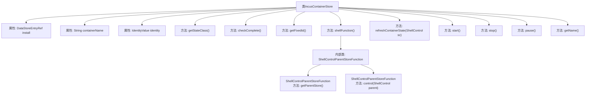

# 基础信息

|      |      |
|------|------|
| 名称 | IncusContainerStore |
| 编码语言 | .java |
| 代码路径 | xpipe/ext/system/src/main/java/io/xpipe/ext/system/incus/IncusContainerStore.java |
| 包名 | io.xpipe.ext.system.incus |
| 依赖项 | ['io.xpipe.app.ext', 'io.xpipe.app.storage.DataStoreEntryRef', 'io.xpipe.app.util', 'io.xpipe.core.process.ShellControl', 'io.xpipe.core.store.FixedChildStore', 'io.xpipe.core.store.StatefulDataStore', 'io.xpipe.ext.base.identity.IdentityValue', 'io.xpipe.ext.base.store.PauseableStore', 'io.xpipe.ext.base.store.StartableStore', 'io.xpipe.ext.base.store.StoppableStore', 'com.fasterxml.jackson.annotation.JsonTypeName', 'lombok.AllArgsConstructor', 'lombok.Getter', 'lombok.Value', 'lombok.experimental.SuperBuilder', 'lombok.extern.jackson.Jacksonized', 'java.util.Objects', 'java.util.OptionalInt'] |
| 概述说明 | Incus容器存储类，实现多种接口，管理容器状态与操作。 |

# 说明

IncusContainerStore是一个实现了多种功能接口的Java类，用于管理Incus容器。它包含安装引用、容器名称和身份信息等字段，并提供了检查完整性、获取固定ID、执行Shell控制、刷新容器状态等功能。类中还实现了启动、停止、暂停容器的方法，并能通过名称获取容器信息。该类通过状态管理跟踪容器运行状态，支持身份验证和错误处理。

# 类列表 Class Summary

| 名称   | 类型  | 说明 |
|-------|------|-------------|
| IncusContainerStore | class | Incus容器存储类，实现多种接口，管理容器状态与操作。 |


## 类 IncusContainerStore

|      |      |
|------|------|
| 访问范围 | @JsonTypeName("incusContainer");@SuperBuilder;@Jacksonized;@Getter;@AllArgsConstructor;@Value;public |
| 类型 | class |
| 名称 | IncusContainerStore |
| 说明 | Incus容器存储类，实现多种接口，管理容器状态与操作。 |


### UML类图

```mermaid
classDiagram
    class IncusContainerStore {
        -DataStoreEntryRef~IncusInstallStore~ install
        -String containerName
        -IdentityValue identity
        +getStateClass() Class~ContainerStoreState~
        +checkComplete() void
        +getFixedId() OptionalInt
        +shellFunction() ShellControlFunction
        +refreshContainerState(ShellControl sc) void
        +start() void
        +stop() void
        +pause() void
        +getName() String
    }

    <<Interface>> ShellStore
    <<Interface>> FixedChildStore
    <<Interface>> StatefulDataStore~ContainerStoreState~
    <<Interface>> StartableStore
    <<Interface>> StoppableStore
    <<Interface>> PauseableStore
    <<Interface>> NameableStore

    IncusContainerStore ..|> ShellStore : 实现
    IncusContainerStore ..|> FixedChildStore : 实现
    IncusContainerStore ..|> StatefulDataStore~ContainerStoreState~ : 实现
    IncusContainerStore ..|> StartableStore : 实现
    IncusContainerStore ..|> StoppableStore : 实现
    IncusContainerStore ..|> PauseableStore : 实现
    IncusContainerStore ..|> NameableStore : 实现

    class ShellControlFunction {
        <<Interface>>
    }
    class ShellControlParentStoreFunction {
        +getParentStore() ShellStore
        +control(ShellControl parent) ShellControl
    }
    IncusContainerStore --> ShellControlParentStoreFunction : 创建
    ShellControlParentStoreFunction ..|> ShellControlFunction : 实现

    class IncusCommandView {
        +exec(String containerName, String user, BooleanSupplier alpineCheck) ShellControl
        +queryContainerState(String containerName) String
        +start(String containerName) void
        +stop(String containerName) void
        +pause(String containerName) void
    }
    IncusContainerStore --> IncusCommandView : 使用

    class DataStoreEntryRef~T~ {
        <<Interface>>
        +getStore() T
        +checkComplete() void
    }
    IncusContainerStore --> DataStoreEntryRef~IncusInstallStore~ : 依赖
```

这段类图展示了IncusContainerStore类的结构和关系。该类实现了7个接口（ShellStore、FixedChildStore等），核心功能包括容器状态管理（start/stop/pause）、Shell控制功能实现和状态检查。通过DataStoreEntryRef关联IncusInstallStore，使用IncusCommandView执行容器操作，并通过ShellControlParentStoreFunction提供Shell控制逻辑。类中维护容器名称、身份信息等状态，并通过泛型接口StatefulDataStore管理ContainerStoreState类型的状态数据。


### 内部方法调用关系图



该流程图展示了IncusContainerStore类的完整结构，包含3个核心属性和9个主要方法。其中shellFunction()方法内部包含ShellControlParentStoreFunction匿名类，具有getParentStore()和control()两个关键方法。类实现了7个接口功能（ShellStore/FixedChildStore等），通过start()/stop()/pause()等方法管理容器生命周期，并通过refreshContainerState()统一更新状态。所有方法都围绕容器管理核心逻辑展开，形成完整的容器操作闭环。

### 字段列表 Field List

| 名称  | 类型  | 说明 |
|-------|-------|------|
| identity | IdentityValue | 定义身份变量 |
| containerName | String | 定义字符串变量containerName。 |
| install | DataStoreEntryRef<IncusInstallStore> | 存储Incus安装数据的引用变量。 |

### 方法列表 Method List

| 名称  | 类型  | 说明 |
|-------|-------|------|
| getName | String | 重写getName方法，返回containerName。 |
| checkComplete | void | 检查安装和容器名，验证身份完整性。 |
| refreshContainerState | void | 刷新容器状态：查询并更新运行状态至新状态。 |
| getStateClass | Class<ContainerStoreState> | 重写方法返回ContainerStoreState类。 |
| getFixedId | OptionalInt | 重写getFixedId方法，返回基于containerName哈希的OptionalInt。 |
| shellFunction | ShellControlFunction | 重写ShellControlFunction，获取父存储，执行容器命令，处理身份验证和启动失败。 |
| start | void | 重写start方法，创建视图并启动容器，刷新状态。 |
| stop | void | 重写stop方法，停止容器并刷新状态。 |
| pause | void | 覆盖pause方法，暂停容器并刷新状态。 |


