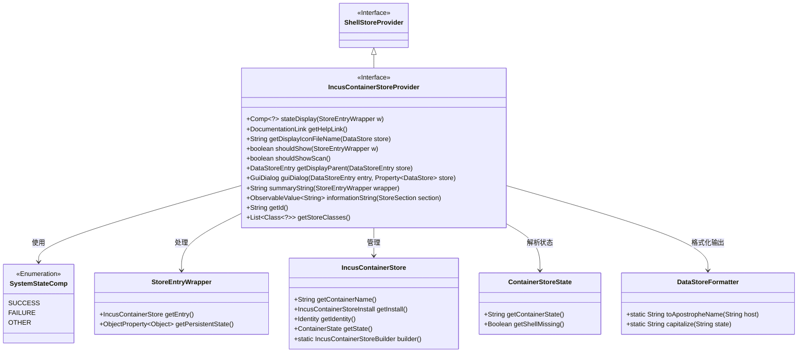
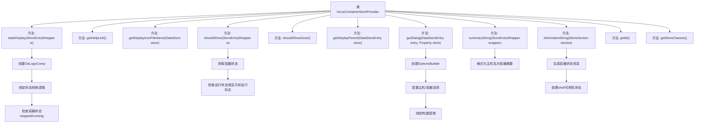

# 基础信息

|      |      |
|------|------|
| 名称 | IncusContainerStoreProvider |
| 编码语言 | .java |
| 代码路径 | xpipe/ext/system/src/main/java/io/xpipe/ext/system/incus/IncusContainerStoreProvider.java |
| 包名 | io.xpipe.ext.system.incus |
| 依赖项 | ['io.xpipe.app.comp.Comp', 'io.xpipe.app.comp.store', 'io.xpipe.app.ext.ContainerStoreState', 'io.xpipe.app.ext.GuiDialog', 'io.xpipe.app.storage.DataStoreEntry', 'io.xpipe.app.util', 'io.xpipe.core.store.DataStore', 'io.xpipe.ext.base.identity.IdentityChoice', 'io.xpipe.ext.base.store.ShellStoreProvider', 'javafx.beans.property.Property', 'javafx.beans.property.SimpleObjectProperty', 'javafx.beans.value.ObservableValue', 'java.util.List'] |
| 概述说明 | Incus容器存储提供者实现，管理容器状态显示、帮助链接、图标及对话框等功能。 |

# 说明

IncusContainerStoreProvider是一个实现ShellStoreProvider接口的类，主要用于管理Incus容器存储的显示和交互逻辑。它提供了容器状态显示功能，根据容器运行状态返回不同状态标识。类中包含获取帮助链接、显示图标文件名、判断是否显示容器条目、是否显示扫描选项等方法。此外，它还处理容器条目的父级显示、生成配置对话框、生成摘要字符串和信息字符串等功能。该类支持IncusContainerStore类型的存储，并通过唯一ID标识自身。

# 类列表 Class Summary

| 名称   | 类型  | 说明 |
|-------|------|-------------|
| IncusContainerStoreProvider | class | Incus容器存储提供者实现，管理容器状态显示、图标、对话框及信息展示。 |

## 类 IncusContainerStoreProvider

|      |      |
|------|------|
| 访问范围 | public |
| 类型 | class |
| 名称 | IncusContainerStoreProvider |
| 说明 | Incus容器存储提供者实现，管理容器状态显示、图标、对话框及信息展示。 |

### UML类图

该代码实现了一个LXC容器存储提供器，主要功能包括容器状态显示、对话框构建、信息格式化和存储管理。类图展示了核心接口继承关系（ShellStoreProvider→IncusContainerStoreProvider）和关键协作类，如状态枚举SystemStateComp、包装类StoreEntryWrapper和容器存储实体IncusContainerStore。通过泛型和观察者模式（ObservableValue）实现动态数据绑定，使用构建器模式创建存储对象，并通过DataStoreFormatter进行标准化输出格式化。

### 内部方法调用关系图

该流程图展示了IncusContainerStoreProvider类的完整方法结构，重点描述了状态显示、对话框构建和容器信息处理等核心逻辑。类实现了ShellStoreProvider接口，包含11个主要方法，其中stateDisplay()通过绑定容器状态实现可视化状态转换，guiDialog()使用建造者模式创建复杂配置对话框，informationString()动态生成容器状态信息。各方法通过属性绑定和条件判断实现LXC容器管理的核心功能，体现了状态驱动UI的设计模式。

### 字段列表 Field List

| 名称  | 类型  | 说明 |
|-------|-------|------|

### 方法列表 Method List

| 名称  | 类型  | 说明 |
|-------|-------|------|
| summaryString | String | 重写方法，返回容器主机名加"container"。 |
| getHelpLink | DocumentationLink | 重写getHelpLink方法，返回LXC文档链接。 |
| getDisplayParent | DataStoreEntry | 重写方法，获取容器存储的安装父项。 |
| shouldShowScan | boolean | 方法重写，返回false不显示扫描。 |
| stateDisplay | Comp<?> | 方法根据容器状态返回对应显示组件：停止为失败，运行为成功，其他为默认状态。 |
| guiDialog | GuiDialog | 重写方法创建LXD容器配置对话框，包含主机选择、容器名和身份绑定，最终返回配置构建器生成的对话框。 |
| informationString | ObservableValue<String> | 重写方法返回容器状态信息，包括缺失提示和格式化状态。 |
| getDisplayIconFileName | String | 重写方法返回LXD图标文件名。 |
| shouldShow | boolean | 检查容器状态，运行中或配置显示非运行则返回真。 |
| getId | String | 重写getId方法，返回字符串"incusContainer"。 |
| getStoreClasses | List<Class<?>> | 重写方法返回IncusContainerStore类列表。 |

