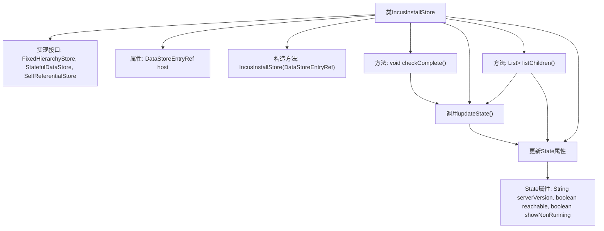
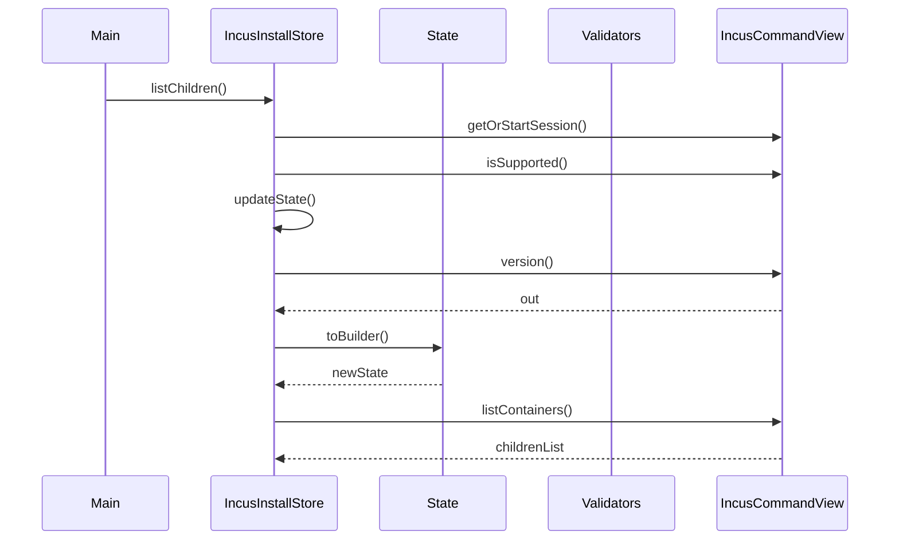

# 基础信息

|      |      |
|------|------|
| 名称 | IncusInstallStore |
| 编码语言 | .java |
| 代码路径 | xpipe/ext/system/src/main/java/io/xpipe/ext/system/incus/IncusInstallStore.java |
| 包名 | io.xpipe.ext.system.incus |
| 依赖项 | ['io.xpipe.app.ext.ShellStore', 'io.xpipe.app.storage.DataStoreEntryRef', 'io.xpipe.app.util.CommandSupport', 'io.xpipe.app.util.FixedHierarchyStore', 'io.xpipe.app.util.Validators', 'io.xpipe.core.store.DataStoreState', 'io.xpipe.core.store.FixedChildStore', 'io.xpipe.core.store.StatefulDataStore', 'io.xpipe.ext.base.SelfReferentialStore', 'com.fasterxml.jackson.annotation.JsonTypeName', 'lombok.EqualsAndHashCode', 'lombok.Getter', 'lombok.Value', 'lombok.experimental.SuperBuilder', 'lombok.extern.jackson.Jacksonized', 'java.util.List', 'java.util.regex.Pattern'] |
| 概述说明 | Incus安装存储类，管理主机连接和状态检查。 |

# 说明

该内容描述了一个名为IncusInstallStore的Java类，实现了多个接口如FixedHierarchyStore和StatefulDataStore。类中包含对主机ShellStore的引用，并通过checkComplete方法验证其完整性。updateState方法通过执行Incus命令检查服务器版本和可达性，并更新状态。listChildren方法列出容器列表。内部类State存储服务器版本、可达性等状态信息。整个类用于管理Incus安装和容器操作。

# 类列表 Class Summary

| 名称   | 类型  | 说明 |
|-------|------|-------------|
| IncusInstallStore | class | Incus安装存储类，管理主机连接和状态检查。 |


## 类 IncusInstallStore

|      |      |
|------|------|
| 访问范围 | @JsonTypeName("incusInstall");@SuperBuilder;@Jacksonized;@Getter;@Value;public |
| 类型 | class |
| 名称 | IncusInstallStore |
| 说明 | Incus安装存储类，管理主机连接和状态检查。 |


### UML类图

```mermaid
classDiagram
    class IncusInstallStore {
        -DataStoreEntryRef~ShellStore~ host
        +IncusInstallStore(DataStoreEntryRef~ShellStore~ host)
        +void checkComplete() throws Throwable
        -void updateState() throws Exception
        +List~? extends DataStoreEntryRef~? extends FixedChildStore~~ listChildren() throws Exception
    }

    class DataStoreState {
        <<abstract>>
    }

    class IncusInstallStore$State {
        +String serverVersion
        +boolean reachable
        +boolean showNonRunning
    }

    class FixedHierarchyStore {
        <<Interface>>
    }

    class StatefulDataStore~T~ {
        <<Interface>>
    }

    class SelfReferentialStore {
        <<Interface>>
    }

    IncusInstallStore --> FixedHierarchyStore : 实现
    IncusInstallStore --> StatefulDataStore~IncusInstallStore$State~ : 实现
    IncusInstallStore --> SelfReferentialStore : 实现
    IncusInstallStore$State --|> DataStoreState : 继承
```

这段代码描述了一个名为`IncusInstallStore`的类，它实现了三个接口：`FixedHierarchyStore`、`StatefulDataStore`和`SelfReferentialStore`。该类包含一个内部静态类`State`用于存储状态信息，包括服务器版本、可达性和是否显示非运行容器的标志。主要功能包括检查存储完整性、更新状态以及列出子容器。通过`DataStoreEntryRef`引用主机Shell存储，并使用`IncusCommandView`执行LXC容器管理命令。类设计采用了建造者模式和Jackson序列化支持，体现了复杂的状态管理和容器操作逻辑。


### 内部方法调用关系图





该流程图展示了IncusInstallStore类的核心结构和调用关系，包含属性定义、方法实现和嵌套State类的关联。时序图重点描述了listChildren()方法的执行过程，涉及会话获取、状态更新和容器列表查询等关键步骤。类通过State对象维护服务器版本、可达性等状态信息，并通过IncusCommandView实现与Incus服务的交互。所有操作都严格遵循接口定义的数据存储规范。

### 字段列表 Field List

| 名称  | 类型  | 说明 |
|-------|-------|------|
| host | DataStoreEntryRef<ShellStore> | 存储ShellStore引用的数据条目。 |

### 方法列表 Method List

| 名称  | 类型  | 说明 |
|-------|-------|------|
| updateState | void | 私有方法updateState获取会话版本信息，匹配服务器版本并更新状态。 |
| listChildren | List<? extends DataStoreEntryRef<? extends FixedChildStore>> | 重写listChildren方法，检查Incus CLI支持后返回容器列表。 |
| checkComplete | void | 检查host非空且为ShellStore类，并调用其checkComplete方法。 |


