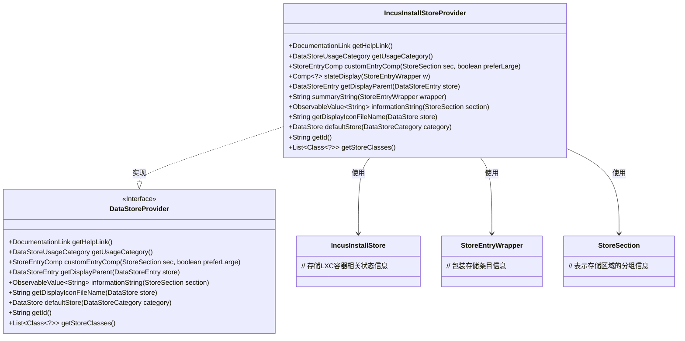

# 基础信息

|      |      |
|------|------|
| 名称 | IncusInstallStoreProvider |
| 编码语言 | .java |
| 代码路径 | xpipe/ext/system/src/main/java/io/xpipe/ext/system/incus/IncusInstallStoreProvider.java |
| 包名 | io.xpipe.ext.system.incus |
| 依赖项 | ['io.xpipe.app.comp.Comp', 'io.xpipe.app.comp.store', 'io.xpipe.app.ext.DataStoreProvider', 'io.xpipe.app.ext.DataStoreUsageCategory', 'io.xpipe.app.storage.DataStorage', 'io.xpipe.app.storage.DataStoreCategory', 'io.xpipe.app.storage.DataStoreEntry', 'io.xpipe.app.util.BindingsHelper', 'io.xpipe.app.util.DataStoreFormatter', 'io.xpipe.app.util.DocumentationLink', 'io.xpipe.core.store.DataStore', 'javafx.beans.value.ObservableValue', 'java.util.List'] |
| 概述说明 | Incus安装存储提供者实现，管理容器状态和显示信息。 |

# 说明

IncusInstallStoreProvider是一个实现DataStoreProvider接口的类，主要用于管理Incus容器存储。它提供了帮助文档链接、存储类别、自定义条目组件等功能。该类支持显示容器状态，包括可达性和服务器版本信息，并返回默认存储实例。它还定义了存储的显示图标、唯一标识符及支持的存储类。关键功能包括状态显示、父级存储获取和摘要信息生成。

# 类列表 Class Summary

| 名称   | 类型  | 说明 |
|-------|------|-------------|
| IncusInstallStoreProvider | class | Incus安装存储提供程序，管理容器状态、连接及显示信息。 |

## 类 IncusInstallStoreProvider

|      |      |
|------|------|
| 访问范围 | public |
| 类型 | class |
| 名称 | IncusInstallStoreProvider |
| 说明 | Incus安装存储提供程序，管理容器状态、连接及显示信息。 |

### UML类图

该代码展示了一个实现`DataStoreProvider`接口的`IncusInstallStoreProvider`类，主要用于管理LXC容器相关的存储操作。类中提供了多种方法用于获取帮助链接、使用类别、创建自定义条目组件、显示状态信息等核心功能。通过泛型和接口实现，该类能灵活处理不同类型的存储数据，并与`IncusInstallStore`、`StoreEntryWrapper`等辅助类进行交互，形成完整的存储管理功能体系。

### 内部方法调用关系图

```mermaid
graph TD
    A["类IncusInstallStoreProvider"]
    B["实现方法: DocumentationLink getHelpLink()"]
    C["实现方法: DataStoreUsageCategory getUsageCategory()"]
    D["实现方法: StoreEntryComp customEntryComp()"]
    E["自定义方法: Comp<?> stateDisplay()"]
    F["实现方法: DataStoreEntry getDisplayParent()"]
    G["自定义方法: String summaryString()"]
    H["实现方法: ObservableValue<String> informationString()"]
    I["实现方法: String getDisplayIconFileName()"]
    J["实现方法: DataStore defaultStore()"]
    K["实现方法: String getId()"]
    L["实现方法: List<Class<?>> getStoreClasses()"]

    A --> B
    A --> C
    A --> D
    A --> E
    A --> F
    A --> G
    A --> H
    A --> I
    A --> J
    A --> K
    A --> L

    D --> D1["调用StoreToggleComp.childrenToggle()"]
    D --> D2["调用StoreEntryComp.create()"]
    E --> E1["创建SystemStateComp对象"]
    F --> F1["调用getStore().asNeeded()"]
    F --> F2["调用getHost().get()"]
    G --> G1["调用DataStoreFormatter.toApostropheName()"]
    H --> H1["调用BindingsHelper.map()"]
```

该流程图展示了IncusInstallStoreProvider类的完整结构，包含11个核心方法及其调用关系。类实现了DataStoreProvider接口的8个方法，并包含3个自定义方法。关键方法包括处理UI组件的customEntryComp()、状态显示的stateDisplay()以及数据获取的getDisplayParent()。方法间通过数据流和对象创建形成调用链，如customEntryComp()内部调用StoreToggleComp工具类，stateDisplay()创建SystemStateComp对象等，完整呈现了LXC容器管理功能的核心逻辑。

### 字段列表 Field List

| 名称  | 类型  | 说明 |
|-------|-------|------|

### 方法列表 Method List

| 名称  | 类型  | 说明 |
|-------|-------|------|
| getDisplayParent | DataStoreEntry | 重写方法，获取存储条目显示父级，返回宿主实例。 |
| summaryString | String | Java方法：返回主机名加" containers"的字符串。 |
| getUsageCategory | DataStoreUsageCategory | 重写方法返回GROUP类型的数据存储用途分类。 |
| stateDisplay | Comp<?> | 方法根据存储状态返回系统状态组件，可达为成功，否则失败。 |
| getHelpLink | DocumentationLink | 重写getHelpLink方法，返回LXC文档链接。 |
| defaultStore | DataStore | 重写方法，返回基于本地存储的新实例。 |
| informationString | ObservableValue<String> | 方法返回服务器版本或连接失败信息。 |
| getDisplayIconFileName | String | 重写方法返回LXD图标文件名。 |
| customEntryComp | StoreEntryComp | 重写方法，根据参数生成包含非运行状态切换控件的商店条目组件。 |
| getId | String | 重写getId方法，返回字符串"incusInstall"。 |
| getStoreClasses | List<Class<?>> | 重写方法返回IncusInstallStore类列表。 |

