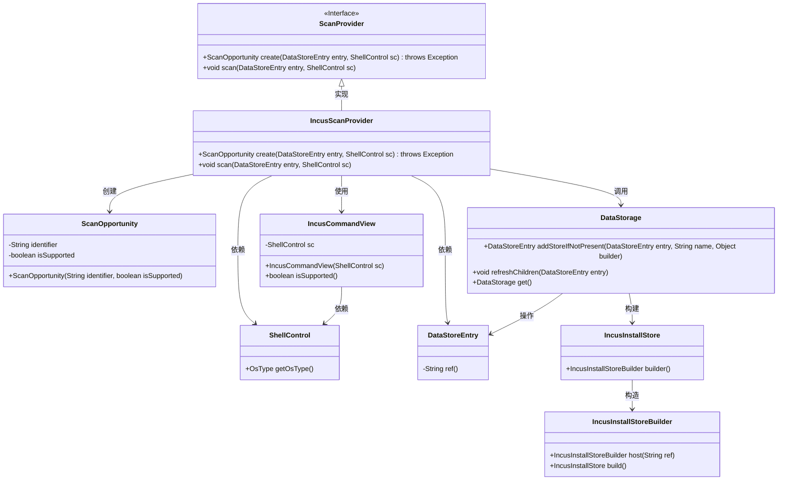
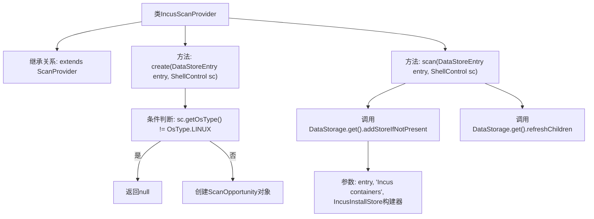

# 基础信息

|      |      |
|------|------|
| 名称 | IncusScanProvider |
| 编码语言 | .java |
| 代码路径 | xpipe/ext/system/src/main/java/io/xpipe/ext/system/incus/IncusScanProvider.java |
| 包名 | io.xpipe.ext.system.incus |
| 依赖项 | ['io.xpipe.app.ext.ScanProvider', 'io.xpipe.app.storage.DataStorage', 'io.xpipe.app.storage.DataStoreEntry', 'io.xpipe.core.process.OsType', 'io.xpipe.core.process.ShellControl'] |
| 概述说明 | IncusScanProvider类：检查Linux系统支持并扫描Incus容器。 |

# 说明

该代码描述了一个名为IncusScanProvider的类，继承自ScanProvider。主要功能包括创建扫描机会和执行扫描操作。在create方法中，首先检查操作系统是否为Linux，否则返回null；若支持则创建ScanOpportunity实例。scan方法通过DataStorage处理数据存储条目，添加或更新Incus容器信息，并刷新子节点。整个过程涉及ShellControl操作和条件判断，确保仅在Linux系统下执行相关逻辑。

# 类列表 Class Summary

| 名称   | 类型  | 说明 |
|-------|------|-------------|
| IncusScanProvider | class | Incus扫描提供程序，检查Linux系统支持并扫描容器。 |

## 类 IncusScanProvider

|      |      |
|------|------|
| 访问范围 | public |
| 类型 | class |
| 名称 | IncusScanProvider |
| 说明 | Incus扫描提供程序，检查Linux系统支持并扫描容器。 |

### UML类图

这段代码描述了一个名为`IncusScanProvider`的类，它实现了`ScanProvider`接口，主要用于扫描和管理Incus容器。该类通过`ShellControl`检查操作系统类型，利用`IncusCommandView`验证功能支持性，并通过`DataStorage`进行数据存储操作。整体设计体现了对Linux环境下容器管理的支持，包含创建扫描机会、执行扫描流程以及数据持久化等功能模块。

### 内部方法调用关系图

这段代码的流程图展示了IncusScanProvider类的核心逻辑结构。该类继承自ScanProvider，主要实现两个方法：create()方法会检查操作系统类型，若非Linux则返回null，否则创建ScanOpportunity对象；scan()方法通过DataStorage进行数据存储操作，先添加存储条目（若不存在），然后刷新子节点数据。流程清晰展现了条件分支和链式调用关系，突出了对Linux系统的专有支持特性。

### 字段列表 Field List

| 名称  | 类型  | 说明 |
|-------|-------|------|

### 方法列表 Method List

| 名称  | 类型  | 说明 |
|-------|-------|------|
| scan | void | 扫描数据存储条目并更新Incus容器信息。 |
| create | ScanOpportunity | 重写方法，检查系统类型为Linux时创建扫描机会，否则返回空。 |

