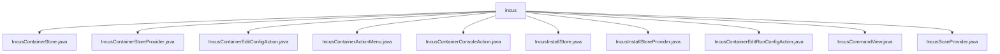

# 基础信息

|      |      |
|------|------|
| 名称 | incus |
| 编码语言 | .java |
| 代码路径 | xpipe/ext/system/src/main/java/io/xpipe/ext/system/incus |
| 包名 | xpipe.ext.system.src.main.java.io.xpipe.ext.system.incus |
| 概述说明 | Incus容器管理Java类集合，含存储、操作、状态控制等功能。 |

# 说明

## 概述

该代码模块是一个用于管理Incus容器的Java实现，提供了一套完整的容器管理功能。模块包含多个核心组件，涵盖了容器存储管理、状态监控、生命周期操作（启动/停止/暂停/重启）、控制台访问、配置编辑等功能。通过分层设计实现了容器信息的存储、状态维护、用户交互和权限控制，支持在Linux系统环境下对Incus容器进行全方位管理。

## 主要业务场景

1. **容器存储与状态管理**
   - 通过`IncusContainerStore`和`IncusInstallStore`实现容器信息的持久化存储
   - 实时跟踪容器运行状态（运行/停止/暂停等）
   - 验证容器完整性和服务器可达性
   - 支持容器列表的扫描和刷新

2. **容器生命周期控制**
   - 提供启动、停止、暂停、重启等基础操作
   - 通过`IncusCommandView`处理底层命令执行
   - 包含权限检查和错误处理机制

3. **容器交互与配置**
   - 控制台访问功能（`IncusContainerConsoleAction`）
   - 容器配置编辑（`IncusContainerEditConfigAction`）
   - 运行配置修改（`IncusContainerEditRunConfigAction`）
   - 支持通过GUI界面进行配置管理

4. **用户界面集成**
   - 提供状态显示图标和国际化支持
   - 生成配置对话框和摘要信息
   - 实现动作菜单（`IncusContainerActionMenu`）整合常用操作
   - 支持帮助文档链接和自定义UI组件

5. **系统集成与扫描**
   - 通过`IncusScanProvider`实现容器自动发现
   - 限制仅在Linux系统下生效
   - 与系统Shell深度集成执行底层命令
   - 处理权限提升和终端设置

### 包内部结构视图

该流程图展示了xpipe系统扩展中incus模块的Java类文件结构。所有文件均位于incus目录下，包含容器存储、安装存储、配置操作、控制台操作等核心功能类，以及扫描提供程序和命令视图等辅助类。这些类共同构成了Incus容器管理的基础功能模块。

# 文件列表 File List

| 名称   | 类型  | 说明 |
|-------|------|-------------|
| [IncusCommandView.java](IncusCommandView.md) | file | IncusCommandView类扩展CommandViewBase，提供容器管理功能如启动、停止、暂停等，支持权限检查和错误处理。 |
| [IncusInstallStoreProvider.java](IncusInstallStoreProvider.md) | file | Incus安装存储提供者实现，管理容器状态和显示信息。 |
| [IncusInstallStore.java](IncusInstallStore.md) | file | Incus安装存储类，管理主机连接和状态检查。 |
| [IncusContainerConsoleAction.java](IncusContainerConsoleAction.md) | file | Incus容器控制台操作类，提供创建、执行及界面显示功能。 |
| [IncusContainerActionMenu.java](IncusContainerActionMenu.md) | file | Incus容器操作菜单实现，包含启动、停止、暂停、重启等子操作。 |
| [IncusContainerEditConfigAction.java](IncusContainerEditConfigAction.md) | file | Incus容器编辑配置操作类，实现ActionProvider接口，提供创建、执行编辑配置功能。 |
| [IncusContainerStoreProvider.java](IncusContainerStoreProvider.md) | file | Incus容器存储提供者实现，管理容器状态显示、帮助链接、图标及对话框等功能。 |
| [IncusContainerStore.java](IncusContainerStore.md) | file | Incus容器存储类，实现多种接口，管理容器状态与操作。 |
| [IncusScanProvider.java](IncusScanProvider.md) | file | IncusScanProvider类：检查Linux系统支持并扫描Incus容器。 |
| [IncusContainerEditRunConfigAction.java](IncusContainerEditRunConfigAction.md) | file | Incus容器编辑运行配置的实现类，包含创建操作和图标等配置。 |

