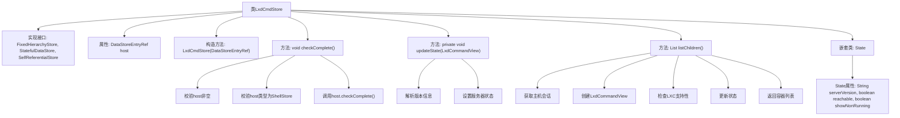
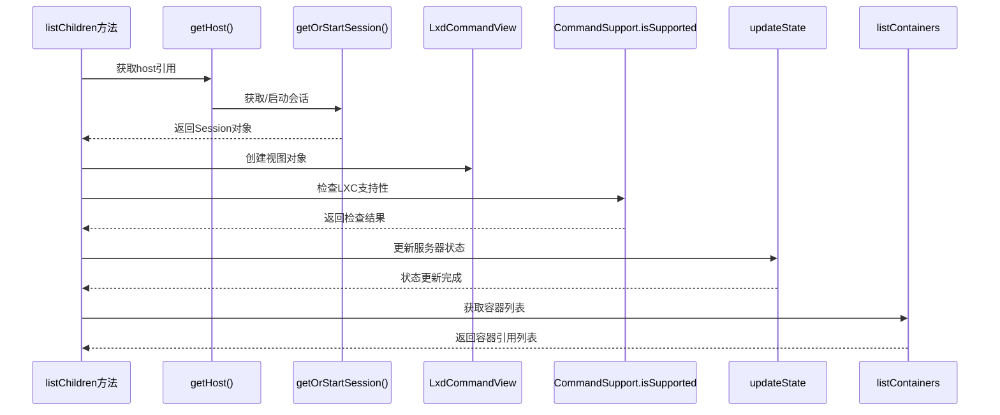

# 基础信息

|      |      |
|------|------|
| 名称 | LxdCmdStore |
| 编码语言 | .java |
| 代码路径 | xpipe/ext/system/src/main/java/io/xpipe/ext/system/lxd/LxdCmdStore.java |
| 包名 | io.xpipe.ext.system.lxd |
| 依赖项 | ['io.xpipe.app.ext.ShellStore', 'io.xpipe.app.storage.DataStoreEntryRef', 'io.xpipe.app.util.CommandSupport', 'io.xpipe.app.util.FixedHierarchyStore', 'io.xpipe.app.util.Validators', 'io.xpipe.core.store.DataStoreState', 'io.xpipe.core.store.FixedChildStore', 'io.xpipe.core.store.StatefulDataStore', 'io.xpipe.ext.base.SelfReferentialStore', 'com.fasterxml.jackson.annotation.JsonTypeName', 'lombok.EqualsAndHashCode', 'lombok.Value', 'lombok.experimental.SuperBuilder', 'lombok.extern.jackson.Jacksonized', 'java.util.List', 'java.util.regex.Pattern'] |
| 概述说明 | LXD命令存储类，管理主机连接、状态及容器列表。 |

# 说明

这是一个名为LxdCmdStore的Java类，实现了FixedHierarchyStore、StatefulDataStore和SelfReferentialStore接口。它包含一个ShellStore类型的host引用，并通过构造函数初始化。类中定义了checkComplete方法用于验证host非空且类型正确。updateState方法通过正则表达式解析服务器版本信息并更新状态。listChildren方法获取会话、检查LXD CLI客户端支持、更新状态并返回容器列表。内部类State继承DataStoreState，包含serverVersion、reachable和showNonRunning三个状态字段，使用构建器模式创建实例。整个类使用了Lombok注解简化代码，包括@Value、@SuperBuilder和@Jacksonized。

# 类列表 Class Summary

| 名称   | 类型  | 说明 |
|-------|------|-------------|
| LxdCmdStore | class | LxdCmdStore类实现状态管理，包含主机引用、状态更新和子容器列表功能。 |


## 类 LxdCmdStore

|      |      |
|------|------|
| 访问范围 | @JsonTypeName("lxdCmd");@SuperBuilder;@Jacksonized;@Value;public |
| 类型 | class |
| 名称 | LxdCmdStore |
| 说明 | LxdCmdStore类实现状态管理，包含主机引用、状态更新和子容器列表功能。 |


### UML类图

```mermaid
classDiagram
    class LxdCmdStore {
        -DataStoreEntryRef~ShellStore~ host
        +LxdCmdStore(DataStoreEntryRef~ShellStore~ host)
        +void checkComplete() throws Throwable
        -void updateState(LxdCommandView view) throws Exception
        +List~? extends DataStoreEntryRef~? extends FixedChildStore~~ listChildren() throws Exception
    }

    class State {
        -String serverVersion
        -boolean reachable
        -boolean showNonRunning
    }

    <<Interface>> FixedHierarchyStore
    <<Interface>> StatefulDataStore~State~
    <<Interface>> SelfReferentialStore

    LxdCmdStore --|> FixedHierarchyStore : 实现
    LxdCmdStore --|> StatefulDataStore~State~ : 实现
    LxdCmdStore --|> SelfReferentialStore : 实现
    LxdCmdStore *-- State : 包含

    class DataStoreEntryRef~T~ {
        <<泛型类>>
    }
    class DataStoreState {
        <<基类>>
    }
    class LxdCommandView {
        <<工具类>>
    }

    LxdCmdStore --> DataStoreEntryRef~ShellStore~ : 依赖
    State --|> DataStoreState : 继承
    LxdCmdStore --> LxdCommandView : 依赖
```

这段代码描述了一个LXD命令存储类`LxdCmdStore`，它实现了三个接口：`FixedHierarchyStore`、`StatefulDataStore`和`SelfReferentialStore`。该类包含一个内部状态类`State`，用于跟踪服务器版本、可达性等状态信息。主要功能包括完整性检查、状态更新和子节点列表获取。类图中清晰地展示了类之间的关系，包括实现接口、包含状态类以及与其他工具类的依赖关系。该设计体现了良好的分层架构，通过泛型和接口实现了灵活的存储管理能力。


### 内部方法调用关系图





这段代码定义了一个LXD命令存储类LxdCmdStore，实现了多个存储接口。主要功能包括：通过构造方法初始化主机引用，检查存储完整性(checkComplete)，更新服务器状态(updateState)，以及列出子容器(listChildren)。其中updateState方法会解析LXD版本信息并设置服务器可达状态，listChildren方法通过LxdCommandView获取容器列表并更新状态。嵌套类State用于维护服务器版本、可达性和运行状态等数据。整个类设计用于管理LXD容器的存储和状态信息。

### 字段列表 Field List

| 名称  | 类型  | 说明 |
|-------|-------|------|
| host | DataStoreEntryRef<ShellStore> | 存储ShellStore引用的数据条目。 |

### 方法列表 Method List

| 名称  | 类型  | 说明 |
|-------|-------|------|
| listChildren | List<? extends DataStoreEntryRef<? extends FixedChildStore>> | 重写listChildren方法，检查LXD CLI支持并返回容器列表。 |
| checkComplete | void | 检查host非空且为ShellStore类型，并调用其checkComplete方法。 |
| updateState | void | 方法更新状态：检查服务器版本，设置可达性和版本信息。 |


