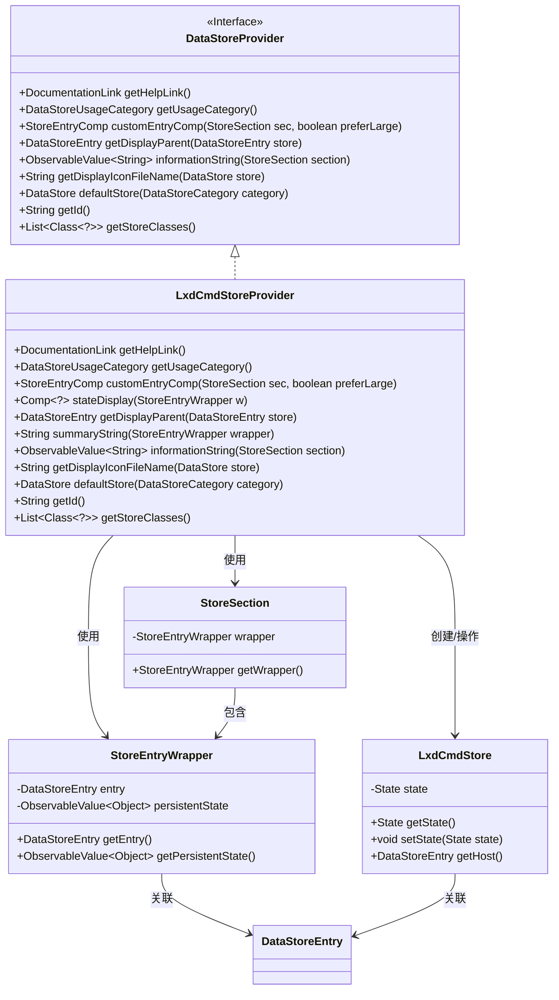
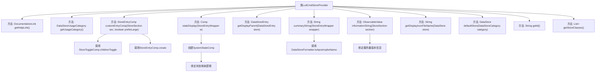

# 基础信息

|      |      |
|------|------|
| 名称 | LxdCmdStoreProvider |
| 编码语言 | .java |
| 代码路径 | xpipe/ext/system/src/main/java/io/xpipe/ext/system/lxd/LxdCmdStoreProvider.java |
| 包名 | io.xpipe.ext.system.lxd |
| 依赖项 | ['io.xpipe.app.comp.Comp', 'io.xpipe.app.comp.store', 'io.xpipe.app.ext.DataStoreProvider', 'io.xpipe.app.ext.DataStoreUsageCategory', 'io.xpipe.app.storage.DataStorage', 'io.xpipe.app.storage.DataStoreCategory', 'io.xpipe.app.storage.DataStoreEntry', 'io.xpipe.app.util.BindingsHelper', 'io.xpipe.app.util.DataStoreFormatter', 'io.xpipe.app.util.DocumentationLink', 'io.xpipe.core.store.DataStore', 'javafx.beans.value.ObservableValue', 'java.util.List'] |
| 概述说明 | LxdCmdStoreProvider实现DataStoreProvider接口，提供LXD容器存储管理功能，包括状态显示、分类和默认存储等。 |

# 说明

LxdCmdStoreProvider类实现了DataStoreProvider接口，主要用于管理LXD容器存储。它提供了帮助文档链接、使用类别为GROUP，并支持自定义条目组件和状态显示。功能包括：切换非运行容器显示、根据可达性显示成功或失败状态、获取显示父级条目、生成摘要字符串（如主机名加容器）、返回连接状态信息（如LXD版本或连接失败）、指定显示图标文件。默认存储为LxdCmdStore实例，ID为lxdCmd，存储类仅限LxdCmdStore。

# 类列表 Class Summary

| 名称   | 类型  | 说明 |
|-------|------|-------------|
| LxdCmdStoreProvider | class | LxdCmdStoreProvider实现DataStoreProvider接口，管理LXD容器存储，提供状态显示、分类和帮助链接等功能。 |

## 类 LxdCmdStoreProvider

|      |      |
|------|------|
| 访问范围 | public |
| 类型 | class |
| 名称 | LxdCmdStoreProvider |
| 说明 | LxdCmdStoreProvider实现DataStoreProvider接口，管理LXD容器存储，提供状态显示、分类和帮助链接等功能。 |

### UML类图

这段类图展示了LxdCmdStoreProvider作为DataStoreProvider接口的实现类，负责管理LXD容器存储的相关功能。核心类包括LxdCmdStore（存储状态）、StoreEntryWrapper（条目包装器）和StoreSection（存储分区）。LxdCmdStoreProvider通过自定义组件、状态显示和信息字符串等方法，实现了对LXD容器存储的完整管理能力，包括状态监控、父级条目获取和图标显示等功能，体现了清晰的职责划分和模块化设计。

### 内部方法调用关系图

流程图描述：该流程图展示了LxdCmdStoreProvider类的完整结构，包含11个核心方法实现。重点突出了customEntryComp方法内部的StoreToggleComp调用链、stateDisplay方法的状态绑定机制，以及informationString方法的动态数据绑定特性。类实现了DataStoreProvider接口，主要功能包括容器状态管理、数据显示定制和LXD连接处理，其中包含多个涉及状态转换和UI组件创建的复杂交互流程。

### 字段列表 Field List

| 名称  | 类型  | 说明 |
|-------|-------|------|

### 方法列表 Method List

| 名称  | 类型  | 说明 |
|-------|-------|------|
| getHelpLink | DocumentationLink | 重写getHelpLink方法，返回LXC文档链接。 |
| stateDisplay | Comp<?> | 方法根据存储状态返回系统状态组件，可达为成功，否则失败。 |
| informationString | ObservableValue<String> | 重写方法，返回LXD连接状态信息：成功显示版本号，失败提示连接失败。 |
| defaultStore | DataStore | 重写方法，返回基于本地存储的LxdCmdStore实例。 |
| summaryString | String | 方法返回主机名加" containers"字符串。 |
| getDisplayIconFileName | String | 重写方法返回LXD图标文件名。 |
| getUsageCategory | DataStoreUsageCategory | 重写方法返回GROUP类型的数据存储用途分类。 |
| getDisplayParent | DataStoreEntry | 重写方法，获取数据存储条目显示父级，返回主机实例。 |
| customEntryComp | StoreEntryComp | 重写方法，创建包含非运行状态切换的存储条目组件。 |
| getId | String | 重写getId方法，返回字符串"lxdCmd"。 |
| getStoreClasses | List<Class<?>> | 重写方法返回包含LxdCmdStore的列表。 |

