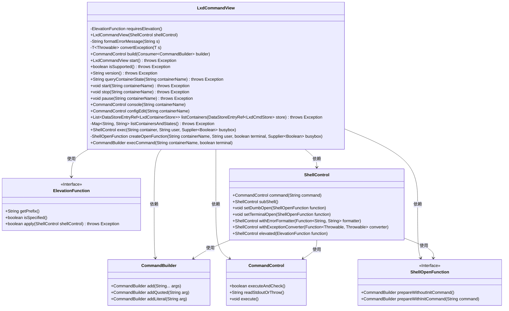

# 基础信息

|      |      |
|------|------|
| 名称 | LxdCommandView |
| 编码语言 | .java |
| 代码路径 | xpipe/ext/system/src/main/java/io/xpipe/ext/system/lxd/LxdCommandView.java |
| 包名 | io.xpipe.ext.system.lxd |
| 依赖项 | ['io.xpipe.app.ext.ContainerStoreState', 'io.xpipe.app.issue.ErrorEvent', 'io.xpipe.app.storage.DataStoreEntry', 'io.xpipe.app.storage.DataStoreEntryRef', 'io.xpipe.app.util.CommandViewBase', 'io.xpipe.core.process', 'lombok.NonNull', 'java.util', 'java.util.function.Consumer', 'java.util.function.Supplier', 'java.util.stream.Collectors'] |
| 概述说明 | LXD命令视图类，提供容器管理功能如启动、停止、查询状态等。 |

# 说明

LxdCommandView是一个继承自CommandViewBase的类，用于管理LXD容器操作。它提供了检查LXD套接字权限的ElevationFunction，支持执行LXC命令并处理错误和异常。主要功能包括启动、停止、暂停容器，查询容器状态，编辑配置，进入控制台，以及执行容器内命令。通过ShellControl实现命令执行，支持错误格式化和异常转换。还包含容器列表查询和状态管理功能，支持不同用户和终端模式下的命令执行。

# 类列表 Class Summary

| 名称   | 类型  | 说明 |
|-------|------|-------------|
| LxdCommandView | class | LXD命令视图类，提供容器管理功能，如启动、停止、查询状态等。 |

## 类 LxdCommandView

|      |      |
|------|------|
| 访问范围 | public |
| 类型 | class |
| 名称 | LxdCommandView |
| 说明 | LXD命令视图类，提供容器管理功能，如启动、停止、查询状态等。 |

### UML类图

这段代码展示了一个LXD容器管理工具的核心类`LxdCommandView`，它继承自`CommandViewBase`（图中未展示）。该类通过`ShellControl`执行LXC命令，支持容器启动/停止/暂停、状态查询、控制台连接等操作。关键特性包括权限提升处理（通过`ElevationFunction`接口）、错误格式化、异常转换，以及通过`ShellOpenFunction`实现交互式终端功能。类图中清晰地展示了各组件间的协作关系，特别是`LxdCommandView`如何组合多个接口和工具类来完成复杂的容器管理任务。

### 内部方法调用关系图

```mermaid
graph TD
    A["类LxdCommandView"]
    B["构造方法: LxdCommandView(ShellControl shellControl)"]
    C["私有方法: static String formatErrorMessage(String s)"]
    D["私有方法: static <T> T convertException(T s)"]
    E["重写方法: CommandControl build(Consumer<CommandBuilder> builder)"]
    F["重写方法: LxdCommandView start()"]
    G["公共方法: boolean isSupported()"]
    H["公共方法: String version()"]
    I["公共方法: String queryContainerState(String containerName)"]
    J["公共方法: void start(String containerName)"]
    K["公共方法: void stop(String containerName)"]
    L["公共方法: void pause(String containerName)"]
    M["公共方法: CommandControl console(String containerName)"]
    N["公共方法: CommandControl configEdit(String containerName)"]
    O["公共方法: List<DataStoreEntryRef> listContainers(DataStoreEntryRef store)"]
    P["私有方法: Map<String,String> listContainersAndStates()"]
    Q["公共方法: ShellControl exec(String container, String user, Supplier<Boolean> busybox)"]
    R["私有方法: ShellOpenFunction createOpenFunction(String containerName, String user, boolean terminal, Supplier<Boolean> busybox)"]
    S["公共方法: CommandBuilder execCommand(String containerName, boolean terminal)"]
    T["静态方法: static ElevationFunction requiresElevation()"]

    A --> B
    A --> C
    A --> D
    A --> E
    A --> F
    A --> G
    A --> H
    A --> I
    A --> J
    A --> K
    A --> L
    A --> M
    A --> N
    A --> O
    A --> P
    A --> Q
    A --> R
    A --> S
    A -.-> T
```

该流程图展示了LxdCommandView类的完整结构，包含构造函数、私有方法、公共方法和静态方法。类主要处理LXD容器操作，包括启动/停止容器、查询状态、执行命令等核心功能。关键方法build()作为命令构造入口，requiresElevation()处理权限提升，listContainersAndStates()实现容器状态采集。错误处理和命令执行流程通过formatErrorMessage和convertException方法标准化，体现了对Shell命令执行的完整封装。

### 字段列表 Field List

| 名称  | 类型  | 说明 |
|-------|-------|------|

### 方法列表 Method List

| 名称  | 类型  | 说明 |
|-------|-------|------|
| build | CommandControl | 构建LXC命令控制，支持错误处理和权限提升。 |
| formatErrorMessage | String | 私有方法格式化错误信息，直接返回输入字符串。 |
| version | String | Java方法：调用LXC版本命令，处理错误和异常，返回输出。 |
| convertException | T | 转换异常为预期错误事件 |
| queryContainerState | String | 查询容器状态，返回名称对应的状态，不存在则返回"?"。 |
| isSupported | boolean | 检查LXC命令是否支持，执行并验证结果。 |
| console | CommandControl | 构建控制台命令，参数为容器名。 |
| configEdit | CommandControl | 配置编辑命令，输入容器名，返回控制对象。 |
| pause | void | 暂停指定容器。 |
| start | void | 启动指定容器的方法，异常时抛出。 |
| listContainers | List<DataStoreEntryRef<LxdContainerStore>> | 列出LXD容器并返回状态信息列表。 |
| requiresElevation | ElevationFunction | 私有方法检查LXD套接字可写性，返回ElevationFunction实例。 |
| stop | void | 停止指定名称的容器。 |
| start | LxdCommandView | 重写start方法，调用shellControl.start()并返回自身。 |
| listContainersAndStates | Map<String, String> | 私有方法列出容器及状态，处理旧版LXD不兼容错误。 |
| exec | ShellControl | ShellControl方法exec创建子shell，设置打开函数并配置错误处理和权限提升。 |
| createOpenFunction | ShellOpenFunction | 创建ShellOpenFunction，根据用户和终端参数生成命令，支持初始命令判断。 |
| execCommand | CommandBuilder | 创建LXC容器执行命令构建器，支持终端参数。 |

