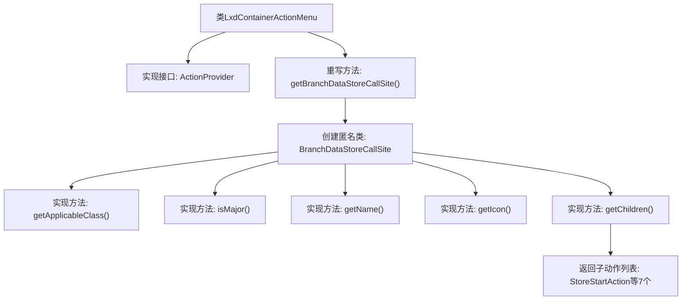

# 基础信息

|      |      |
|------|------|
| 名称 | LxdContainerActionMenu |
| 编码语言 | .java |
| 代码路径 | xpipe/ext/system/src/main/java/io/xpipe/ext/system/lxd/LxdContainerActionMenu.java |
| 包名 | io.xpipe.ext.system.lxd |
| 依赖项 | ['io.xpipe.app.core.AppI18n', 'io.xpipe.app.ext.ActionProvider', 'io.xpipe.app.storage.DataStoreEntryRef', 'io.xpipe.app.util.LabelGraphic', 'io.xpipe.ext.base.store.StorePauseAction', 'io.xpipe.ext.base.store.StoreRestartAction', 'io.xpipe.ext.base.store.StoreStartAction', 'io.xpipe.ext.base.store.StoreStopAction', 'javafx.beans.value.ObservableValue', 'java.util.List'] |
| 概述说明 | Lxd容器操作菜单类，提供启动、停止、暂停等容器操作选项。 |

# 说明

该代码定义了一个名为LxdContainerActionMenu的类，实现了ActionProvider接口。主要功能是为LXD容器提供操作菜单，包括获取数据存储调用站点、确定适用类、判断重要性、获取名称和图标，以及返回子操作列表。子操作包含启动、停止、暂停、重启容器，以及控制台访问和配置编辑等功能。所有操作均通过BranchDataStoreCallSite进行封装管理。

# 类列表 Class Summary

| 名称   | 类型  | 说明 |
|-------|------|-------------|
| LxdContainerActionMenu | class | Lxd容器操作菜单类，提供启动、停止、暂停等子操作。 |


## 类 LxdContainerActionMenu

|      |      |
|------|------|
| 访问范围 | public |
| 类型 | class |
| 名称 | LxdContainerActionMenu |
| 说明 | Lxd容器操作菜单类，提供启动、停止、暂停等子操作。 |


### UML类图

```mermaid
classDiagram
    class LxdContainerActionMenu {
        +BranchDataStoreCallSite~?~ getBranchDataStoreCallSite()
    }
    <<Interface>> ActionProvider {
        <<interface>>
        +BranchDataStoreCallSite~?~ getBranchDataStoreCallSite()
    }
    class BranchDataStoreCallSite~T~ {
        <<interface>>
        +Class~T~ getApplicableClass()
        +boolean isMajor(DataStoreEntryRef~T~ o)
        +ObservableValue~String~ getName(DataStoreEntryRef~T~ store)
        +LabelGraphic getIcon(DataStoreEntryRef~T~ store)
        +List~ActionProvider~ getChildren(DataStoreEntryRef~T~ store)
    }
    class DataStoreEntryRef~T~ {
    }
    class ObservableValue~String~ {
    }
    class LabelGraphic {
    }
    class AppI18n {
        +ObservableValue~String~ observable(String key)
    }
    class StoreStartAction {
    }
    class StoreStopAction {
    }
    class StorePauseAction {
    }
    class StoreRestartAction {
    }
    class LxdContainerConsoleAction {
    }
    class LxdContainerEditConfigAction {
    }
    class LxdContainerEditRunConfigAction {
    }

    LxdContainerActionMenu --> ActionProvider : 实现
    BranchDataStoreCallSite~?~ <|-- LxdContainerActionMenu : 匿名实现
    BranchDataStoreCallSite~T~ --> DataStoreEntryRef~T~ : 使用
    BranchDataStoreCallSite~T~ --> ObservableValue~String~ : 返回
    BranchDataStoreCallSite~T~ --> LabelGraphic : 返回
    BranchDataStoreCallSite~T~ --> ActionProvider : 返回
    AppI18n --> ObservableValue~String~ : 创建
    StoreStartAction --> ActionProvider : 实现
    StoreStopAction --> ActionProvider : 实现
    StorePauseAction --> ActionProvider : 实现
    StoreRestartAction --> ActionProvider : 实现
    LxdContainerConsoleAction --> ActionProvider : 实现
    LxdContainerEditConfigAction --> ActionProvider : 实现
    LxdContainerEditRunConfigAction --> ActionProvider : 实现
```

该图展示了LXD容器操作菜单的类结构，核心是LxdContainerActionMenu实现了ActionProvider接口，并通过匿名类实现了BranchDataStoreCallSite接口。BranchDataStoreCallSite接口定义了获取容器操作相关信息的多种方法，包括获取适用类、判断重要性、获取名称/图标/子操作等。系统通过DataStoreEntryRef泛型类引用数据存储条目，并返回ObservableValue和LabelGraphic等UI组件。底部7个具体操作类（如启动/停止容器）都实现了ActionProvider接口，构成完整的容器操作体系。


### 内部方法调用关系图



这段代码展示了一个LxdContainerActionMenu类，它实现了ActionProvider接口并重写了getBranchDataStoreCallSite方法。该方法返回一个匿名BranchDataStoreCallSite实例，该实例定义了容器操作相关的5个核心方法：获取适用类、判断主操作、获取名称、获取图标以及生成子操作列表。子操作列表包含7种具体的容器操作类型，如启动、停止、暂停等，这些操作都实现了ActionProvider接口。整体结构体现了组合设计模式，通过嵌套的匿名类实现功能扩展。

### 字段列表 Field List

| 名称  | 类型  | 说明 |
|-------|-------|------|

### 方法列表 Method List

| 名称  | 类型  | 说明 |
|-------|-------|------|
| getBranchDataStoreCallSite | BranchDataStoreCallSite<?> | 重写方法返回BranchDataStoreCallSite实例，定义LxdContainerStore相关操作和子动作。 |


