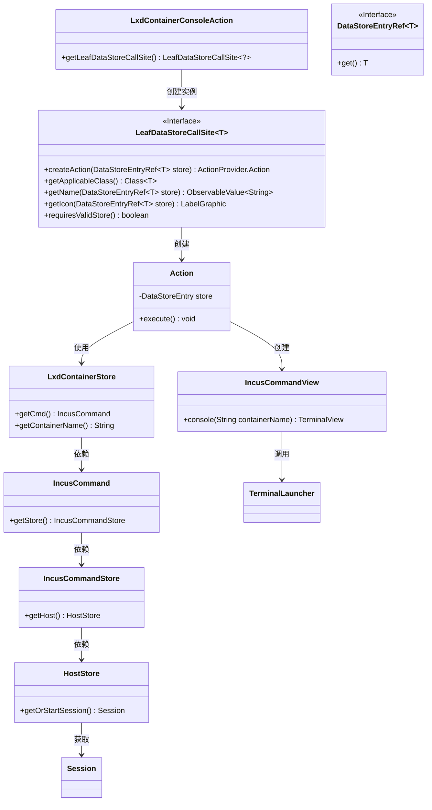
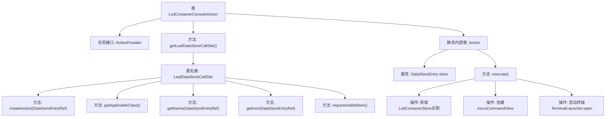

# 基础信息

|      |      |
|------|------|
| 名称 | LxdContainerConsoleAction |
| 编码语言 | .java |
| 代码路径 | xpipe/ext/system/src/main/java/io/xpipe/ext/system/lxd/LxdContainerConsoleAction.java |
| 包名 | io.xpipe.ext.system.lxd |
| 依赖项 | ['io.xpipe.app.core.AppI18n', 'io.xpipe.app.ext.ActionProvider', 'io.xpipe.app.storage.DataStoreEntry', 'io.xpipe.app.storage.DataStoreEntryRef', 'io.xpipe.app.terminal.TerminalLauncher', 'io.xpipe.app.util.LabelGraphic', 'io.xpipe.ext.system.incus.IncusCommandView', 'javafx.beans.value.ObservableValue', 'lombok.Value'] |
| 概述说明 | Lxd容器控制台操作类，实现ActionProvider接口，提供创建、执行控制台操作功能。 |

# 说明

该代码定义了一个名为LxdContainerConsoleAction的类，实现了ActionProvider接口，用于提供LXD容器控制台操作功能。主要包含两个部分：一是getLeafDataStoreCallSite方法返回一个LeafDataStoreCallSite实例，用于创建控制台操作动作，指定了适用的LxdContainerStore类、操作名称、图标等；二是内部静态Action类实现了具体执行逻辑，通过IncusCommandView和TerminalLauncher打开指定容器的控制台终端。整个结构实现了从数据存储到终端操作的完整流程。

# 类列表 Class Summary

| 名称   | 类型  | 说明 |
|-------|------|-------------|
| LxdContainerConsoleAction | class | Lxd容器控制台操作类，实现ActionProvider接口，提供串行控制台功能。 |

## 类 LxdContainerConsoleAction

|      |      |
|------|------|
| 访问范围 | public |
| 类型 | class |
| 名称 | LxdContainerConsoleAction |
| 说明 | Lxd容器控制台操作类，实现ActionProvider接口，提供串行控制台功能。 |

### UML类图

这段代码描述了一个LXD容器控制台操作的实现结构。LxdContainerConsoleAction作为入口类，通过LeafDataStoreCallSite接口创建具体操作，Action类负责执行实际控制台打开逻辑。整个流程涉及多层数据存储访问（从容器存储到主机会话），最终通过TerminalLauncher打开控制台视图。类图清晰地展示了从顶层操作到底层终端启动的完整调用链和数据依赖关系。

### 内部方法调用关系图

这段代码实现了LXD容器控制台操作的功能，主要包含一个主类LxdContainerConsoleAction和静态内部类Action。主类通过getLeafDataStoreCallSite方法返回一个匿名类实例，该实例定义了创建动作、获取适用类、名称、图标等核心方法。内部类Action负责具体执行逻辑，包括获取容器存储实例、创建命令行视图并启动终端控制台。整个流程展示了从动作定义到终端启动的完整调用链，适用于容器管理场景。

### 字段列表 Field List

| 名称  | 类型  | 说明 |
|-------|-------|------|

### 方法列表 Method List

| 名称  | 类型  | 说明 |
|-------|-------|------|
| getLeafDataStoreCallSite | LeafDataStoreCallSite<?> | 重写方法返回自定义LeafDataStoreCallSite，实现创建动作、类匹配、名称、图标及有效性检查。 |

