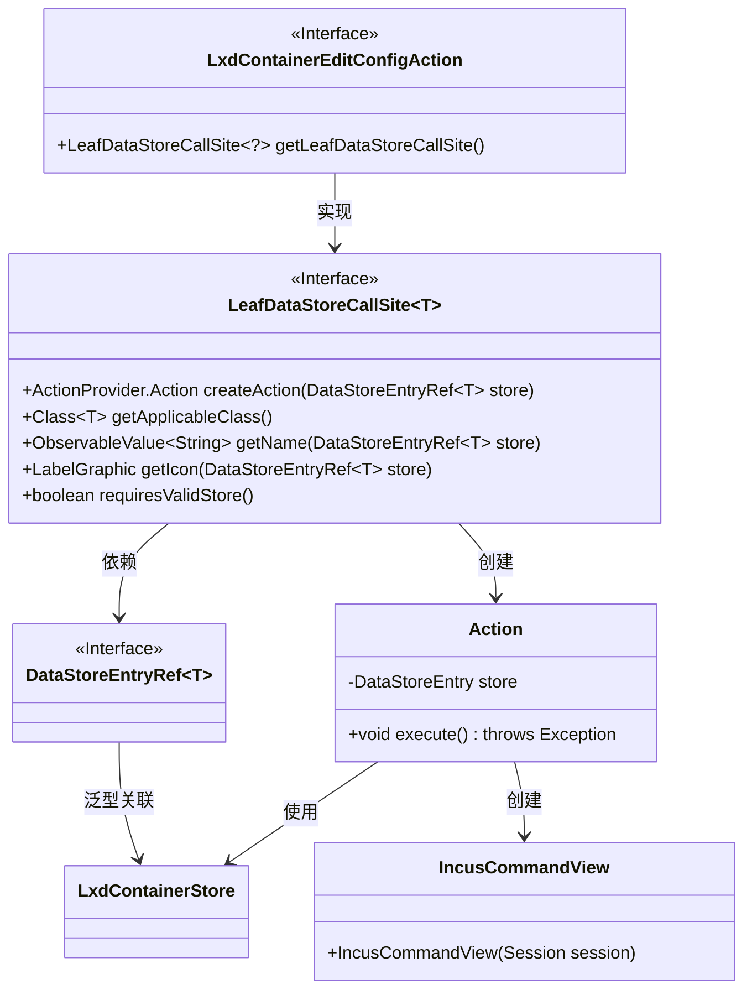
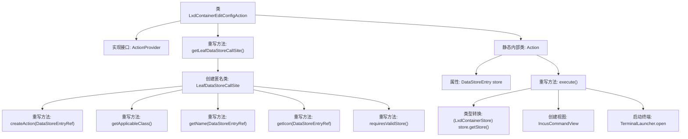

# 基础信息

|      |      |
|------|------|
| 名称 | LxdContainerEditConfigAction |
| 编码语言 | .java |
| 代码路径 | xpipe/ext/system/src/main/java/io/xpipe/ext/system/lxd/LxdContainerEditConfigAction.java |
| 包名 | io.xpipe.ext.system.lxd |
| 依赖项 | ['io.xpipe.app.core.AppI18n', 'io.xpipe.app.ext.ActionProvider', 'io.xpipe.app.storage.DataStoreEntry', 'io.xpipe.app.storage.DataStoreEntryRef', 'io.xpipe.app.terminal.TerminalLauncher', 'io.xpipe.app.util.LabelGraphic', 'io.xpipe.ext.system.incus.IncusCommandView', 'javafx.beans.value.ObservableValue', 'lombok.Value'] |
| 概述说明 | LxdContainerEditConfigAction类提供编辑LXD容器配置的功能，包含创建操作、图标和名称定义，执行时打开终端编辑配置。 |

# 说明

该代码定义了一个名为LxdContainerEditConfigAction的类，实现了ActionProvider接口，用于编辑LXD容器配置。主要功能包括：创建数据存储调用站点，返回适用于LxdContainerStore类的操作；提供操作名称和图标；执行操作时打开终端启动器，加载容器配置编辑视图。内部Action类负责具体执行逻辑，通过IncusCommandView和TerminalLauncher实现配置编辑功能。

# 类列表 Class Summary

| 名称   | 类型  | 说明 |
|-------|------|-------------|
| LxdContainerEditConfigAction | class | LxdContainerEditConfigAction类实现编辑LXD容器配置功能，包含创建操作、图标及执行逻辑。 |

## 类 LxdContainerEditConfigAction

|      |      |
|------|------|
| 访问范围 | public |
| 类型 | class |
| 名称 | LxdContainerEditConfigAction |
| 说明 | LxdContainerEditConfigAction类实现编辑LXD容器配置功能，包含创建操作、图标及执行逻辑。 |

### UML类图

这段类图展示了LXD容器配置编辑功能的实现结构。LxdContainerEditConfigAction作为入口类，通过LeafDataStoreCallSite接口提供操作工厂，生成具体的Action实现。Action类负责执行核心逻辑，依赖LxdContainerStore获取容器数据，并通过IncusCommandView进行配置编辑界面展示。整个设计采用工厂模式，通过泛型接口实现类型安全的存储访问，同时支持国际化文本和图标定制。

### 内部方法调用关系图

该流程图展示了LxdContainerEditConfigAction类的核心结构和执行流程。主类实现ActionProvider接口并重写getLeafDataStoreCallSite方法，该方法返回一个包含5个重写方法的匿名类。静态内部类Action通过execute方法实现核心逻辑：获取存储数据、创建配置编辑视图并启动终端窗口。整个设计采用分层结构，通过匿名类和内部类实现功能解耦，最终完成LXD容器配置编辑操作。

### 字段列表 Field List

| 名称  | 类型  | 说明 |
|-------|-------|------|

### 方法列表 Method List

| 名称  | 类型  | 说明 |
|-------|-------|------|
| getLeafDataStoreCallSite | LeafDataStoreCallSite<?> | 重写getLeafDataStoreCallSite方法，返回自定义LeafDataStoreCallSite实例，包含创建动作、适用类、名称、图标及有效性要求。 |

