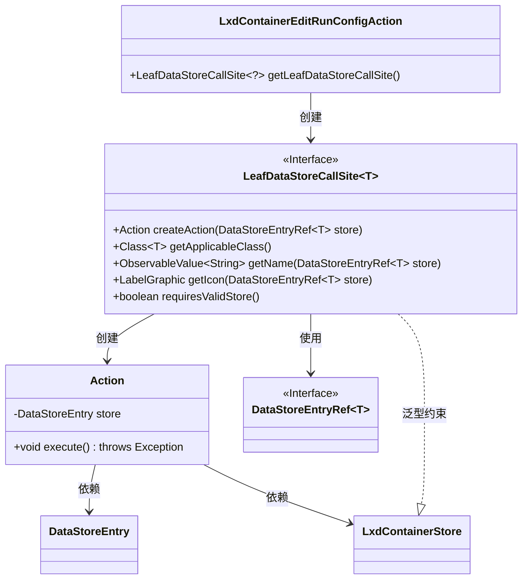
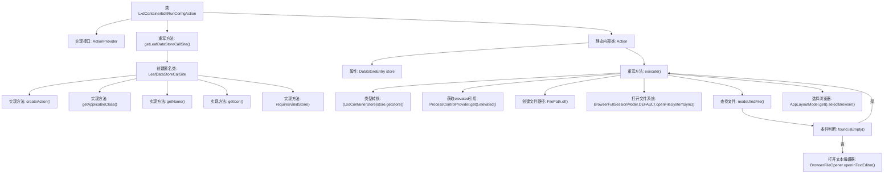

# 基础信息

|      |      |
|------|------|
| 名称 | LxdContainerEditRunConfigAction |
| 编码语言 | .java |
| 代码路径 | xpipe/ext/system/src/main/java/io/xpipe/ext/system/lxd/LxdContainerEditRunConfigAction.java |
| 包名 | io.xpipe.ext.system.lxd |
| 依赖项 | ['io.xpipe.app.browser.BrowserFullSessionModel', 'io.xpipe.app.browser.file.BrowserFileOpener', 'io.xpipe.app.core.AppI18n', 'io.xpipe.app.core.AppLayoutModel', 'io.xpipe.app.ext.ActionProvider', 'io.xpipe.app.ext.ProcessControlProvider', 'io.xpipe.app.storage.DataStoreEntry', 'io.xpipe.app.storage.DataStoreEntryRef', 'io.xpipe.app.util.LabelGraphic', 'io.xpipe.core.store.FilePath', 'javafx.beans.value.ObservableValue', 'lombok.Value'] |
| 概述说明 | Lxd容器编辑运行配置的ActionProvider实现类。 |

# 说明

LxdContainerEditRunConfigAction是一个实现ActionProvider接口的类，用于编辑LXD容器的运行配置。它通过LeafDataStoreCallSite提供操作逻辑，包括创建动作、获取名称、图标及适用类。内部Action类执行具体操作：获取容器存储，通过提升权限访问容器配置文件路径，在文件系统中查找并打开配置文件进行编辑。整个过程涉及权限提升、文件系统操作和文本编辑器集成。

# 类列表 Class Summary

| 名称   | 类型  | 说明 |
|-------|------|-------------|
| LxdContainerEditRunConfigAction | class | Lxd容器编辑运行配置的ActionProvider实现类。 |

## 类 LxdContainerEditRunConfigAction

|      |      |
|------|------|
| 访问范围 | public |
| 类型 | class |
| 名称 | LxdContainerEditRunConfigAction |
| 说明 | Lxd容器编辑运行配置的ActionProvider实现类。 |

### UML类图

这段代码描述了一个LXD容器编辑运行配置的动作系统。LxdContainerEditRunConfigAction作为入口类，通过getLeafDataStoreCallSite()方法返回一个匿名LeafDataStoreCallSite实现，该实现负责创建具体的Action操作。Action类包含核心业务逻辑execute()方法，通过文件系统操作打开容器配置文件进行编辑。整个设计采用泛型接口和匿名内部类实现，体现了良好的扩展性和类型安全性，同时通过DataStoreEntryRef等接口实现数据存储的抽象访问。

### 内部方法调用关系图

这段代码流程图展示了LxdContainerEditRunConfigAction类的完整执行流程。该类实现了ActionProvider接口，主要功能是通过getLeafDataStoreCallSite方法返回一个匿名LeafDataStoreCallSite实例，该实例定义了创建动作、获取类名、名称、图标等行为。内部类Action实现了具体的执行逻辑，包括获取LXD容器存储、提升权限、定位配置文件、打开文件系统会话、查找文件并在文本编辑器中打开等步骤。整个过程体现了对LXD容器运行配置的编辑操作流程，包含权限管理和文件操作等关键环节。

### 字段列表 Field List

| 名称  | 类型  | 说明 |
|-------|-------|------|

### 方法列表 Method List

| 名称  | 类型  | 说明 |
|-------|-------|------|
| getLeafDataStoreCallSite | LeafDataStoreCallSite<?> | 重写LeafDataStoreCallSite方法，返回LxdContainerStore相关操作，包括创建动作、适用类、名称、图标及存储验证要求。 |

