# 基础信息

|      |      |
|------|------|
| 名称 | LxdContainerStore |
| 编码语言 | .java |
| 代码路径 | xpipe/ext/system/src/main/java/io/xpipe/ext/system/lxd/LxdContainerStore.java |
| 包名 | io.xpipe.ext.system.lxd |
| 依赖项 | ['io.xpipe.app.ext', 'io.xpipe.app.storage.DataStoreEntryRef', 'io.xpipe.app.util', 'io.xpipe.core.process.ShellControl', 'io.xpipe.core.store.FixedChildStore', 'io.xpipe.core.store.StatefulDataStore', 'io.xpipe.ext.base.identity.IdentityValue', 'io.xpipe.ext.base.store.PauseableStore', 'io.xpipe.ext.base.store.StartableStore', 'io.xpipe.ext.base.store.StoppableStore', 'com.fasterxml.jackson.annotation.JsonTypeName', 'lombok.AllArgsConstructor', 'lombok.Value', 'lombok.experimental.SuperBuilder', 'lombok.extern.jackson.Jacksonized', 'java.util.Objects', 'java.util.OptionalInt'] |
| 概述说明 | LXD容器存储类，实现多种接口，管理容器状态、命令执行及生命周期操作。 |

# 说明

LxdContainerStore是一个实现多种存储接口的Java类，用于管理LXD容器。它包含cmd、containerName和identity字段，提供容器名称、状态检查和固定ID功能。通过ShellControlFunction实现容器的控制逻辑，包括启动、停止、暂停和状态刷新。支持身份验证和错误处理，能动态更新容器状态。

# 类列表 Class Summary

| 名称   | 类型  | 说明 |
|-------|------|-------------|
| LxdContainerStore | class | LXD容器存储类，实现多种接口，管理容器状态与操作。 |


## 类 LxdContainerStore

|      |      |
|------|------|
| 访问范围 | @JsonTypeName("lxd");@SuperBuilder;@Jacksonized;@Value;@AllArgsConstructor;public |
| 类型 | class |
| 名称 | LxdContainerStore |
| 说明 | LXD容器存储类，实现多种接口，管理容器状态与操作。 |


### UML类图

```mermaid
classDiagram
    class LxdContainerStore {
        -DataStoreEntryRef~LxdCmdStore~ cmd
        -String containerName
        -IdentityValue identity
        +String getName()
        +Class~ContainerStoreState~ getStateClass()
        +void checkComplete() throws Throwable
        +OptionalInt getFixedId()
        +ShellControlFunction shellFunction()
        -void refreshContainerState(ShellControl sc) throws Exception
        +void start() throws Exception
        +void stop() throws Exception
        +void pause() throws Exception
    }

    <<Interface>> ShellStore
    <<Interface>> FixedChildStore
    <<Interface>> StatefulDataStore~ContainerStoreState~
    <<Interface>> StartableStore
    <<Interface>> StoppableStore
    <<Interface>> PauseableStore
    <<Interface>> NameableStore

    LxdContainerStore ..|> ShellStore : 实现
    LxdContainerStore ..|> FixedChildStore : 实现
    LxdContainerStore ..|> StatefulDataStore~ContainerStoreState~ : 实现
    LxdContainerStore ..|> StartableStore : 实现
    LxdContainerStore ..|> StoppableStore : 实现
    LxdContainerStore ..|> PauseableStore : 实现
    LxdContainerStore ..|> NameableStore : 实现

    class ShellControlFunction {
        <<Interface>>
        +ShellControl control(ShellControl parent) throws Exception
    }

    class ShellControlParentStoreFunction {
        +ShellStore getParentStore()
    }

    LxdContainerStore --> ShellControlFunction : 创建实例
    ShellControlParentStoreFunction ..|> ShellControlFunction : 实现
```

类图描述：LxdContainerStore 是一个实现了多个接口的复杂类，主要用于管理LXD容器的生命周期和状态。它通过ShellControlFunction提供容器控制功能，并依赖DataStoreEntryRef和IdentityValue等组件。该类实现了包括启动、停止、暂停容器在内的核心操作，并通过状态管理接口维护容器运行状态。图中清晰展示了类与7个接口的实现关系，以及其内部方法结构和关键依赖。


### 内部方法调用关系图

```mermaid
graph TD
    A["类LxdContainerStore"]
    B["实现接口: ShellStore, FixedChildStore, StatefulDataStore<ContainerStoreState>, StartableStore, StoppableStore, PauseableStore, NameableStore"]
    C["属性: DataStoreEntryRef<LxdCmdStore> cmd"]
    D["属性: String containerName"]
    E["属性: IdentityValue identity"]
    F["方法: String getName()"]
    G["方法: Class<ContainerStoreState> getStateClass()"]
    H["方法: void checkComplete()"]
    I["方法: OptionalInt getFixedId()"]
    J["方法: ShellControlFunction shellFunction()"]
    K["方法: void refreshContainerState(ShellControl sc)"]
    L["方法: void start()"]
    M["方法: void stop()"]
    N["方法: void pause()"]
    O["内部类: ShellControlParentStoreFunction"]

    A --> B
    A --> C
    A --> D
    A --> E
    A --> F
    A --> G
    A --> H
    A --> I
    A --> J
    J --> O
    O -->|override| P["ShellStore getParentStore()"]
    O -->|override| Q["ShellControl control(ShellControl parent)"]
    Q --> R["refreshContainerState"]
    Q --> S["new LxdCommandView"]
    Q --> T["setElevationHandler"]
    Q --> U["withSourceStore"]
    Q --> V["withShellStateInit"]
    Q --> W["onStartupFail"]
    A --> K
    K --> X["getState"]
    K --> Y["new LxdCommandView"]
    K --> Z["setState"]
    A --> L
    L --> AA["getCmd"]
    L --> AB["getOrStartSession"]
    L --> AC["new LxdCommandView"]
    L --> AD["start"]
    L --> K
    A --> M
    M --> AE["getCmd"]
    M --> AF["getOrStartSession"]
    M --> AG["new LxdCommandView"]
    M --> AH["stop"]
    M --> K
    A --> N
    N --> AI["getCmd"]
    N --> AJ["getOrStartSession"]
    N --> AK["new LxdCommandView"]
    N --> AL["pause"]
    N --> K
```



该流程图展示了LxdContainerStore类的结构和主要方法调用关系。该类实现了7个接口，包含3个核心属性和9个主要方法。核心逻辑集中在shellFunction()方法中，该方法返回一个匿名内部类ShellControlParentStoreFunction，负责处理容器控制逻辑。start()、stop()、pause()三个方法共享相似的执行流程：获取会话→创建视图→执行操作→刷新状态。refreshContainerState()作为关键辅助方法被多个方法调用，用于同步容器状态。整个设计体现了对LXD容器管理的完整生命周期控制。

### 字段列表 Field List

| 名称  | 类型  | 说明 |
|-------|-------|------|
| cmd | DataStoreEntryRef<LxdCmdStore> | LxdCmdStore命令存储引用 |
| containerName | String | 声明字符串变量containerName。 |
| identity | IdentityValue | 定义身份变量 |

### 方法列表 Method List

| 名称  | 类型  | 说明 |
|-------|-------|------|
| getFixedId | OptionalInt | 重写getFixedId方法，返回基于containerName哈希的OptionalInt。 |
| start | void | 重写start方法，初始化会话并启动容器视图，刷新状态。 |
| stop | void | 重写stop方法：获取会话，创建视图停止容器并刷新状态。 |
| pause | void | 重写pause方法，暂停容器并刷新状态。 |
| refreshContainerState | void | 刷新容器状态：查询并更新运行状态至新状态。 |
| checkComplete | void | 检查命令完整性，验证容器名，可选验证身份。 |
| getName | String | 重写getName方法，返回containerName。 |
| getStateClass | Class<ContainerStoreState> | 重写方法返回ContainerStoreState类类型。 |
| shellFunction | ShellControlFunction | 重写ShellControlFunction，获取父存储，控制容器状态，处理用户身份和异常。 |


