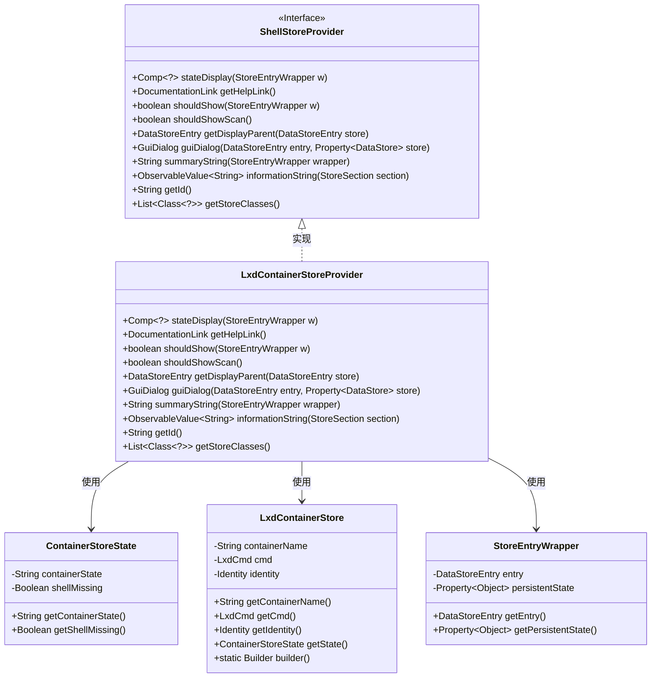
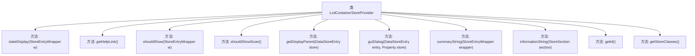

# 基础信息

|      |      |
|------|------|
| 名称 | LxdContainerStoreProvider |
| 编码语言 | .java |
| 代码路径 | xpipe/ext/system/src/main/java/io/xpipe/ext/system/lxd/LxdContainerStoreProvider.java |
| 包名 | io.xpipe.ext.system.lxd |
| 依赖项 | ['io.xpipe.app.comp.Comp', 'io.xpipe.app.comp.store', 'io.xpipe.app.ext.ContainerStoreState', 'io.xpipe.app.ext.GuiDialog', 'io.xpipe.app.storage.DataStoreEntry', 'io.xpipe.app.util', 'io.xpipe.core.store.DataStore', 'io.xpipe.ext.base.identity.IdentityChoice', 'io.xpipe.ext.base.store.ShellStoreProvider', 'javafx.beans.property.Property', 'javafx.beans.property.SimpleObjectProperty', 'javafx.beans.value.ObservableValue', 'java.util.List'] |
| 概述说明 | Lxd容器存储提供者，管理容器状态显示、对话框及信息摘要。 |

# 说明

LxdContainerStoreProvider是一个实现ShellStoreProvider接口的类，主要用于管理LXD容器存储的显示与交互逻辑。它包含状态显示方法，根据容器运行状态返回不同状态标识；提供帮助链接指向LXC文档；控制容器条目显示条件，如运行状态或配置要求。类还实现对话框构建、父条目获取、信息摘要生成等功能，支持容器身份绑定与配置更新。此外，它定义了唯一标识符"lxd"并声明支持的存储类为LxdContainerStore。

# 类列表 Class Summary

| 名称   | 类型  | 说明 |
|-------|------|-------------|
| LxdContainerStoreProvider | class | Lxd容器存储提供者，管理容器状态显示、帮助链接、显示条件及对话框配置。 |

## 类 LxdContainerStoreProvider

|      |      |
|------|------|
| 访问范围 | public |
| 类型 | class |
| 名称 | LxdContainerStoreProvider |
| 说明 | Lxd容器存储提供者，管理容器状态显示、帮助链接、显示条件及对话框配置。 |

### UML类图

该类图展示了LxdContainerStoreProvider实现ShellStoreProvider接口的结构关系，主要包含5个核心类。LxdContainerStoreProvider作为LXD容器存储提供者，通过实现接口方法管理容器状态显示、对话框构建等功能，依赖ContainerStoreState获取容器运行状态，使用LxdContainerStore操作容器数据，并通过StoreEntryWrapper包装存储条目。图中清晰呈现了接口实现关系和各组件间的协作方式，体现了模块化设计思想。

### 内部方法调用关系图

该流程图展示了LxdContainerStoreProvider类的完整结构，包含10个核心方法。stateDisplay方法处理容器状态显示逻辑，shouldShow控制条目可见性，guiDialog构建配置对话框，informationString生成状态信息字符串。类实现了ShellStoreProvider接口，专用于管理LXD容器存储的显示和交互逻辑，通过多种方法提供容器状态判断、帮助链接获取、父条目检索等功能，形成一个完整的容器存储管理解决方案。

### 字段列表 Field List

| 名称  | 类型  | 说明 |
|-------|-------|------|

### 方法列表 Method List

| 名称  | 类型  | 说明 |
|-------|-------|------|
| getHelpLink | DocumentationLink | 重写getHelpLink方法，返回LXC文档链接。 |
| informationString | ObservableValue<String> | 重写方法返回容器状态信息，包括缺失提示和格式化状态。 |
| getDisplayParent | DataStoreEntry | 重写getDisplayParent方法，返回容器存储命令结果。 |
| shouldShowScan | boolean | 重写方法，返回false不显示扫描。 |
| shouldShow | boolean | 检查容器状态，若运行中或允许显示非运行则返回真。 |
| stateDisplay | Comp<?> | 方法根据容器状态返回对应显示组件：停止返回FAILURE，运行返回SUCCESS，其他返回OTHER。 |
| guiDialog | GuiDialog | 创建LXD容器配置对话框，包含主机选择、容器名和身份绑定功能。 |
| getId | String | 重写getId方法，返回"lxd"。 |
| summaryString | String | 重写方法，返回主机名加"container"字符串。 |
| getStoreClasses | List<Class<?>> | 重写方法返回包含LxdContainerStore类的列表。 |

