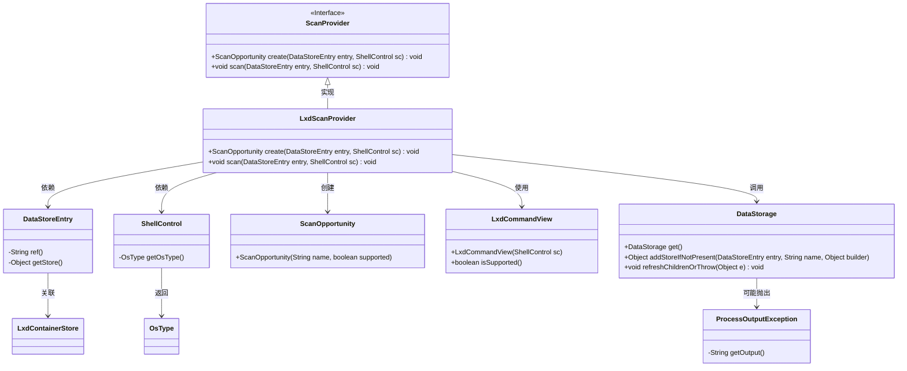
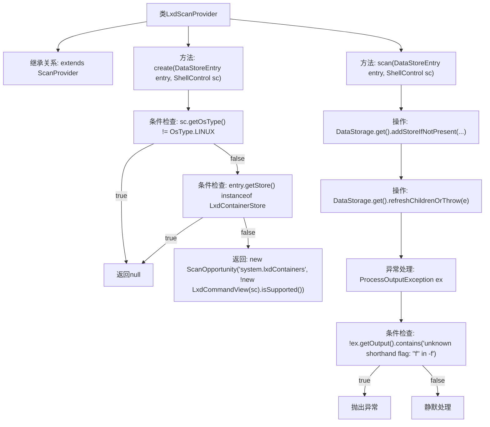

# 基础信息

|      |      |
|------|------|
| 名称 | LxdScanProvider |
| 编码语言 | .java |
| 代码路径 | xpipe/ext/system/src/main/java/io/xpipe/ext/system/lxd/LxdScanProvider.java |
| 包名 | io.xpipe.ext.system.lxd |
| 依赖项 | ['io.xpipe.app.ext.ScanProvider', 'io.xpipe.app.storage.DataStorage', 'io.xpipe.app.storage.DataStoreEntry', 'io.xpipe.core.process.OsType', 'io.xpipe.core.process.ProcessOutputException', 'io.xpipe.core.process.ShellControl'] |
| 概述说明 | LxdScanProvider类检查Linux系统及LXD容器支持，创建扫描机会并处理数据存储。 |

# 说明

LxdScanProvider是一个扫描提供者类，继承自ScanProvider。它包含两个主要方法：create和scan。create方法首先检查操作系统是否为Linux，以及数据存储条目是否为LXD容器存储，若不符合条件则返回null。否则返回一个ScanOpportunity对象，标识系统是否支持LXD容器。scan方法负责扫描LXD容器，通过DataStorage添加或更新存储条目，并尝试刷新子条目。若遇到特定异常（包含未知缩写标志的错误信息），则忽略该异常，否则重新抛出异常。整个过程涉及对LXD容器支持的检查和数据存储操作。

# 类列表 Class Summary

| 名称   | 类型  | 说明 |
|-------|------|-------------|
| LxdScanProvider | class | LxdScanProvider类检查Linux系统及LXD容器支持，创建扫描机会并处理数据存储异常。 |

## 类 LxdScanProvider

|      |      |
|------|------|
| 访问范围 | public |
| 类型 | class |
| 名称 | LxdScanProvider |
| 说明 | LxdScanProvider类检查Linux系统及LXD容器支持，创建扫描机会并处理数据存储异常。 |

### UML类图

该类图展示了LxdScanProvider继承自ScanProvider接口，并实现了创建扫描机会和执行扫描的核心逻辑。LxdScanProvider依赖多个辅助类如DataStoreEntry、ShellControl等来检查系统环境条件，并通过DataStorage管理数据存储。整个过程涉及条件判断、异常处理和子节点刷新等操作，专门用于处理LXD容器的扫描场景，体现了对Linux环境和特定命令行工具的强依赖关系。

### 内部方法调用关系图

该流程图描述了LxdScanProvider类的两个核心方法逻辑。create方法通过两次条件检查决定是否创建扫描机会，scan方法则处理数据存储操作和异常情况。图中清晰展示了条件分支、方法调用链和异常处理流程，特别是对Linux系统类型和LXD容器存储的验证逻辑，以及特定错误信息的过滤处理机制。

### 字段列表 Field List

| 名称  | 类型  | 说明 |
|-------|-------|------|

### 方法列表 Method List

| 名称  | 类型  | 说明 |
|-------|-------|------|
| scan | void | 扫描LXD容器，处理异常输出。 |
| create | ScanOpportunity | 检查系统是否为Linux且非LXD容器，返回扫描机会结果。 |

