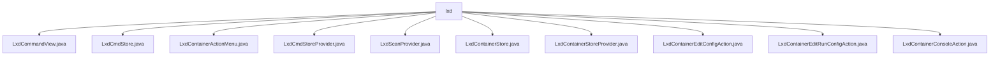

# 基础信息

|      |      |
|------|------|
| 名称 | lxd |
| 编码语言 | .java |
| 代码路径 | xpipe/ext/system/src/main/java/io/xpipe/ext/system/lxd |
| 包名 | xpipe.ext.system.src.main.java.io.xpipe.ext.system.lxd |
| 概述说明 | LXD容器管理相关Java类，包括命令执行、状态管理、操作菜单、存储管理等功能模块。 |

# 说明

```markdown
## 概述

该代码模块是一个基于Java实现的LXD容器管理系统，提供对LXD容器的全生命周期管理和操作功能。模块采用分层架构设计，包含命令执行、状态管理、存储管理、扫描发现和用户交互等多个组件。主要特点包括：

1. 支持通过Shell命令与LXD容器交互
2. 提供完整的容器操作功能（启动/停止/暂停/重启）
3. 实现容器配置编辑（常规配置和运行配置）
4. 包含容器控制台访问功能
5. 支持容器状态监控和列表展示
6. 提供Linux环境下的自动扫描发现能力
7. 采用构建器模式和Lombok简化代码

## 主要业务场景

### 容器操作管理
- 通过`LxdCommandView`执行基础容器命令（启动/停止/暂停）
- 使用`LxdContainerActionMenu`提供统一的操作入口
- 支持错误处理和权限提升（ElevationFunction）
- 通过`ShellControl`实现命令执行和结果处理

### 容器状态管理
- `LxdCmdStore`负责维护容器列表和服务器状态
- 使用正则表达式解析服务器版本信息
- 支持可达性检查和运行状态过滤
- 通过`State`类管理serverVersion等状态信息

### 容器配置管理
- `LxdContainerEditConfigAction`编辑常规配置
- `LxdContainerEditRunConfigAction`编辑运行配置
- 通过终端启动器和文件系统操作实现配置编辑
- 支持权限提升访问受保护配置文件

### 控制台访问
- `LxdContainerConsoleAction`提供控制台接入功能
- 通过`TerminalLauncher`打开容器控制台
- 集成`IncusCommandView`实现终端交互

### 存储与发现
- `LxdCmdStoreProvider`管理存储显示和交互
- `LxdScanProvider`实现Linux环境下的自动发现
- 支持数据存储的添加、更新和刷新
- 提供状态显示和摘要生成功能

### 用户界面
- 提供操作名称和图标支持
- 支持不同用户和终端模式
- 包含帮助文档链接（LXC文档）
- 实现对话框构建和信息展示
```


### 包内部结构视图



该流程图展示了LXD模块下的文件结构关系，根节点为lxd目录，其下直接包含10个Java文件节点，包括命令视图、存储操作、容器菜单等功能类。所有文件均位于同一层级，没有嵌套子目录结构，属于典型的扁平化代码组织方式，每个文件代表LXD扩展系统中的一个独立功能组件。

# 文件列表 File List

| 名称   | 类型  | 说明 |
|-------|------|-------------|
| [LxdContainerStoreProvider.java](LxdContainerStoreProvider.md) | file | Lxd容器存储提供者，管理容器状态显示、对话框及信息摘要。 |
| [LxdScanProvider.java](LxdScanProvider.md) | file | LxdScanProvider类检查Linux系统及LXD容器支持，创建扫描机会并处理数据存储。 |
| [LxdContainerStore.java](LxdContainerStore.md) | file | LXD容器存储类，实现多种接口，管理容器状态、命令执行及生命周期操作。 |
| [LxdCmdStoreProvider.java](LxdCmdStoreProvider.md) | file | LxdCmdStoreProvider实现DataStoreProvider接口，提供LXD容器存储管理功能，包括状态显示、分类和默认存储等。 |
| [LxdContainerActionMenu.java](LxdContainerActionMenu.md) | file | Lxd容器操作菜单类，提供启动、停止、暂停等容器操作选项。 |
| [LxdCmdStore.java](LxdCmdStore.md) | file | LXD命令存储类，管理主机连接、状态及容器列表。 |
| [LxdCommandView.java](LxdCommandView.md) | file | LXD命令视图类，提供容器管理功能如启动、停止、查询状态等。 |
| [LxdContainerConsoleAction.java](LxdContainerConsoleAction.md) | file | Lxd容器控制台操作类，实现ActionProvider接口，提供创建、执行控制台操作功能。 |
| [LxdContainerEditRunConfigAction.java](LxdContainerEditRunConfigAction.md) | file | Lxd容器编辑运行配置的ActionProvider实现类。 |
| [LxdContainerEditConfigAction.java](LxdContainerEditConfigAction.md) | file | LxdContainerEditConfigAction类提供编辑LXD容器配置的功能，包含创建操作、图标和名称定义，执行时打开终端编辑配置。 |


