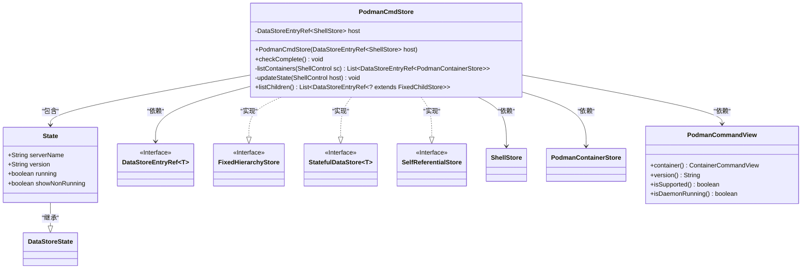

# 基础信息

|      |      |
|------|------|
| 名称 | PodmanCmdStore |
| 编码语言 | .java |
| 代码路径 | xpipe/ext/system/src/main/java/io/xpipe/ext/system/podman/PodmanCmdStore.java |
| 包名 | io.xpipe.ext.system.podman |
| 依赖项 | ['io.xpipe.app.ext.ContainerStoreState', 'io.xpipe.app.ext.ShellStore', 'io.xpipe.app.issue.ErrorEvent', 'io.xpipe.app.storage.DataStoreEntry', 'io.xpipe.app.storage.DataStoreEntryRef', 'io.xpipe.app.util.CommandSupport', 'io.xpipe.app.util.FixedHierarchyStore', 'io.xpipe.app.util.Validators', 'io.xpipe.core.process.ShellControl', 'io.xpipe.core.store', 'io.xpipe.ext.base.SelfReferentialStore', 'com.fasterxml.jackson.annotation.JsonTypeName', 'lombok.EqualsAndHashCode', 'lombok.Value', 'lombok.experimental.SuperBuilder', 'lombok.extern.jackson.Jacksonized', 'java.util.List', 'java.util.regex.Pattern'] |
| 概述说明 | PodmanCmdStore类，管理Podman容器状态，包含主机引用、容器列表及版本检查功能。 |

# 说明

这是一个名为PodmanCmdStore的Java类，实现了多个存储接口。它包含一个主机ShellStore引用，提供容器管理和状态检查功能。类中定义了检查完整性、列出容器列表和更新状态的方法。通过PodmanCommandView与Podman交互，获取容器信息、版本号和服务状态。内部State类记录服务器名称、版本、运行状态等元数据。该类能检测Podman守护进程是否运行，并处理容器状态转换。

# 类列表 Class Summary

| 名称   | 类型  | 说明 |
|-------|------|-------------|
| PodmanCmdStore | class | PodmanCmdStore类实现数据存储接口，管理Podman容器状态和版本信息。 |

## 类 PodmanCmdStore

|      |      |
|------|------|
| 访问范围 | @JsonTypeName("podmanCmd");@SuperBuilder;@Jacksonized;@Value;public |
| 类型 | class |
| 名称 | PodmanCmdStore |
| 说明 | PodmanCmdStore类实现数据存储接口，管理Podman容器状态和版本信息。 |

### UML类图

这段代码定义了一个PodmanCmdStore类，实现了FixedHierarchyStore、StatefulDataStore和SelfReferentialStore三个接口。该类主要用于管理Podman容器状态，包含主机引用、状态检查、容器列表获取和状态更新等功能。内部State类继承自DataStoreState，用于存储服务器名称、版本和运行状态等信息。类通过PodmanCommandView与Podman命令行交互，并依赖ShellStore和PodmanContainerStore来管理主机和容器信息。整体设计体现了状态管理和容器操作的核心功能。

### 内部方法调用关系图

该流程图展示了PodmanCmdStore类的完整结构，包含主要方法调用关系和状态更新逻辑。时序图详细描述了listChildren()方法的执行过程，包括会话获取、CLI检查、守护进程状态验证、版本信息更新和容器列表获取等关键步骤。类通过State内部类维护运行时状态，并通过组合模式管理子容器存储，体现了对Podman容器管理的完整封装。

### 字段列表 Field List

| 名称  | 类型  | 说明 |
|-------|-------|------|
| host | DataStoreEntryRef<ShellStore> | 存储ShellStore的DataStoreEntryRef引用变量host。 |

### 方法列表 Method List

| 名称  | 类型  | 说明 |
|-------|-------|------|
| listChildren | List<? extends DataStoreEntryRef<? extends FixedChildStore>> | 方法检查Podman守护进程状态，更新状态并返回容器列表。若未运行则抛出异常。 |
| listContainers | List<DataStoreEntryRef<PodmanContainerStore>> | 方法列出Podman容器状态并返回引用列表。 |
| updateState | void | 私有方法通过Podman命令获取服务器名和版本并更新状态。 |
| checkComplete | void | 检查host非空且为ShellStore类型，并调用其checkComplete方法。 |

