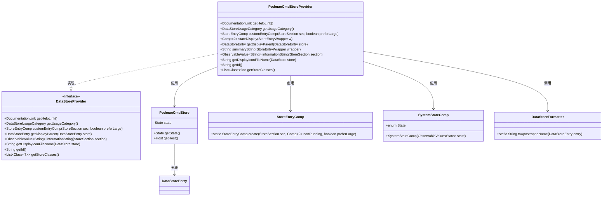

# 基础信息

|      |      |
|------|------|
| 名称 | PodmanCmdStoreProvider |
| 编码语言 | .java |
| 代码路径 | xpipe/ext/system/src/main/java/io/xpipe/ext/system/podman/PodmanCmdStoreProvider.java |
| 包名 | io.xpipe.ext.system.podman |
| 依赖项 | ['io.xpipe.app.comp.Comp', 'io.xpipe.app.comp.store.StoreEntryComp', 'io.xpipe.app.comp.store.StoreEntryWrapper', 'io.xpipe.app.comp.store.StoreSection', 'io.xpipe.app.comp.store.StoreToggleComp', 'io.xpipe.app.comp.store.SystemStateComp', 'io.xpipe.app.ext.DataStoreProvider', 'io.xpipe.app.ext.DataStoreUsageCategory', 'io.xpipe.app.storage.DataStoreEntry', 'io.xpipe.app.util.BindingsHelper', 'io.xpipe.app.util.DataStoreFormatter', 'io.xpipe.app.util.DocumentationLink', 'io.xpipe.core.store.DataStore', 'javafx.beans.value.ObservableValue', 'java.util.List'] |
| 概述说明 | PodmanCmdStoreProvider实现DataStoreProvider接口，管理Podman容器状态和显示逻辑。 |

# 说明

该代码定义了一个名为PodmanCmdStoreProvider的类，实现了DataStoreProvider接口，用于管理Podman容器存储。主要功能包括：提供帮助文档链接、设置存储使用类别为GROUP、自定义存储条目组件、显示容器运行状态、获取父级存储条目、生成摘要信息字符串、返回连接状态信息、指定显示图标文件以及标识存储类。该类通过多种方法处理Podman容器的状态显示、连接状态和版本信息，并支持非运行容器的切换显示。

# 类列表 Class Summary

| 名称   | 类型  | 说明 |
|-------|------|-------------|
| PodmanCmdStoreProvider | class | PodmanCmdStoreProvider实现DataStoreProvider接口，管理Podman容器状态和显示逻辑。 |

## 类 PodmanCmdStoreProvider

|      |      |
|------|------|
| 访问范围 | public |
| 类型 | class |
| 名称 | PodmanCmdStoreProvider |
| 说明 | PodmanCmdStoreProvider实现DataStoreProvider接口，管理Podman容器状态和显示逻辑。 |

### UML类图

这段代码展示了一个Podman命令存储提供者`PodmanCmdStoreProvider`的实现，它实现了`DataStoreProvider`接口，主要用于管理Podman容器相关的数据存储和状态显示。类图清晰地呈现了核心类之间的关系：提供者类通过组合方式使用`PodmanCmdStore`存储实体，依赖`StoreEntryComp`创建UI组件，利用`SystemStateComp`显示运行状态，并调用`DataStoreFormatter`进行数据格式化。该设计体现了清晰的职责分离，存储逻辑与UI展示解耦，支持动态状态监控和多种信息展示方式。

### 内部方法调用关系图

```mermaid
graph TD
    A["类PodmanCmdStoreProvider"]
    B["实现接口: DataStoreProvider"]
    C["方法: DocumentationLink getHelpLink()"]
    D["方法: DataStoreUsageCategory getUsageCategory()"]
    E["方法: StoreEntryComp customEntryComp(StoreSection sec, boolean preferLarge)"]
    F["方法: Comp<?> stateDisplay(StoreEntryWrapper w)"]
    G["方法: DataStoreEntry getDisplayParent(DataStoreEntry store)"]
    H["方法: String summaryString(StoreEntryWrapper wrapper)"]
    I["方法: ObservableValue<String> informationString(StoreSection section)"]
    J["方法: String getDisplayIconFileName(DataStore store)"]
    K["方法: String getId()"]
    L["方法: List<Class<?>> getStoreClasses()"]

    A --> B
    A --> C
    A --> D
    A --> E
    A --> F
    A --> G
    A --> H
    A --> I
    A --> J
    A --> K
    A --> L
```

这段代码展示了一个实现DataStoreProvider接口的PodmanCmdStoreProvider类，主要用于管理Podman容器相关的数据存储和显示逻辑。类中包含多个关键方法，如获取帮助链接、使用类别、自定义条目组件、状态显示、父级条目获取、摘要字符串生成、信息字符串处理、图标文件名获取、唯一标识符返回以及存储类列表获取等。这些方法共同构成了对Podman容器状态和信息的完整管理能力，通过不同的返回值类型和参数处理，实现了从底层状态监控到前端界面展示的全流程支持。

### 字段列表 Field List

| 名称  | 类型  | 说明 |
|-------|-------|------|

### 方法列表 Method List

| 名称  | 类型  | 说明 |
|-------|-------|------|
| getHelpLink | DocumentationLink | 重写方法返回PODMAN文档链接。 |
| getDisplayIconFileName | String | 方法返回Podman图标文件名"system:podman_icon.svg"。 |
| customEntryComp | StoreEntryComp | 重写StoreEntryComp方法，包含非运行状态切换功能。 |
| summaryString | String | 获取主机名并返回其容器信息。 |
| informationString | ObservableValue<String> | 方法返回Podman运行状态信息，失败显示"Connection failed"，成功显示服务器名及版本。 |
| getDisplayParent | DataStoreEntry | 方法getDisplayParent获取DataStoreEntry的父级，返回PodmanCmdStore中Host对象。 |
| stateDisplay | Comp<?> | 方法根据PodmanCmdStore状态返回运行成功或失败的系统状态组件。 |
| getId | String | 重写getId方法，返回字符串"podmanCmd"。 |
| getUsageCategory | DataStoreUsageCategory | 重写方法返回GROUP类型的数据存储用途分类。 |
| getStoreClasses | List<Class<?>> | 重写方法返回PodmanCmdStore类列表。 |

