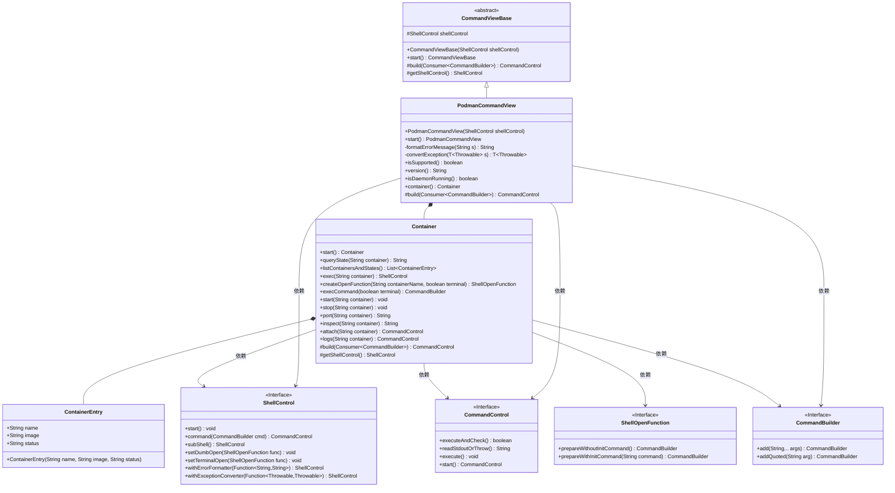
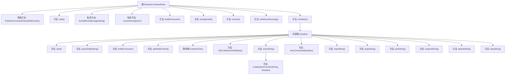

# 基础信息

|      |      |
|------|------|
| 名称 | PodmanCommandView |
| 编码语言 | .java |
| 代码路径 | xpipe/ext/system/src/main/java/io/xpipe/ext/system/podman/PodmanCommandView.java |
| 包名 | io.xpipe.ext.system.podman |
| 依赖项 | ['io.xpipe.app.issue.ErrorEvent', 'io.xpipe.app.util.CommandView', 'io.xpipe.app.util.CommandViewBase', 'io.xpipe.core.process', 'lombok.NonNull', 'lombok.Value', 'java.util.List', 'java.util.function.Consumer'] |
| 概述说明 | Podman命令视图类，封装容器操作及错误处理。 |

# 说明

PodmanCommandView是一个基于CommandViewBase的类，用于管理Podman容器操作。它提供了启动、停止、查询容器状态等功能，并支持错误处理和异常转换。内部类Container封装了容器相关操作，如查询状态、列出容器、执行命令、启动/停止容器、端口映射、检查容器信息、附加和查看日志等。该类通过ShellControl执行命令，并支持自定义错误消息格式和异常转换。

# 类列表 Class Summary

| 名称   | 类型  | 说明 |
|-------|------|-------------|
| PodmanCommandView | class | Podman命令视图类，封装容器操作及错误处理。 |

## 类 PodmanCommandView

|      |      |
|------|------|
| 访问范围 | public |
| 类型 | class |
| 名称 | PodmanCommandView |
| 说明 | Podman命令视图类，封装容器操作及错误处理。 |

### UML类图

这段代码实现了一个Podman命令行工具的高级封装，主要包含PodmanCommandView和其内部类Container。PodmanCommandView继承自CommandViewBase，提供了与Podman守护进程交互的核心功能，包括版本检查、容器管理等。Container类则专门处理容器相关操作，如启动/停止容器、查询状态、执行命令等。通过ShellControl和CommandBuilder等接口实现命令构建和执行，并提供了完善的错误处理和异常转换机制。整体设计采用分层结构，将基础功能与具体实现分离，便于扩展和维护。

### 内部方法调用关系图

这段代码定义了一个PodmanCommandView类，用于管理Podman容器操作。主要功能包括启动/停止容器、查询容器状态、执行容器命令等。内部类Container封装了容器相关操作，如查询状态、启动/停止容器、获取端口信息等。代码通过ShellControl执行命令，并提供了错误格式化和异常转换功能。整体结构清晰，将Podman操作封装为面向对象的方法，便于调用和管理。

### 字段列表 Field List

| 名称  | 类型  | 说明 |
|-------|-------|------|

### 方法列表 Method List

| 名称  | 类型  | 说明 |
|-------|-------|------|
| isSupported | boolean | 检查系统是否支持Podman命令。 |
| formatErrorMessage | String | 私有方法：格式化Podman连接错误信息，返回"Podman connection failed:"加输入字符串。 |
| convertException | T | 转换异常方法，检查特定错误信息并返回预期异常。 |
| start | PodmanCommandView | 重写start方法，调用shellControl.start并返回当前对象。 |
| build | CommandControl | 构建Podman命令控制，支持自定义构建器、错误格式化与异常转换。 |
| version | String | 获取版本号并返回，失败时抛出异常。 |
| isDaemonRunning | boolean | 检查守护进程是否运行 |
| container | Container | 创建并返回新容器实例的方法。 |

