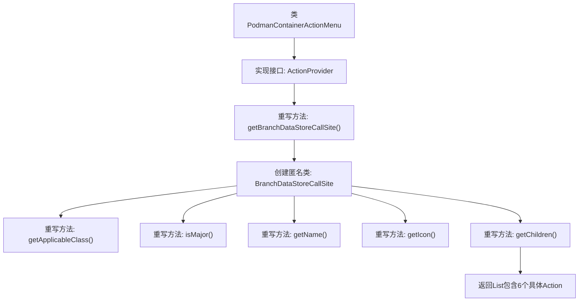

# 基础信息

|      |      |
|------|------|
| 名称 | PodmanContainerActionMenu |
| 编码语言 | .java |
| 代码路径 | xpipe/ext/system/src/main/java/io/xpipe/ext/system/podman/PodmanContainerActionMenu.java |
| 包名 | io.xpipe.ext.system.podman |
| 依赖项 | ['io.xpipe.app.core.AppI18n', 'io.xpipe.app.ext.ActionProvider', 'io.xpipe.app.storage.DataStoreEntryRef', 'io.xpipe.app.util.LabelGraphic', 'io.xpipe.ext.base.store.StoreRestartAction', 'io.xpipe.ext.base.store.StoreStartAction', 'io.xpipe.ext.base.store.StoreStopAction', 'javafx.beans.value.ObservableValue', 'java.util.List'] |
| 概述说明 | Podman容器操作菜单实现，提供启动、停止、重启等子操作。 |

# 说明

该代码定义了一个名为PodmanContainerActionMenu的类，实现了ActionProvider接口。主要功能是为Podman容器提供操作菜单，包括获取数据存储调用站点、确定适用类、设置主操作标志、定义菜单名称和图标，以及提供子操作列表。子操作包括启动、停止、重启容器，以及检查、查看日志和附加到容器等功能。该类使用国际化支持菜单名称，并采用特定图标标识。

# 类列表 Class Summary

| 名称   | 类型  | 说明 |
|-------|------|-------------|
| PodmanContainerActionMenu | class | Podman容器操作菜单类，提供启动、停止、重启等子操作。 |


## 类 PodmanContainerActionMenu

|      |      |
|------|------|
| 访问范围 | public |
| 类型 | class |
| 名称 | PodmanContainerActionMenu |
| 说明 | Podman容器操作菜单类，提供启动、停止、重启等子操作。 |


### UML类图

```mermaid
classDiagram
    class PodmanContainerActionMenu {
        +BranchDataStoreCallSite~?~ getBranchDataStoreCallSite()
    }
    class BranchDataStoreCallSite~T~ {
        <<Interface>>
        +Class~T~ getApplicableClass()
        +boolean isMajor(DataStoreEntryRef~T~ o)
        +ObservableValue~String~ getName(DataStoreEntryRef~T~ store)
        +LabelGraphic getIcon(DataStoreEntryRef~T~ store)
        +List~ActionProvider~ getChildren(DataStoreEntryRef~T~ store)
    }
    class DataStoreEntryRef~T~ {
        <<Interface>>
    }
    class ObservableValue~T~ {
        <<Interface>>
    }
    class LabelGraphic {
        <<Interface>>
    }
    class ActionProvider {
        <<Interface>>
    }
    class StoreStartAction
    class StoreStopAction
    class StoreRestartAction
    class PodmanContainerInspectAction
    class PodmanContainerLogsAction
    class PodmanContainerAttachAction

    PodmanContainerActionMenu --> BranchDataStoreCallSite : 实现
    BranchDataStoreCallSite <|-- PodmanContainerActionMenu$1 : 匿名实现
    DataStoreEntryRef <-- BranchDataStoreCallSite : 使用
    ObservableValue <-- BranchDataStoreCallSite : 使用
    LabelGraphic <-- BranchDataStoreCallSite : 使用
    ActionProvider <-- BranchDataStoreCallSite : 使用
    StoreStartAction ..|> ActionProvider : 实现
    StoreStopAction ..|> ActionProvider : 实现
    StoreRestartAction ..|> ActionProvider : 实现
    PodmanContainerInspectAction ..|> ActionProvider : 实现
    PodmanContainerLogsAction ..|> ActionProvider : 实现
    PodmanContainerAttachAction ..|> ActionProvider : 实现
```

这段代码展示了一个Podman容器操作菜单的实现结构。PodmanContainerActionMenu类通过实现ActionProvider接口，提供了一个分支数据存储调用站点(BranchDataStoreCallSite)，该站点定义了与Podman容器存储相关的各种操作。这些操作包括获取适用类、判断重要性、获取名称和图标，以及获取子操作列表（如启动、停止、重启、检查、日志和附加等操作）。整个设计采用了泛型和接口来保证灵活性和扩展性，各个具体操作类都实现了ActionProvider接口。


### 内部方法调用关系图



这段代码流程图展示了PodmanContainerActionMenu类的核心结构，该类实现了ActionProvider接口并重写了getBranchDataStoreCallSite方法。该方法返回一个匿名BranchDataStoreCallSite实例，该实例通过5个重写方法分别处理容器存储类型判断、主操作标识、名称获取、图标生成以及子操作列表生成（包含启动/停止/重启等6个具体容器操作）。整体设计采用组合模式，通过嵌套类实现多层级操作菜单的构建。

### 字段列表 Field List

| 名称  | 类型  | 说明 |
|-------|-------|------|

### 方法列表 Method List

| 名称  | 类型  | 说明 |
|-------|-------|------|
| getBranchDataStoreCallSite | BranchDataStoreCallSite<?> | 重写方法返回Podman容器存储的调用站点，包含类定义、名称、图标及操作列表。 |


