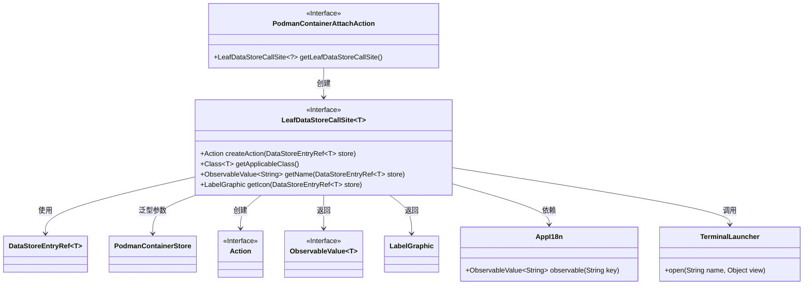
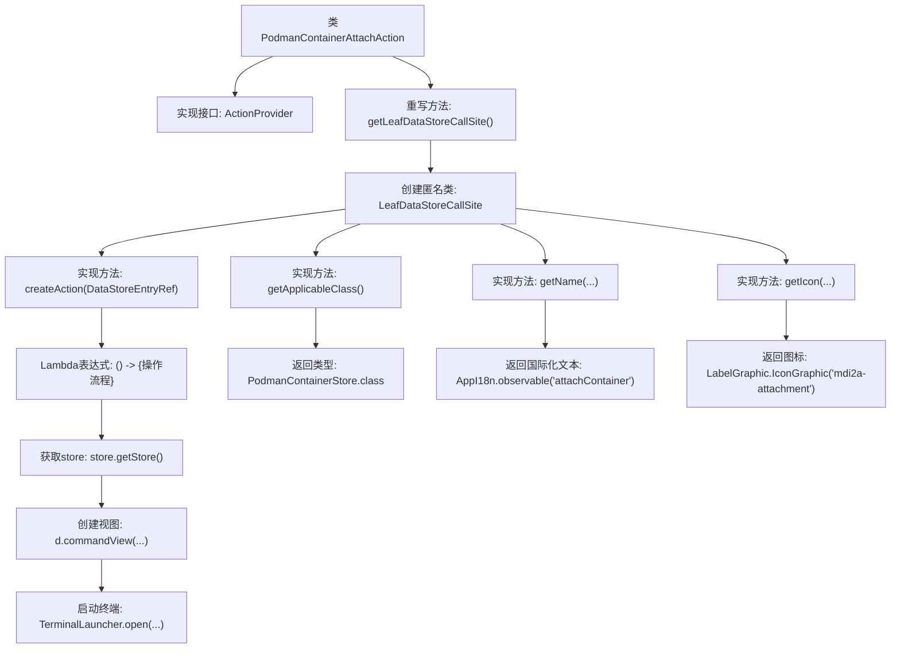

# 基础信息

|      |      |
|------|------|
| 名称 | PodmanContainerAttachAction |
| 编码语言 | .java |
| 代码路径 | xpipe/ext/system/src/main/java/io/xpipe/ext/system/podman/PodmanContainerAttachAction.java |
| 包名 | io.xpipe.ext.system.podman |
| 依赖项 | ['io.xpipe.app.core.AppI18n', 'io.xpipe.app.ext.ActionProvider', 'io.xpipe.app.storage.DataStoreEntryRef', 'io.xpipe.app.terminal.TerminalLauncher', 'io.xpipe.app.util.LabelGraphic', 'javafx.beans.value.ObservableValue'] |
| 概述说明 | Podman容器附加操作实现类，提供创建、名称和图标功能。 |

# 说明

该代码定义了一个名为PodmanContainerAttachAction的类，实现了ActionProvider接口，用于提供容器附加操作功能。主要功能包括创建数据存储调用站点，生成附加容器的动作，并返回适用的容器存储类。动作执行时会获取容器存储，创建命令视图，并通过终端启动器打开指定容器的附加界面。此外，还提供了操作名称的国际化支持和图标显示功能，使用"mdi2a-attachment"作为图标标识。

# 类列表 Class Summary

| 名称   | 类型  | 说明 |
|-------|------|-------------|
| PodmanContainerAttachAction | class | Podman容器附加操作实现类，提供创建、名称和图标功能。 |

## 类 PodmanContainerAttachAction

|      |      |
|------|------|
| 访问范围 | public |
| 类型 | class |
| 名称 | PodmanContainerAttachAction |
| 说明 | Podman容器附加操作实现类，提供创建、名称和图标功能。 |

### UML类图

这段代码展示了一个实现`ActionProvider`接口的`PodmanContainerAttachAction`类，主要用于创建与Podman容器相关的操作。核心是通过`LeafDataStoreCallSite`实现容器附加功能，涉及容器存储、动作创建、国际化名称和图标处理等组件。类图清晰地呈现了各接口间的依赖关系和泛型参数的使用，体现了模块化设计思想。

### 内部方法调用关系图

该流程图展示了PodmanContainerAttachAction类的核心结构，这是一个实现ActionProvider接口的类，主要功能是通过getLeafDataStoreCallSite方法返回一个匿名LeafDataStoreCallSite实例。该实例包含四个关键方法实现：createAction用于创建容器附加操作（涉及获取存储、创建视图和启动终端流程），getApplicableClass返回存储类型，getName提供国际化名称，getIcon返回操作图标。整个过程体现了从动作创建到终端启动的完整调用链。

### 字段列表 Field List

| 名称  | 类型  | 说明 |
|-------|-------|------|

### 方法列表 Method List

| 名称  | 类型  | 说明 |
|-------|-------|------|
| getLeafDataStoreCallSite | LeafDataStoreCallSite<?> | 创建Podman容器存储调用站点，实现容器附加操作、名称和图标。 |

