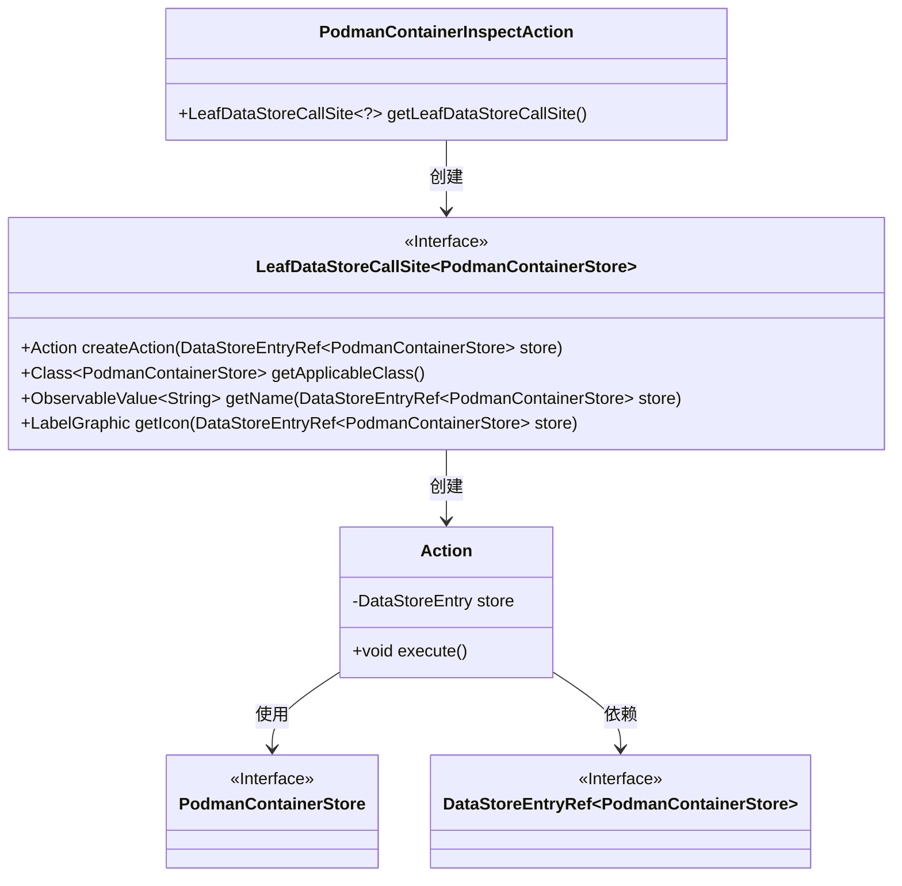
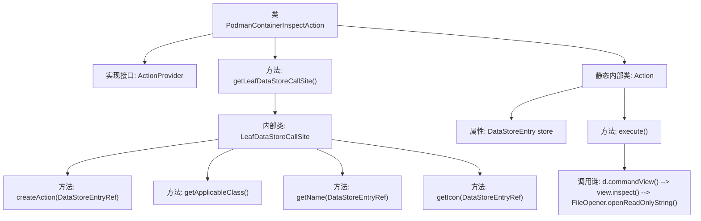

# 基础信息

|      |      |
|------|------|
| 名称 | PodmanContainerInspectAction |
| 编码语言 | .java |
| 代码路径 | xpipe/ext/system/src/main/java/io/xpipe/ext/system/podman/PodmanContainerInspectAction.java |
| 包名 | io.xpipe.ext.system.podman |
| 依赖项 | ['io.xpipe.app.core.AppI18n', 'io.xpipe.app.ext.ActionProvider', 'io.xpipe.app.storage.DataStoreEntry', 'io.xpipe.app.storage.DataStoreEntryRef', 'io.xpipe.app.util.FileOpener', 'io.xpipe.app.util.LabelGraphic', 'javafx.beans.value.ObservableValue', 'lombok.Value'] |
| 概述说明 | Podman容器检查操作类，实现容器信息查看功能。 |

# 说明

该代码定义了一个名为PodmanContainerInspectAction的类，实现了ActionProvider接口，用于检查Podman容器信息。它包含一个内部静态类Action，负责执行具体操作。主要功能包括获取容器存储调用站点、创建操作、获取适用类、名称和图标。执行操作时，会获取容器会话视图，检查容器名称并打开只读输出。整个过程涉及数据存储和视图操作，最终通过FileOpener展示检查结果。

# 类列表 Class Summary

| 名称   | 类型  | 说明 |
|-------|------|-------------|
| PodmanContainerInspectAction | class | Podman容器检查操作类，实现ActionProvider接口，提供容器信息查看功能。 |

## 类 PodmanContainerInspectAction

|      |      |
|------|------|
| 访问范围 | public |
| 类型 | class |
| 名称 | PodmanContainerInspectAction |
| 说明 | Podman容器检查操作类，实现ActionProvider接口，提供容器信息查看功能。 |

### UML类图

这段代码展示了一个Podman容器检查操作的实现结构。PodmanContainerInspectAction作为入口类，通过getLeafDataStoreCallSite()方法返回一个实现了LeafDataStoreCallSite接口的匿名类，该匿名类负责创建具体的Action操作。Action类包含核心执行逻辑，通过execute()方法获取容器信息并展示。整个设计采用接口隔离原则，通过泛型参数PodmanContainerStore确保类型安全，各组件职责明确，形成清晰的调用链。

### 内部方法调用关系图

这段代码展示了一个Podman容器检查操作的实现流程。主类PodmanContainerInspectAction通过getLeafDataStoreCallSite方法返回一个包含容器操作逻辑的LeafDataStoreCallSite实例，该实例定义了动作创建、类匹配、名称和图标获取等方法。内部的Action类实现了具体执行逻辑，包括获取容器视图、执行检查命令并打开只读输出。整个设计采用分层结构，将容器操作抽象为可复用的组件。

### 字段列表 Field List

| 名称  | 类型  | 说明 |
|-------|-------|------|

### 方法列表 Method List

| 名称  | 类型  | 说明 |
|-------|-------|------|
| getLeafDataStoreCallSite | LeafDataStoreCallSite<?> | 重写方法返回Podman容器存储调用站点，包含创建动作、适用类、名称和图标。 |

