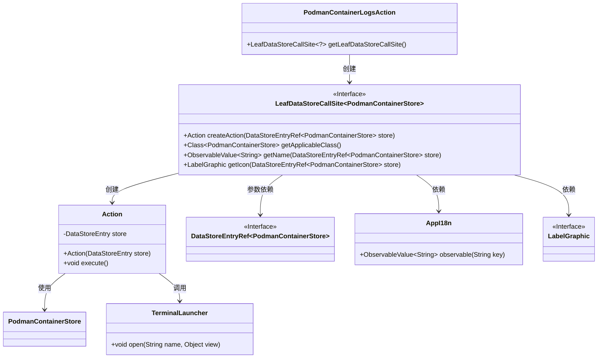
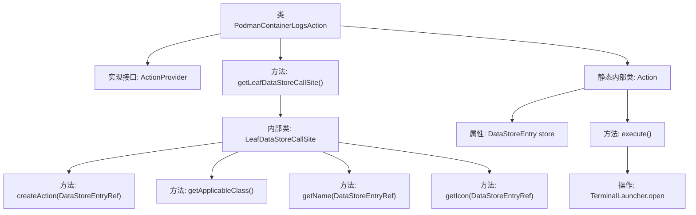

# 基础信息

|      |      |
|------|------|
| 名称 | PodmanContainerLogsAction |
| 编码语言 | .java |
| 代码路径 | xpipe/ext/system/src/main/java/io/xpipe/ext/system/podman/PodmanContainerLogsAction.java |
| 包名 | io.xpipe.ext.system.podman |
| 依赖项 | ['io.xpipe.app.core.AppI18n', 'io.xpipe.app.ext.ActionProvider', 'io.xpipe.app.storage.DataStoreEntry', 'io.xpipe.app.storage.DataStoreEntryRef', 'io.xpipe.app.terminal.TerminalLauncher', 'io.xpipe.app.util.LabelGraphic', 'javafx.beans.value.ObservableValue', 'lombok.Value'] |
| 概述说明 | Podman容器日志操作类，提供获取和显示容器日志功能。 |

# 说明

该代码定义了一个名为PodmanContainerLogsAction的类，实现了ActionProvider接口，用于处理Podman容器日志操作。主要功能包括创建数据存储调用站点，生成操作名称和图标，以及执行日志查看操作。内部Action类负责具体执行逻辑，通过TerminalLauncher打开指定容器的日志视图。整个结构围绕Podman容器日志的获取和展示设计，提供了完整的操作流程。

# 类列表 Class Summary

| 名称   | 类型  | 说明 |
|-------|------|-------------|
| PodmanContainerLogsAction | class | Podman容器日志操作类，提供获取和显示容器日志功能。 |

## 类 PodmanContainerLogsAction

|      |      |
|------|------|
| 访问范围 | public |
| 类型 | class |
| 名称 | PodmanContainerLogsAction |
| 说明 | Podman容器日志操作类，提供获取和显示容器日志功能。 |

### UML类图

这段代码展示了一个Podman容器日志操作的结构，主要包含PodmanContainerLogsAction作为入口类，通过LeafDataStoreCallSite接口创建具体操作Action。Action类负责执行获取容器日志的核心逻辑，涉及与PodmanContainerStore交互并通过TerminalLauncher展示日志。整体设计采用工厂模式和依赖注入，各组件职责明确，通过接口解耦，便于扩展和维护。

### 内部方法调用关系图

这段代码展示了一个Podman容器日志操作类的实现，主要包含两个核心部分：主类PodmanContainerLogsAction实现了ActionProvider接口，负责创建数据存储调用站点；内部静态类Action封装了具体的执行逻辑，通过TerminalLauncher打开容器日志视图。流程图清晰地展示了类之间的继承关系、方法调用链和关键操作步骤，特别是突出了从数据存储到终端视图的完整调用路径。

### 字段列表 Field List

| 名称  | 类型  | 说明 |
|-------|-------|------|

### 方法列表 Method List

| 名称  | 类型  | 说明 |
|-------|-------|------|
| getLeafDataStoreCallSite | LeafDataStoreCallSite<?> | Java方法重写，返回Podman容器日志操作站点，含创建动作、适用类、名称及图标。 |

