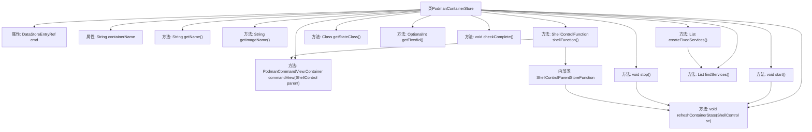
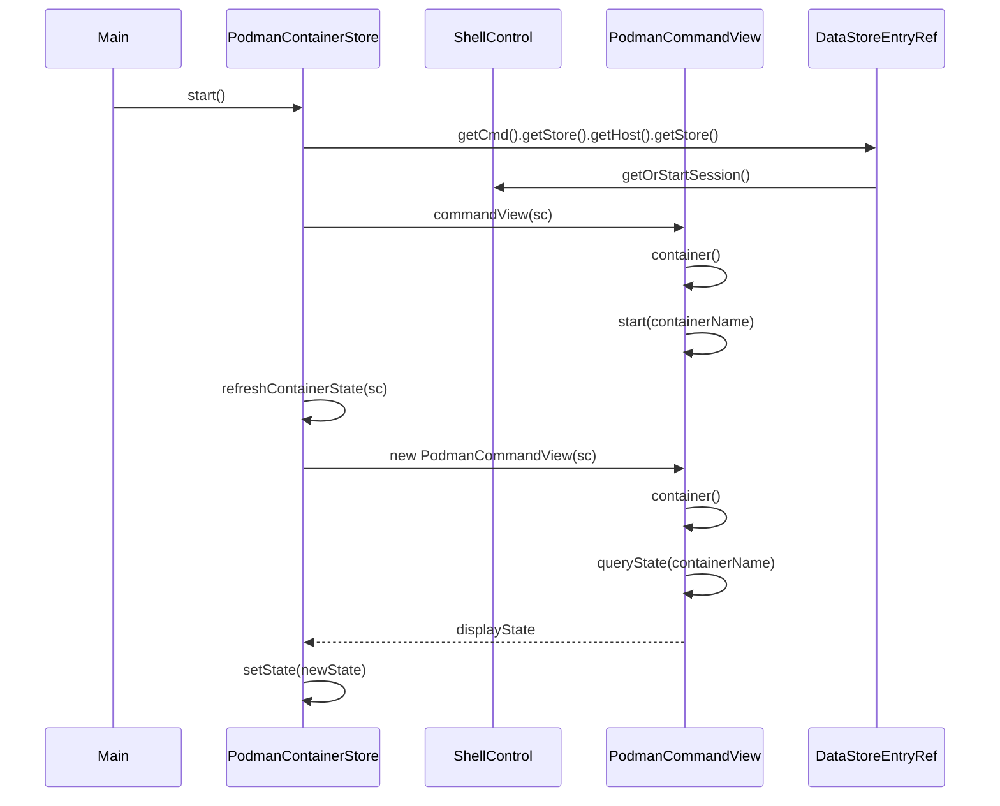

# 基础信息

|      |      |
|------|------|
| 名称 | PodmanContainerStore |
| 编码语言 | .java |
| 代码路径 | xpipe/ext/system/src/main/java/io/xpipe/ext/system/podman/PodmanContainerStore.java |
| 包名 | io.xpipe.ext.system.podman |
| 依赖项 | ['io.xpipe.app.ext', 'io.xpipe.app.storage.DataStoreEntry', 'io.xpipe.app.storage.DataStoreEntryRef', 'io.xpipe.app.util.LicenseRequiredException', 'io.xpipe.app.util.Validators', 'io.xpipe.core.process.ShellControl', 'io.xpipe.core.store.FixedChildStore', 'io.xpipe.core.store.InternalCacheDataStore', 'io.xpipe.core.store.StatefulDataStore', 'io.xpipe.ext.base.SelfReferentialStore', 'io.xpipe.ext.base.service.AbstractServiceStore', 'io.xpipe.ext.base.service.FixedServiceCreatorStore', 'io.xpipe.ext.base.service.MappedServiceStore', 'io.xpipe.ext.base.store.StartableStore', 'io.xpipe.ext.base.store.StoppableStore', 'com.fasterxml.jackson.annotation.JsonTypeName', 'lombok.Value', 'lombok.experimental.SuperBuilder', 'lombok.extern.jackson.Jacksonized', 'java.util.List', 'java.util.Objects', 'java.util.OptionalInt', 'java.util.regex.Pattern'] |
| 概述说明 | Podman容器存储类，实现启动停止等功能，管理容器状态和服务。 |

# 说明

这是一个名为PodmanContainerStore的Java类，实现了多个存储接口，用于管理Podman容器。类包含容器名称和命令存储引用，提供启动、停止容器功能，支持创建固定服务，检查完整性，并处理容器状态刷新。通过ShellControlFunction实现与容器的交互，包括执行命令和状态查询。类还处理端口映射和服务发现，确保容器状态同步和完整性验证。

# 类列表 Class Summary

| 名称   | 类型  | 说明 |
|-------|------|-------------|
| PodmanContainerStore | class | Podman容器存储类，实现启动、停止、服务创建等功能。 |

## 类 PodmanContainerStore

|      |      |
|------|------|
| 访问范围 | @JsonTypeName("podman");@SuperBuilder;@Jacksonized;@Value;public |
| 类型 | class |
| 名称 | PodmanContainerStore |
| 说明 | Podman容器存储类，实现启动、停止、服务创建等功能。 |

### UML类图

```mermaid
classDiagram
    class PodmanContainerStore {
        -DataStoreEntryRef~PodmanCmdStore~ cmd
        -String containerName
        +String getName()
        +String getImageName()
        +PodmanCommandView.Container commandView(ShellControl parent)
        +void start() throws Exception
        +void stop() throws Exception
        +List~? extends DataStoreEntryRef~? extends AbstractServiceStore~~ createFixedServices() throws Exception
        +Class~ContainerStoreState~ getStateClass()
        +OptionalInt getFixedId()
        +void checkComplete() throws Throwable
        +ShellControlFunction shellFunction()
        -List~MappedServiceStore~ findServices() throws Exception
        -void refreshContainerState(ShellControl sc) throws Exception
    }

    class StartableStore {
        <<Interface>>
        +void start() throws Exception
    }
    class StoppableStore {
        <<Interface>>
        +void stop() throws Exception
    }
    class ShellStore {
        <<Interface>>
        +ShellControlFunction shellFunction()
    }
    class InternalCacheDataStore {
        <<Interface>>
    }
    class FixedChildStore {
        <<Interface>>
        +OptionalInt getFixedId()
    }
    class StatefulDataStore~T~ {
        <<Interface>>
        +Class~T~ getStateClass()
    }
    class FixedServiceCreatorStore {
        <<Interface>>
        +List~? extends DataStoreEntryRef~? extends AbstractServiceStore~~ createFixedServices() throws Exception
    }
    class SelfReferentialStore {
        <<Interface>>
    }
    class ContainerImageStore {
        <<Interface>>
        +String getImageName()
    }
    class NameableStore {
        <<Interface>>
        +String getName()
    }

    PodmanContainerStore ..|> StartableStore : 实现
    PodmanContainerStore ..|> StoppableStore : 实现
    PodmanContainerStore ..|> ShellStore : 实现
    PodmanContainerStore ..|> InternalCacheDataStore : 实现
    PodmanContainerStore ..|> FixedChildStore : 实现
    PodmanContainerStore ..|> StatefulDataStore~ContainerStoreState~ : 实现
    PodmanContainerStore ..|> FixedServiceCreatorStore : 实现
    PodmanContainerStore ..|> SelfReferentialStore : 实现
    PodmanContainerStore ..|> ContainerImageStore : 实现
    PodmanContainerStore ..|> NameableStore : 实现

    PodmanContainerStore --> DataStoreEntryRef~PodmanCmdStore~ : 依赖
    PodmanContainerStore --> PodmanCommandView : 依赖
    PodmanContainerStore --> ShellControl : 依赖
    PodmanContainerStore --> MappedServiceStore : 依赖
    PodmanContainerStore --> ContainerStoreState : 依赖
```

这段类图展示了PodmanContainerStore类及其实现的多个接口关系。PodmanContainerStore是一个核心容器管理类，实现了StartableStore、StoppableStore等10个接口，提供容器启动、停止、状态管理等功能。它通过DataStoreEntryRef引用PodmanCmdStore，依赖PodmanCommandView进行命令操作，使用ShellControl执行shell命令，并管理MappedServiceStore和ContainerStoreState等关联对象。该设计体现了容器管理的多接口协同工作模式，支持丰富的容器操作和状态维护能力。

### 内部方法调用关系图

该流程图展示了PodmanContainerStore类的完整结构，包含12个核心方法和2个属性，重点描述了容器生命周期管理（start/stop）、服务创建（createFixedServices）和状态刷新（refreshContainerState）的调用链。时序图则具体呈现了start()方法的执行过程，涉及ShellControl会话获取、Podman命令视图操作和容器状态更新三个关键阶段，反映了与外部组件的交互逻辑。类设计体现了多接口实现特性，尤其通过shellFunction()方法实现了复杂的Shell控制功能嵌套。

### 字段列表 Field List

| 名称  | 类型  | 说明 |
|-------|-------|------|
| cmd | DataStoreEntryRef<PodmanCmdStore> | 存储Podman命令引用的数据条目。 |
| containerName | String | 声明字符串变量containerName |

### 方法列表 Method List

| 名称  | 类型  | 说明 |
|-------|-------|------|
| stop | void | 重写stop方法：获取会话、停止容器、刷新状态。 |
| getName | String | 重写getName方法，返回containerName。 |
| start | void | 重写start方法，创建会话并启动容器视图，刷新容器状态。 |
| getImageName | String | 重写getImageName方法，返回状态中的图像名称。 |
| createFixedServices | List<? extends DataStoreEntryRef<? extends AbstractServiceStore>> | 重写方法，创建固定服务列表并返回引用。 |
| checkComplete | void | 检查cmd非空且为PodmanCmdStore类型，执行cmd检查，确认containerName非空。 |
| getFixedId | OptionalInt | 重写getFixedId方法，返回基于containerName哈希值的OptionalInt。 |
| refreshContainerState | void | 刷新容器状态：查询并更新运行状态和显示信息。 |
| findServices | List<MappedServiceStore> | 查找服务并映射端口信息，返回有效服务列表。 |
| shellFunction | ShellControlFunction | 重写ShellControlFunction，获取父存储并控制容器执行，处理启动失败及许可证异常。 |
| commandView | PodmanCommandView.Container | 公开方法返回Podman容器命令视图 |
| getStateClass | Class<ContainerStoreState> | 重写方法返回ContainerStoreState类类型。 |

