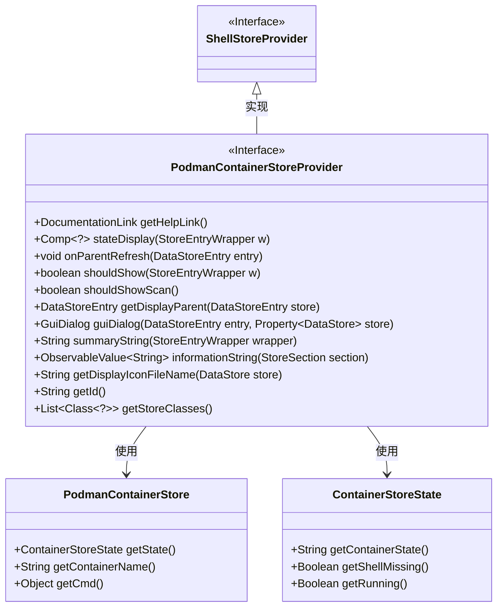

# 基础信息

|      |      |
|------|------|
| 名称 | PodmanContainerStoreProvider |
| 编码语言 | .java |
| 代码路径 | xpipe/ext/system/src/main/java/io/xpipe/ext/system/podman/PodmanContainerStoreProvider.java |
| 包名 | io.xpipe.ext.system.podman |
| 依赖项 | ['io.xpipe.app.comp.Comp', 'io.xpipe.app.comp.store', 'io.xpipe.app.ext.ContainerStoreState', 'io.xpipe.app.ext.GuiDialog', 'io.xpipe.app.storage.DataStorage', 'io.xpipe.app.storage.DataStoreEntry', 'io.xpipe.app.util', 'io.xpipe.core.store.DataStore', 'io.xpipe.ext.base.service.FixedServiceGroupStore', 'io.xpipe.ext.base.store.ShellStoreProvider', 'javafx.beans.property.Property', 'javafx.beans.property.SimpleObjectProperty', 'javafx.beans.value.ObservableValue', 'java.util.List'] |
| 概述说明 | Podman容器存储实现，管理状态显示、刷新及对话框。 |

# 说明

该代码定义了一个名为PodmanContainerStoreProvider的类，实现了ShellStoreProvider接口，用于管理Podman容器存储。主要功能包括：获取帮助文档链接、根据容器状态显示不同图标（运行成功、失败或其他）、在父级刷新时处理子服务、控制容器显示条件（如运行状态）、构建配置对话框（设置主机和容器信息）、生成摘要和信息字符串、提供显示图标及唯一标识符。该类还指定了支持的存储类为PodmanContainerStore。

# 类列表 Class Summary

| 名称   | 类型  | 说明 |
|-------|------|-------------|
| PodmanContainerStoreProvider | class | Podman容器存储提供程序，管理容器状态显示、刷新、对话框及信息汇总。 |

## 类 PodmanContainerStoreProvider

|      |      |
|------|------|
| 访问范围 | public |
| 类型 | class |
| 名称 | PodmanContainerStoreProvider |
| 说明 | Podman容器存储提供程序，管理容器状态显示、刷新、对话框及信息汇总。 |

### UML类图

这段类图展示了PodmanContainerStoreProvider类实现了ShellStoreProvider接口，并依赖于PodmanContainerStore和ContainerStoreState两个类。PodmanContainerStoreProvider提供了容器状态显示、父级刷新、显示控制、对话框创建等功能，主要用于管理Podman容器的存储和状态展示。图中清晰地展示了接口实现关系和类之间的依赖关系，体现了该模块的核心结构和功能分工。

### 内部方法调用关系图

```mermaid
graph TD
    A["类PodmanContainerStoreProvider"]
    B["方法: DocumentationLink getHelpLink()"]
    C["方法: Comp<?> stateDisplay(StoreEntryWrapper w)"]
    D["方法: void onParentRefresh(DataStoreEntry entry)"]
    E["方法: boolean shouldShow(StoreEntryWrapper w)"]
    F["方法: boolean shouldShowScan()"]
    G["方法: DataStoreEntry getDisplayParent(DataStoreEntry store)"]
    H["方法: GuiDialog guiDialog(DataStoreEntry entry, Property<DataStore> store)"]
    I["方法: String summaryString(StoreEntryWrapper wrapper)"]
    J["方法: ObservableValue<String> informationString(StoreSection section)"]
    K["方法: String getDisplayIconFileName(DataStore store)"]
    L["方法: String getId()"]
    M["方法: List<Class<?>> getStoreClasses()"]

    A --> B
    A --> C
    A --> D
    A --> E
    A --> F
    A --> G
    A --> H
    A --> I
    A --> J
    A --> K
    A --> L
    A --> M
```

这段代码是Podman容器存储提供者的实现类，主要功能包括：获取帮助文档链接、显示容器状态、处理父级刷新事件、控制UI显示逻辑、构建配置对话框、生成摘要信息等。流程图展示了12个核心方法及其与主类的层级关系，其中stateDisplay()方法通过容器状态映射系统状态，guiDialog()方法构建了包含主机选择和容器信息的配置界面，体现了对Podman容器管理的完整功能支持。

### 字段列表 Field List

| 名称  | 类型  | 说明 |
|-------|-------|------|

### 方法列表 Method List

| 名称  | 类型  | 说明 |
|-------|-------|------|
| getDisplayParent | DataStoreEntry | 重写方法，获取容器存储的父级显示项。 |
| summaryString | String | 重写summaryString方法，返回容器主机名的字符串。 |
| shouldShowScan | boolean | 重写方法，返回false不显示扫描。 |
| onParentRefresh | void | 父刷新时检查服务条目并刷新子项。 |
| guiDialog | GuiDialog | 重写方法，创建带主机和容器选项的Podman对话框，禁用主机输入。 |
| getHelpLink | DocumentationLink | 重写getHelpLink方法返回PODMAN文档链接。 |
| stateDisplay | Comp<?> | 方法根据容器状态返回对应显示组件：失败（exited）、成功（up）或其他。 |
| informationString | ObservableValue<String> | 重写方法返回容器存储状态信息，包括缺失提示和容器状态。 |
| shouldShow | boolean | 检查容器是否运行或配置显示非运行状态 |
| getDisplayIconFileName | String | 方法返回Podman图标文件名"system:podman_icon.svg"。 |
| getId | String | 重写getId方法，返回字符串"podman"。 |
| getStoreClasses | List<Class<?>> | 重写方法返回PodmanContainerStore类列表。 |

