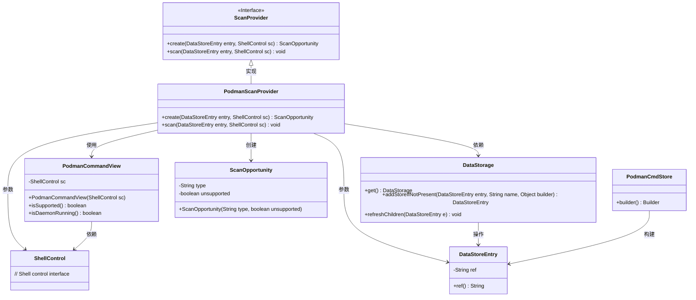
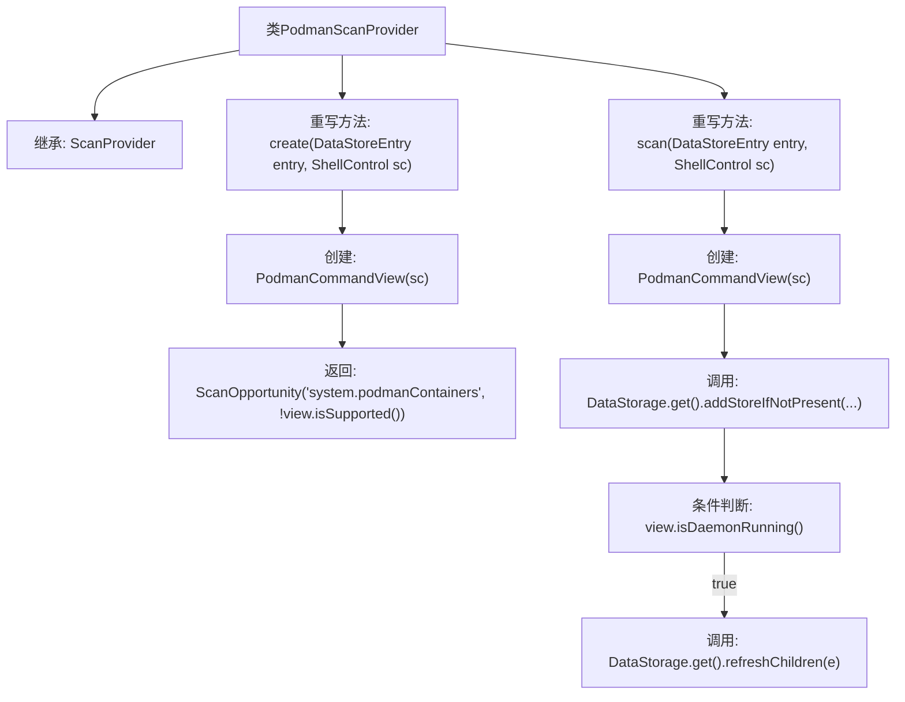

# 基础信息

|      |      |
|------|------|
| 名称 | PodmanScanProvider |
| 编码语言 | .java |
| 代码路径 | xpipe/ext/system/src/main/java/io/xpipe/ext/system/podman/PodmanScanProvider.java |
| 包名 | io.xpipe.ext.system.podman |
| 依赖项 | ['io.xpipe.app.ext.ScanProvider', 'io.xpipe.app.storage.DataStorage', 'io.xpipe.app.storage.DataStoreEntry', 'io.xpipe.core.process.ShellControl'] |
| 概述说明 | Podman扫描提供者类，检查支持性并扫描容器状态。 |

# 说明

这是一个名为PodmanScanProvider的Java类，继承自ScanProvider基类。它提供了两个主要方法：create和scan。create方法检查Podman支持情况并返回扫描机会对象；scan方法通过PodmanCommandView检查守护进程状态，若运行则刷新数据存储。类主要处理Podman容器相关的扫描功能，与数据存储系统交互。

# 类列表 Class Summary

| 名称   | 类型  | 说明 |
|-------|------|-------------|
| PodmanScanProvider | class | Podman扫描提供类，检查支持性并扫描容器状态。 |

## 类 PodmanScanProvider

|      |      |
|------|------|
| 访问范围 | public |
| 类型 | class |
| 名称 | PodmanScanProvider |
| 说明 | Podman扫描提供类，检查支持性并扫描容器状态。 |

### UML类图

这段代码展示了一个Podman扫描提供者(PodmanScanProvider)的实现，它继承自ScanProvider接口。主要功能包括创建扫描机会(create)和执行扫描操作(scan)。在扫描过程中，会使用PodmanCommandView来检查Podman支持状态和守护进程运行状态，并通过DataStorage进行数据存储操作。整个设计体现了对容器化环境(Podman)的状态检查和数据收集能力，通过分层设计将命令执行、数据存储和业务逻辑分离。

### 内部方法调用关系图

流程图描述了PodmanScanProvider类的两个核心方法。create方法创建PodmanCommandView并返回扫描机会对象；scan方法先初始化数据存储，在检测到Podman守护进程运行时刷新子节点数据。该流程清晰展现了条件判断和数据存储操作的关键路径，体现了对容器运行时状态的检查机制。

### 字段列表 Field List

| 名称  | 类型  | 说明 |
|-------|-------|------|

### 方法列表 Method List

| 名称  | 类型  | 说明 |
|-------|-------|------|
| create | ScanOpportunity | 重写方法创建扫描机会，检查Podman支持状态并返回结果。 |
| scan | void | 扫描Podman容器并更新存储状态 |

