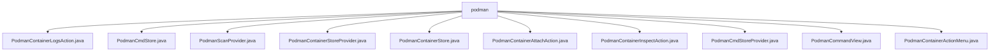

# 基础信息

|      |      |
|------|------|
| 名称 | podman |
| 编码语言 | .java |
| 代码路径 | xpipe/ext/system/src/main/java/io/xpipe/ext/system/podman |
| 包名 | xpipe.ext.system.src.main.java.io.xpipe.ext.system.podman |
| 概述说明 | Podman容器管理相关Java类，功能包括日志查看、状态检查、容器操作等。 |

# 说明

```markdown
## 概述
该代码模块是一个基于Java实现的Podman容器管理工具，主要提供对Podman容器的全生命周期管理功能。模块通过多个协同工作的类实现了容器状态监控、操作执行、日志查看、信息检查等核心功能，并与终端界面深度集成。所有组件围绕`io.xpipe.ext.system.podman`包组织，采用命令模式与Shell交互，支持国际化、状态图标显示等辅助功能。

## 主要业务场景
1. **容器状态管理**
   - 通过`PodmanCmdStore`和`PodmanContainerStore`实现容器列表获取、运行状态检查（启动/停止/重启）
   - 使用`PodmanCommandView.Container`处理底层命令执行（如`podman ps`、`podman start/stop`）
   - 状态可视化：不同运行状态显示对应图标（成功/失败/其他）

2. **容器操作执行**
   - 提供标准化操作菜单（`PodmanContainerActionMenu`）
   - 支持附加到容器（`PodmanContainerAttachAction`）
   - 日志查看（`PodmanContainerLogsAction`通过`TerminalLauncher`展示）
   - 容器检查（`PodmanContainerInspectAction`生成只读报告）

3. **系统集成**
   - 自动扫描（`PodmanScanProvider`检测守护进程状态）
   - 配置管理：通过`PodmanContainerStoreProvider`构建配置对话框
   - 端口映射与服务发现处理
   - 与父级存储系统的状态同步刷新

4. **异常处理**
   - 统一错误消息格式（`PodmanCommandView`实现异常转换）
   - 完整性检查（验证容器配置有效性）
   - 命令执行错误处理（如守护进程未运行等情况）
```


### 包内部结构视图



该流程图展示了Podman模块下的文件结构，所有文件均直接位于podman目录下，没有更深层级的子目录。这些文件包括容器日志操作、命令存储、扫描提供者、容器存储相关类以及各种容器操作和视图类，共同构成了Podman模块的功能实现基础。

# 文件列表 File List

| 名称   | 类型  | 说明 |
|-------|------|-------------|
| [PodmanContainerInspectAction.java](PodmanContainerInspectAction.md) | file | Podman容器检查操作类，实现容器信息查看功能。 |
| [PodmanContainerAttachAction.java](PodmanContainerAttachAction.md) | file | Podman容器附加操作实现类，提供创建、名称和图标功能。 |
| [PodmanContainerStore.java](PodmanContainerStore.md) | file | Podman容器存储类，实现启动停止等功能，管理容器状态和服务。 |
| [PodmanContainerStoreProvider.java](PodmanContainerStoreProvider.md) | file | Podman容器存储实现，管理状态显示、刷新及对话框。 |
| [PodmanScanProvider.java](PodmanScanProvider.md) | file | Podman扫描提供者类，检查支持性并扫描容器状态。 |
| [PodmanCmdStore.java](PodmanCmdStore.md) | file | PodmanCmdStore类，管理Podman容器状态，包含主机引用、容器列表及版本检查功能。 |
| [PodmanContainerLogsAction.java](PodmanContainerLogsAction.md) | file | Podman容器日志操作类，提供获取和显示容器日志功能。 |
| [PodmanContainerActionMenu.java](PodmanContainerActionMenu.md) | file | Podman容器操作菜单实现，提供启动、停止、重启等子操作。 |
| [PodmanCommandView.java](PodmanCommandView.md) | file | Podman命令视图类，封装容器操作及错误处理。 |
| [PodmanCmdStoreProvider.java](PodmanCmdStoreProvider.md) | file | PodmanCmdStoreProvider实现DataStoreProvider接口，管理Podman容器状态和显示逻辑。 |


